# `OpenCV` 入门训练营

`OpenCV`是家喻户晓的计算机视觉元老级别库，应用于无数领域，下面浅学一下官方教程。

官方教程：https://courses.opencv.org

官方文档：https://docs.opencv.org

## 00 opencv-python

给系统安装opencv的python库开发环境

### 00-01 macos

1. www.anaconda.com 
2. 下载anaconda环境包，（包括python环境 opencv包环境一条龙）
3. 安装anaconda
4. 打开终端
```bash
conda create --name opencv-env
conda activate opencv-env
# 给环境安装opencv
conda install -c conda-forge opencv
```
5. 检验安装
```python
python3
import cv2 as cv
cv.__version__
```

### 00-02 windows

同上类似

### 00-03 linux

同上类似

## 01 图像基本读写

代码见文件夹：`01_getting_started_with_images`

本笔记本将帮助您迈出使用 `OpenCV` 学习图像处理和计算机视觉的第一步。您将通过一些简单的示例学到以下内容：

+ 读取图像
+ 检查图像属性：数据类型和形状（大小）等
+ 使用 `Numpy` 库，将图像用矩阵表示
+ 彩色图像以及分割/合并图像通道
+ 使用 `matplotlib` 显示图像
+  保存图像

### 01-01 导入库（包括内库和外库）

```python
import os
import cv2
import numpy as np
import matplotlib.pyplot as plt

from zipfile import ZipFile
from urllib.request import urlretrieve

from IPython.display import Image
```

### 01-02 下载资料（图片和代码）

`download_and_unzip(...)`函数用于下载和提取笔记资源。

```python
def download_and_unzip(url, save_path):
    print(f"Downloading and extracting assests....", end="")

    # Downloading zip file using urllib package.
    urlretrieve(url, save_path)

    try:
        # Extracting zip file using the zipfile package.
        with ZipFile(save_path) as z:
            # Extract ZIP file contents in the same directory.
            z.extractall(os.path.split(save_path)[0])

        print("Done")

    except Exception as e:
        print("\nInvalid file.", e)

# 下载：
URL = r"https://www.dropbox.com/s/qhhlqcica1nvtaw/opencv_bootcamp_assets_NB1.zip?dl=1"

asset_zip_path = os.path.join(os.getcwd(), f"opencv_bootcamp_assets_NB1.zip")

# Download if assest ZIP does not exists. 
if not os.path.exists(asset_zip_path):
    download_and_unzip(URL, asset_zip_path) 
```

执行以上程序后会下载获得`opencv_bootcamp_assets_NB1.zip` 文件，其中还包含附加的 `display_image.py` python 脚本。

### 01-03 直接显示图片

我们将使用以下作为我们的示例图像。我们将使用 `ipython` 图像函数来加载和显示图像。

```python
# Display 18x18 pixel image.
Image(filename="checkerboard_18x18.png")
```

 

```python
# Display 84x84 pixel image.
Image(filename="checkerboard_84x84.jpg")
```

 

### 01-03 使用`OpenCV`读取图片

`OpenCV` 允许读取不同类型的图像（`JPG`、`PNG` 等）。您可以加载灰度图像、彩色图像，也可以加载带有 `Alpha` 通道的图像。它使用 `cv2.imread()` 函数，其语法如下：

#### retval = cv2.imread( 文件名[, 标志] )

`retval`：如果加载成功则为图片。否则就是`None`。如果文件名错误或文件已损坏，则可能会发生这种情况。

该函数有 1 个必需的输入参数和 1 个可选标志：

1. 文件名：这可以是绝对路径或相对路径。这是一个强制性的参数。
2. 标志：这些标志用于读取特定格式的图像（例如，灰度/彩色/带 Alpha 通道）。这是一个可选参数，默认值为 `cv2.IMREAD_COLOR` 或 `1`，它将图像加载为彩色图像。

在我们继续一些示例之前，让我们先看一下一些可用的标志:

1. `cv2.IMREAD_GRAYSCALE` 或 `0`：以灰度模式加载图像
2. `cv2.IMREAD_COLOR` 或 `1`：加载彩色图像。图像的任何透明度都将被忽略。这是默认标志。
3. `cv2.IMREAD_UNCHANGED` 或 `-1`： 以Alpha 通道模式加载图像。

```python
# Read image as gray scale.
cb_img = cv2.imread("checkerboard_18x18.png", 0)

# Print the image data (pixel values), element of a 2D numpy array.
# Each pixel value is 8-bits [0,255]
print(cb_img)
```

```shell
[[  0   0   0   0   0   0 255 255 255 255 255 255   0   0   0   0   0   0]
 [  0   0   0   0   0   0 255 255 255 255 255 255   0   0   0   0   0   0]
 [  0   0   0   0   0   0 255 255 255 255 255 255   0   0   0   0   0   0]
 [  0   0   0   0   0   0 255 255 255 255 255 255   0   0   0   0   0   0]
 [  0   0   0   0   0   0 255 255 255 255 255 255   0   0   0   0   0   0]
 [  0   0   0   0   0   0 255 255 255 255 255 255   0   0   0   0   0   0]
 [255 255 255 255 255 255   0   0   0   0   0   0 255 255 255 255 255 255]
 [255 255 255 255 255 255   0   0   0   0   0   0 255 255 255 255 255 255]
 [255 255 255 255 255 255   0   0   0   0   0   0 255 255 255 255 255 255]
 [255 255 255 255 255 255   0   0   0   0   0   0 255 255 255 255 255 255]
 [255 255 255 255 255 255   0   0   0   0   0   0 255 255 255 255 255 255]
 [255 255 255 255 255 255   0   0   0   0   0   0 255 255 255 255 255 255]
 [  0   0   0   0   0   0 255 255 255 255 255 255   0   0   0   0   0   0]
 [  0   0   0   0   0   0 255 255 255 255 255 255   0   0   0   0   0   0]
 [  0   0   0   0   0   0 255 255 255 255 255 255   0   0   0   0   0   0]
 [  0   0   0   0   0   0 255 255 255 255 255 255   0   0   0   0   0   0]
 [  0   0   0   0   0   0 255 255 255 255 255 255   0   0   0   0   0   0]
 [  0   0   0   0   0   0 255 255 255 255 255 255   0   0   0   0   0   0]]
```

### 01-04 显示图片属性

```python
# print the size  of image
print("Image size (H, W) is:", cb_img.shape)
# print data-type of image
print("Data type of image is:", cb_img.dtype)
```

```shell
Image size (H, W) is: (18, 18)
Data type of image is: uint8
```

### 01-05 使用`Matplotlib`显示灰度图片

```python
# Display image.
plt.imshow(cb_img)
# <matplotlib.image.AxesImage at 0x2dd1ffc36d0>
```

 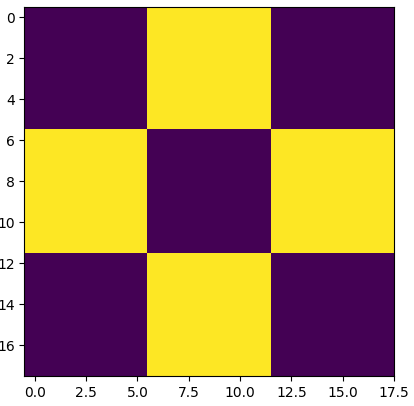

#### 发生了啥？

即使图像被读取为灰度图像，但在使用 `imshow()` 时，它不一定会以灰度显示。 `matplotlib` 使用不同的颜色映射模式，并且可能未设置灰度颜色映射模式。

```python
# 将颜色映射设置为灰度以便正确渲染。
plt.imshow(cb_img, cmap="gray")
```

 

#### 另外一个例子

```python
# 将图像读取为灰度模式
cb_img_fuzzy = cv2.imread("checkerboard_fuzzy_18x18.jpg", 0)
# print image
print(cb_img_fuzzy)
# Display image.
plt.imshow(cb_img_fuzzy, cmap="gray")
```

```shell
[[  0   0  15  20   1 134 233 253 253 253 255 229 130   1  29   2   0   0]
 [  0   1   5  18   0 137 232 255 254 247 255 228 129   0  24   2   0   0]
 [  7   5   2  28   2 139 230 254 255 249 255 226 128   0  27   3   2   2]
 [ 25  27  28  38   0 129 236 255 253 249 251 227 129   0  36  27  27  27]
 [  2   0   0   4   2 130 239 254 254 254 255 230 126   0   4   2   0   0]
 [132 129 131 124 121 163 211 226 227 225 226 203 164 125 125 129 131 131]
 [234 227 230 229 232 205 151 115 125 124 117 156 205 232 229 225 228 228]
 [254 255 255 251 255 222 102   1   0   0   0 120 225 255 254 255 255 255]
 [254 255 254 255 253 225 104   0  50  46   0 120 233 254 247 253 251 253]
 [252 250 250 253 254 223 105   2  45  50   0 127 223 255 251 255 251 253]
 [254 255 255 252 255 226 104   0   1   1   0 120 229 255 255 254 255 255]
 [233 235 231 233 234 207 142 106 108 102 108 146 207 235 237 232 231 231]
 [132 132 131 132 130 175 207 223 224 224 224 210 165 134 130 136 134 134]
 [  1   1   3   0   0 129 238 255 254 252 255 233 126   0   0   0   0   0]
 [ 20  19  30  40   5 130 236 253 252 249 255 224 129   0  39  23  21  21]
 [ 12   6   7  27   0 131 234 255 254 250 254 230 123   1  28   5  10  10]
 [  0   0   9  22   1 133 233 255 253 253 254 230 129   1  26   2   0   0]
 [  0   0   9  22   1 132 233 255 253 253 254 230 129   1  26   2   0   0]]
```

 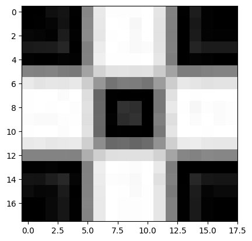

### 01-05 处理彩色图片

到目前为止，我们在讨论中一直使用灰度图像。现在让我们讨论彩色图像。

```python
# 读取可口可乐的LOGO
Image("coca-cola-logo.png")
```

 

### 01-06 读取和显示彩色图片

让我们读取彩色图像并检查参数。注意图像尺寸。

```python
# 读取图片，flag为1 表示彩色模式
coke_img = cv2.imread("coca-cola-logo.png", 1)
# 打印图像的大小
print("Image size (H, W, C) is:", coke_img.shape) # Image size (H, W, C) is: (700, 700, 3)
# 打印数据类型
print("Data type of image is:", coke_img.dtype) # Data type of image is: uint8
```

### 01-07 使用matplot显示彩色图片

```python
plt.imshow(coke_img)
```

 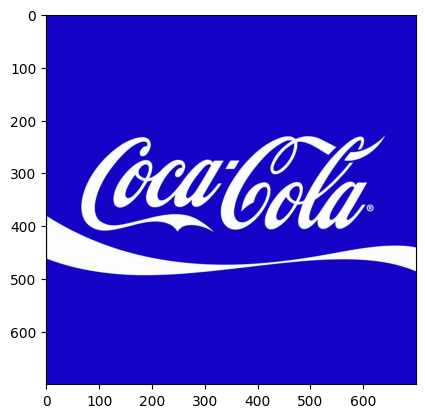

#### 发生了啥？

上面显示的颜色与实际图像不同。这是因为 matplotlib 需要 `RGB` 格式的图像，而 OpenCV 以 `BGR` 格式存储图像。因此，为了正确显示，我们需要`反转`图像的通道。我们将在下面的部分中讨论`Channels`。

```python
coke_img_channels_reversed = coke_img[:, :, ::-1]
plt.imshow(coke_img_channels_reversed)
```

 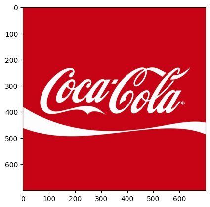

### 01-08 分割和合并颜色通道

+ `cv2.split()` 将一个多通道数组分成多个单通道数组。
+ `cv2.merge() `合并多个数组以形成单个多通道数组。所有输入矩阵必须具有相同的大小。

```python
# 将图像分割split成B、G、R分量
img_NZ_bgr = cv2.imread("New_Zealand_Lake.jpg", cv2.IMREAD_COLOR)
b, g, r = cv2.split(img_NZ_bgr)

# Show the channels
plt.figure(figsize=[20, 5])

plt.subplot(141);plt.imshow(r, cmap="gray");plt.title("Red Channel")
plt.subplot(142);plt.imshow(g, cmap="gray");plt.title("Green Channel")
plt.subplot(143);plt.imshow(b, cmap="gray");plt.title("Blue Channel")

# 将各个通道合并成 BGR 图像
imgMerged = cv2.merge((b, g, r))
# Show the merged output
plt.subplot(144)
plt.imshow(imgMerged[:, :, ::-1])
plt.title("Merged Output")
```

 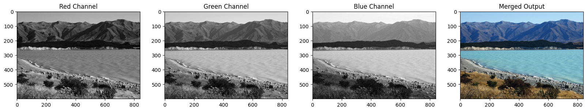

### 01-09 转换为不同的色彩空间 `BGR2RGB`

`cv2.cvtColor()` 将图像从一种颜色空间转换为另一种颜色空间。该函数将输入图像从一种颜色空间转换为另一种颜色空间。在进行 RGB  颜色空间转换时，应明确指定通道的顺序（`RGB` 或 `BGR`）。请注意，`OpenCV` 中的默认颜色格式通常称为 RGB，但实际上是  BGR（字节反转）。因此，`标准（24 位）`彩色图像中的第一个字节将是 8  位蓝色分量，第二个字节将是绿色，第三个字节将是红色。第四、第五和第六字节将是第二个像素（蓝色，然后是绿色，然后是红色），依此类推。

函数语法：

`dst = cv2.cvtColor( src, code )`

`dst`：是与`src`大小和深度相同的输出图像。

该函数有 2 个必需参数：

1. `src` 输入图像：8 位无符号、16 位无符号（`CV_16UC`...）或单精度浮点。
2. 代码颜色空间转换代码（请参阅 `ColorConversionCodes`）。

```python
# OpenCV 以与大多数其他应用程序不同,RGB需要进行翻转
img_NZ_rgb = cv2.cvtColor(img_NZ_bgr, cv2.COLOR_BGR2RGB)
plt.imshow(img_NZ_rgb)
```

 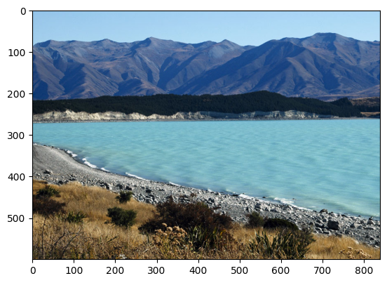

### 01-10 转换成`BGR2HSV`色彩空间

```python
img_hsv = cv2.cvtColor(img_NZ_bgr, cv2.COLOR_BGR2HSV)
h,s,v = cv2.split(img_hsv)
# Show the channels
plt.figure(figsize=[20,5])
plt.subplot(141);plt.imshow(h, cmap="gray");plt.title("H Channel");
plt.subplot(142);plt.imshow(s, cmap="gray");plt.title("S Channel");
plt.subplot(143);plt.imshow(v, cmap="gray");plt.title("V Channel");
plt.subplot(144);plt.imshow(img_NZ_rgb);   plt.title("Original");
```

 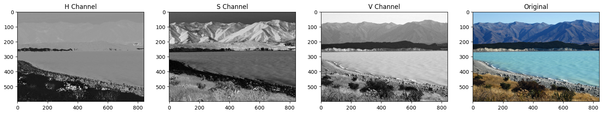

### 01-11 修改图像单个空间

```python
h_new = h + 10
img_NZ_merged = cv2.merge((h_new, s, v))
img_NZ_rgb = cv2.cvtColor(img_NZ_merged, cv2.COLOR_HSV2RGB)
# Show the channels
plt.figure(figsize=[20,5])
plt.subplot(141);plt.imshow(h, cmap="gray");plt.title("H Channel");
plt.subplot(142);plt.imshow(s, cmap="gray");plt.title("S Channel");
plt.subplot(143);plt.imshow(v, cmap="gray");plt.title("V Channel");
plt.subplot(144);plt.imshow(img_NZ_rgb);   plt.title("Original");
```

 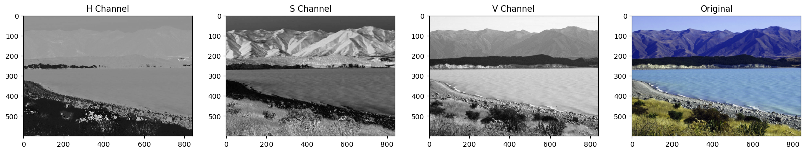

### 01-12 保存图片

保存图像就像在 `OpenCV` 中读取图像一样简单。我们使用带有两个参数的函数 `cv2.imwrite()`。第一个参数是文件名，第二个参数是图像对象。

函数 `imwrite` 将图像保存到指定文件中。图像格式是根据文件扩展名选择的（有关扩展名列表，请参阅  `cv::imread`）。一般来说，使用此函数只能保存 8 位单通道或 3 通道（具有`BGR`通道顺序）图像（有关更多详细信息，请参阅  `OpenCV` 文档）。

函数语法：

`cv2.imwrite( filename, img[, params] )`

该函数有 2 个必需参数：

1. 文件名：这可以是绝对路径或相对路径。
2. `img`：要保存的一个或多个图像。

```py
cv2.imwrite("New_Zealand_Lake_SAVED.png", img_NZ_bgr)
Image(filename='New_Zealand_Lake_SAVED.png') 
```

 

```python
# read the image as Color
img_NZ_bgr = cv2.imread("New_Zealand_Lake_SAVED.png", cv2.IMREAD_COLOR)
print("img_NZ_bgr shape (H, W, C) is:", img_NZ_bgr.shape) #img_NZ_bgr shape (H, W, C) is: (600, 840, 3)
# read the image as Gray scaled
img_NZ_gry = cv2.imread("New_Zealand_Lake_SAVED.png", cv2.IMREAD_GRAYSCALE)
print("img_NZ_gry shape (H, W) is:", img_NZ_gry.shape) # img_NZ_gry shape (H, W) is: (600, 840)
```

## 02 图像基本处理

以下我们将介绍如何执行图像转换，包括：

+ 访问和操作图像像素 Accessing
+ 调整图像大小 Resizing
+ 裁剪 Cropping
+ 翻转 Flipping

### 02-01 下载物料

引入依赖

```python
import os
import cv2
import numpy as np
import matplotlib.pyplot as plt

from zipfile import ZipFile
from urllib.request import urlretrieve

from IPython.display import Image
# 下载函数：
```

```python
def download_and_unzip(url, save_path):
    print(f"Downloading and extracting assests....", end="")
    # Downloading zip file using urllib package.
    urlretrieve(url, save_path)
    try:
        # Extracting zip file using the zipfile package.
        with ZipFile(save_path) as z:
            # Extract ZIP file contents in the same directory.
            z.extractall(os.path.split(save_path)[0])
        print("Done")

    except Exception as e:
        print("\nInvalid file.", e)

URL = r"https://www.dropbox.com/s/rys6f1vprily2bg/opencv_bootcamp_assets_NB2.zip?dl=1"
asset_zip_path = os.path.join(os.getcwd(), f"opencv_bootcamp_assets_NB2.zip")

# Download if assest ZIP does not exists.
if not os.path.exists(asset_zip_path):
    download_and_unzip(URL, asset_zip_path)
```

执行函数：

```shell
conda activate opencv-env
https_proxy=127.0.0.1:7890 python3 02_basic_image_manipulations.py 
```

打开原始棋盘图像：

```python
# 灰度模式读取图像
cb_img = cv2.imread("checkerboard_18x18.png", 0)
# 通过matplotlib以灰度模式展示图片
plt.imshow(cb_img, cmap="gray")
print(cb_img)
```

```shell
[[  0   0   0   0   0   0 255 255 255 255 255 255   0   0   0   0   0   0]
 [  0   0   0   0   0   0 255 255 255 255 255 255   0   0   0   0   0   0]
 [  0   0   0   0   0   0 255 255 255 255 255 255   0   0   0   0   0   0]
 [  0   0   0   0   0   0 255 255 255 255 255 255   0   0   0   0   0   0]
 [  0   0   0   0   0   0 255 255 255 255 255 255   0   0   0   0   0   0]
 [  0   0   0   0   0   0 255 255 255 255 255 255   0   0   0   0   0   0]
 [255 255 255 255 255 255   0   0   0   0   0   0 255 255 255 255 255 255]
 [255 255 255 255 255 255   0   0   0   0   0   0 255 255 255 255 255 255]
 [255 255 255 255 255 255   0   0   0   0   0   0 255 255 255 255 255 255]
 [255 255 255 255 255 255   0   0   0   0   0   0 255 255 255 255 255 255]
 [255 255 255 255 255 255   0   0   0   0   0   0 255 255 255 255 255 255]
 [255 255 255 255 255 255   0   0   0   0   0   0 255 255 255 255 255 255]
 [  0   0   0   0   0   0 255 255 255 255 255 255   0   0   0   0   0   0]
 [  0   0   0   0   0   0 255 255 255 255 255 255   0   0   0   0   0   0]
 [  0   0   0   0   0   0 255 255 255 255 255 255   0   0   0   0   0   0]
 [  0   0   0   0   0   0 255 255 255 255 255 255   0   0   0   0   0   0]
 [  0   0   0   0   0   0 255 255 255 255 255 255   0   0   0   0   0   0]
 [  0   0   0   0   0   0 255 255 255 255 255 255   0   0   0   0   0   0]]
```

 

### 02-02 读取单个像素

让我们看看如何读取图像中的像素。

要访问 `numpy` 矩阵中的任何像素，您必须使用矩阵表示法，例如矩阵 [r,c]，其中 r 是行号，c 是列号。另请注意，该矩阵是从 0 开始索引的。

例如，如果要访问第一个像素，则需要指定matrix[0,0]。让我们看一些例子。我们将从左上角打印一个黑色像素，从顶部中心打印一个白色像素。

```python
# 打印第一行的第一个像素
print(cb_img[0, 0]) # 0
# 打印第一行白方块内的第一个元素
print(cb_img[0, 6]) # 255
```

### 02-03 修改图像像素

我们可以用与上述相同的方式修改像素的强度值（深浅，值越小，颜色越深）。

```python
cb_img_copy = cb_img.copy()
cb_img_copy[2, 2] = 200
cb_img_copy[2, 3] = 200
cb_img_copy[3, 2] = 200
cb_img_copy[3, 3] = 200

# 可以简写为以下一行：
# cb_img_copy[2:3,2:3] = 200

plt.imshow(cb_img_copy, cmap="gray")
print(cb_img_copy)
```

```shell


[[  0   0   0   0   0   0 255 255 255 255 255 255   0   0   0   0   0   0]
 [  0   0   0   0   0   0 255 255 255 255 255 255   0   0   0   0   0   0]
 [  0   0 200 200   0   0 255 255 255 255 255 255   0   0   0   0   0   0]
 [  0   0 200 200   0   0 255 255 255 255 255 255   0   0   0   0   0   0]
 [  0   0   0   0   0   0 255 255 255 255 255 255   0   0   0   0   0   0]
 [  0   0   0   0   0   0 255 255 255 255 255 255   0   0   0   0   0   0]
 [255 255 255 255 255 255   0   0   0   0   0   0 255 255 255 255 255 255]
 [255 255 255 255 255 255   0   0   0   0   0   0 255 255 255 255 255 255]
 [255 255 255 255 255 255   0   0   0   0   0   0 255 255 255 255 255 255]
 [255 255 255 255 255 255   0   0   0   0   0   0 255 255 255 255 255 255]
 [255 255 255 255 255 255   0   0   0   0   0   0 255 255 255 255 255 255]
 [255 255 255 255 255 255   0   0   0   0   0   0 255 255 255 255 255 255]
 [  0   0   0   0   0   0 255 255 255 255 255 255   0   0   0   0   0   0]
 [  0   0   0   0   0   0 255 255 255 255 255 255   0   0   0   0   0   0]
 [  0   0   0   0   0   0 255 255 255 255 255 255   0   0   0   0   0   0]
 [  0   0   0   0   0   0 255 255 255 255 255 255   0   0   0   0   0   0]
 [  0   0   0   0   0   0 255 255 255 255 255 255   0   0   0   0   0   0]
 [  0   0   0   0   0   0 255 255 255 255 255 255   0   0   0   0   0   0]]


```

 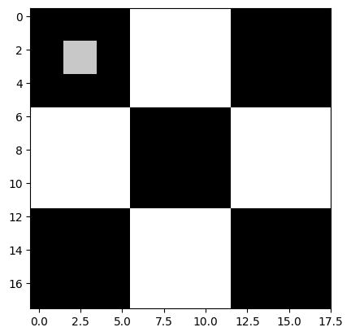

### 02-04 剪裁图像

裁剪图像只需选择图像的特定（像素）区域即可实现。

先用`matplotlib`读取一张图：

```python
img_NZ_bgr = cv2.imread("New_Zealand_Boat.jpg", cv2.IMREAD_COLOR)
img_NZ_rgb = img_NZ_bgr[:, :, ::-1]
plt.imshow(img_NZ_rgb)
# <matplotlib.image.AxesImage at 0x1c6c64c6890>
```

 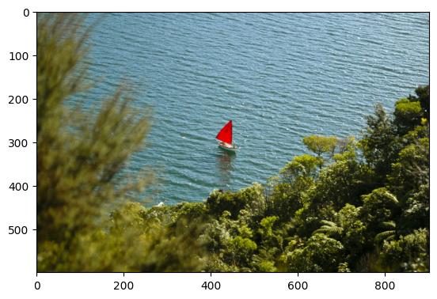

#### 裁剪出（Crop out）图像中间位置

```python
cropped_region = img_NZ_rgb[200:400, 300:600]
plt.imshow(cropped_region)
# <matplotlib.image.AxesImage at 0x1c6c648b730>
```

 

### 02-05 调整图像大小

函数 `resize()` 将图像 `src` 的大小调整为指定大小。大小和类型源自 `src`、`dsize`、`fx` 和 `fy`。函数语法如下：

```python
dst = resize( src, dsize[, dst[, fx[, fy[, interpolation]]]] )
```

`dst`：输出图像；它的大小为 `dsize `（当它非零时）或根据 `src.size()`、`fx` 和 `fy` 计算的大小； `dst` 的类型与 `src` 的类型相同。该函数有 2 个必需参数：

1. `src`：输入图像
2. `dsize`：输出图像大小

经常使用的可选参数包括：

    1. `fx`：沿水平轴的比例因子；当它等于 0 时，计算为` (𝚍𝚘𝚞𝚋𝚕𝚎)𝚍𝚜𝚒𝚣𝚎.𝚠𝚒𝚍𝚝𝚑/𝚜𝚛𝚌.𝚌𝚘𝚕𝚜`
    1. `fy`：沿垂直轴的比例因子；当它等于 0 时，计算为 `(𝚍𝚘𝚞𝚋𝚕𝚎)𝚍𝚜𝚒𝚣𝚎.𝚑𝚎𝚒𝚐𝚑𝚝/𝚜𝚛𝚌.𝚛𝚘𝚠𝚜`

输出图像的大小为 `dsize `（当它非零时）或根据 `src.size()`、`fx `和 `fy` 计算的大小； `dst` 的类型与 `src` 的类型相同。

#### 02-05-01 场景一：使用 `fx` 和 `fy` 指定缩放因子

```python
resized_cropped_region_2x = cv2.resize(cropped_region, None, fx=2, fy=2)
plt.imshow(resized_cropped_region_2x)
```

可以观察到坐标都双倍了。

 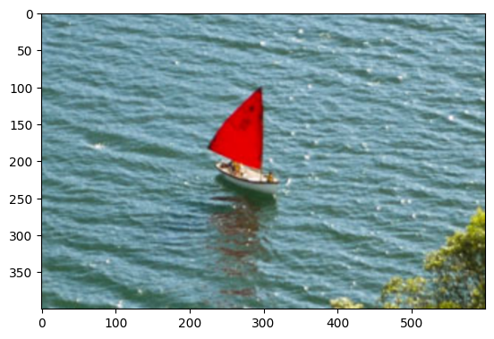

#### 02-05-02 场景二：指定输出图像的精确尺寸

```python
desired_width = 100
desired_height = 200
dim = (desired_width, desired_height)
# 将背景图像调整为徽标图像的大小
resized_cropped_region = cv2.resize(cropped_region, dsize=dim, interpolation=cv2.INTER_AREA)
plt.imshow(resized_cropped_region)
```

 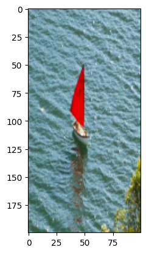

#### 02-05-03 场景三：调整大小同时保持纵横比(按比例缩放)

```python
desired_width = 100
aspect_ratio = desired_width / cropped_region.shape[1]
desired_height = int(cropped_region.shape[0] * aspect_ratio)
dim = (desired_width, desired_height)
resized_cropped_region = cv2.resize(cropped_region, dsize=dim, interpolation=cv2.INTER_AREA)
plt.imshow(resized_cropped_region)
```

 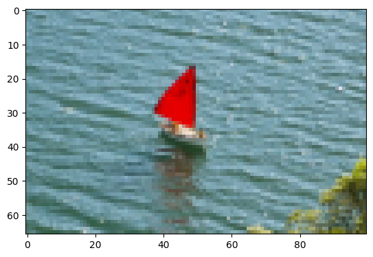

#### 让我们实际显示（裁剪的）调整大小的图像。

```python
resized_cropped_region_2x = resized_cropped_region_2x[:, :, ::-1]
cv2.imwrite("resized_cropped_region_2x_Image.png", resized_cropped_region_2x)
Image(filename="resized_cropped_region_2x_Image.png")
```

 

### 02-06 翻转图像

函数 `Flip` 以三种不同方式翻转数组（行索引和列索引从 0 开始），函数语法如下：

`dst = cv.flip( src, flipCode )`

`dst`：与 `src` 大小和类型相同的输出数组。该函数有 2 个必需参数：

1. `src`：输入图像
2. `FlipCode`：指定如何翻转数组的标志； 0 表示绕 `x` 轴翻转，正值（例如 1）表示绕 `y` 轴翻转。负值（例如 -1）表示绕两个轴翻转。

```python
img_NZ_rgb_flipped_horz = cv2.flip(img_NZ_rgb, 1)
img_NZ_rgb_flipped_vert = cv2.flip(img_NZ_rgb, 0)
img_NZ_rgb_flipped_both = cv2.flip(img_NZ_rgb, -1)

plt.figure(figsize=(18, 5))
plt.subplot(141);plt.imshow(img_NZ_rgb_flipped_horz);plt.title("Horizontal Flip");
plt.subplot(142);plt.imshow(img_NZ_rgb_flipped_vert);plt.title("Vertical Flip");
plt.subplot(143);plt.imshow(img_NZ_rgb_flipped_both);plt.title("Both Flipped");
plt.subplot(144);plt.imshow(img_NZ_rgb);plt.title("Original");
```

 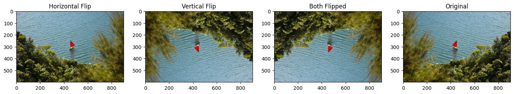


## 03 图像标注

在下文中，我们将介绍如何使用 `OpenCV` 对图像进行标注。我们将学习如何对图像执行以下标注。

+ 画线 Lines
+ 画圆圈 Circles
+ 绘制矩形 Rectangles
+ 添加文字 Text

当您想要标注演示结果或进行应用程序演示时，这些非常有用。标注在开发和调试过程中也很有用。（比如画框框标注出ROI）

### 03-01 下载物料

```python
import os
import cv2
import matplotlib
import numpy as np
import matplotlib.pyplot as plt
from zipfile import ZipFile
from urllib.request import urlretrieve
matplotlib.rcParams['figure.figsize'] = (9.0, 9.0)

# 下载函数
def download_and_unzip(url, save_path):
    print(f"Downloading and extracting assests....", end="")
    urlretrieve(url, save_path)
    try:
        with ZipFile(save_path) as z:
            z.extractall(os.path.split(save_path)[0])
        print("Done")
    except Exception as e:
        print("\nInvalid file.", e)

# 下载
URL = r"https://www.dropbox.com/s/48hboi1m4crv1tl/opencv_bootcamp_assets_NB3.zip?dl=1"
asset_zip_path = os.path.join(os.getcwd(), f"opencv_bootcamp_assets_NB3.zip")
if not os.path.exists(asset_zip_path):
    download_and_unzip(URL, asset_zip_path)

image = cv2.imread("Apollo_11_Launch.jpg", cv2.IMREAD_COLOR)

# 展示原始示例图片“阿波罗11号”
plt.imshow(image[:, :, ::-1])
# <matplotlib.image.AxesImage at 0x1bda3bf2d10>
```

 

### 03-02 画线

让我们从在图像上画一条线开始。为此，我们将使用 `cv2.line()` 函数。函数语法:

`img = cv2.line(img, pt1, pt2, 颜色[, 厚度[, 线型[, 移位]]])`

`img`：标注过后的输出图像。

该函数有 4 个必需参数：

1. `img`：我们将在其上画线的图像
2. `pt1`：线段的第一个点（x，y位置）
3. `pt2`：线段的第二个点
4. `color`：将绘制的线的颜色

可选参数包括：

    1. 厚度：指定线条粗细的整数。默认值为 1。
    1. `lineType`：线路类型。默认值为 8，代表 8 条连接线。通常，cv2.LINE_AA（抗锯齿或平滑线）用于 `lineType`。

```python
imageLine = image.copy()
# The line starts from (200,100) and ends at (400,100)
# The color of the line is YELLOW (Recall that OpenCV uses BGR format)
# Thickness of line is 5px
# Linetype is cv2.LINE_AA
cv2.line(imageLine, (200, 100), (400, 100), (0, 255, 255), thickness=5, lineType=cv2.LINE_AA);
plt.imshow(imageLine[:,:,::-1])
```

 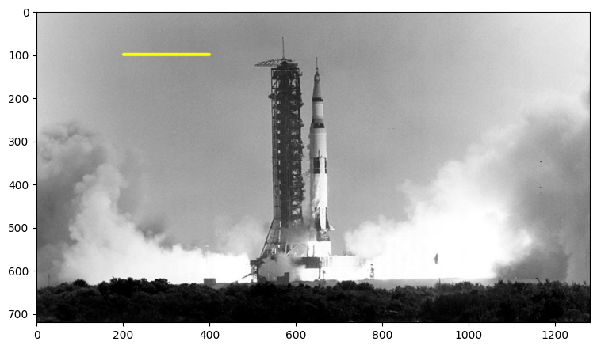

### 03-03 画圈圈

画一个圆圈我们将使用 `cv2.circle` 函数。函数式语法如下：

`img = cv2.circle(img, 中心, 半径, 颜色[, 厚度[, 线型[, 移位]]])`

`img`：已标注的输出图像。

该函数有 4 个必需参数：

1. `img`：我们将在其上画线的图像
2. 中心：圆的中心
3. radius：圆的半径
4. color：将绘制的圆的颜色

（可选）参数:

    1. 厚度：圆形轮廓的厚度（如果为正）。如果为此参数提供`负值`，则会产生`实心圆`。
    1.  `lineType`：圆边界的类型。这与 `cv2.line` 中的 `lineType` 参数完全相同

```python
imageCircle = image.copy()
cv2.circle(imageCircle, (900,500), 100, (0, 0, 255), thickness=5, lineType=cv2.LINE_AA);
plt.imshow(imageCircle[:,:,::-1])
```

 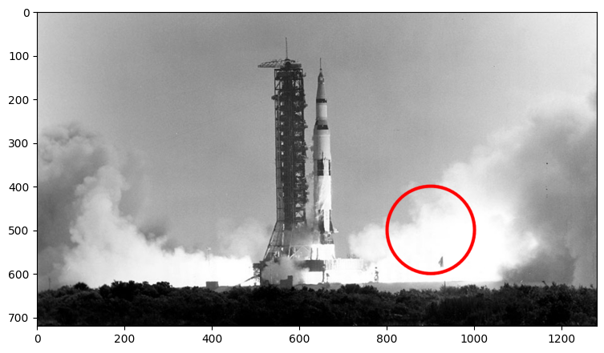

### 03-04 画矩形

`cv2.rectangle` 函数在图像上绘制矩形。函数语法如下:

`img = cv2.rectangle(img, pt1, pt2, 颜色[, 厚度[, 线型[, 移位]]])`

`img`：已标注的输出图像。

该函数有 4 个必需参数：

1. `img`：要在其上绘制矩形的图像。
2.  `pt1`：矩形的顶点。通常我们在这里使用左上角的顶点。
3. `pt2`：与 `pt1 `相对的矩形的顶点。通常我们在这里使用右下角的顶点。
4. 颜色: 长方形颜色

可选参数:

1. 厚度：圆形轮廓的厚度（如果为正）。如果为此参数提供负值，则会生成填充矩形。
2. `lineType`：圆边界的类型。这与 `cv2.line` 中的 `lineType` 参数完全相同

```python
# Draw a rectangle (thickness is a positive integer)
imageRectangle = image.copy()
cv2.rectangle(imageRectangle, (500, 100), (700, 600), (255, 0, 255), thickness=5, lineType=cv2.LINE_8)
# Display the image
plt.imshow(imageRectangle[:, :, ::-1])
```

 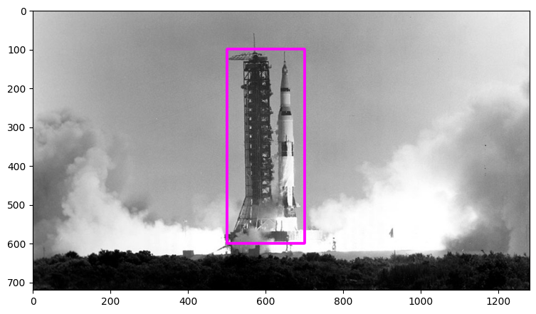

### 03-05 添加文本

最后，让我们看看如何使用 `cv2.putText` 函数在图像上写入一些文本。函数式语法如下：

`img = cv2.putText（img，文本，org，fontFace，fontScale，颜色[，厚度[，lineType [，bottomLeftOrigin]]]）`

`img`：已标注的输出图像。

该函数有 6 个必需参数：

1. `img`：必须在其上写入文本的图像。
2. `text`：要写入的文本字符串。
3.  `org`：图像中文本字符串的左下角。
4.  `fontFace`：字体类型
5.   `fontScale`：字体比例因子乘以字体特定的基本尺寸。
6.  `颜色`：字体颜色

我们需要了解的其他可选参数包括：

1. 厚度：指定文本线条粗细的整数。默认值为 1。
2.  `lineType`：同上。

```python
imageText = image.copy()
text = "Apollo 11 Saturn V Launch, July 16, 1969"
fontScale = 2.3
fontFace = cv2.FONT_HERSHEY_PLAIN
fontColor = (0, 255, 0)
fontThickness = 2
cv2.putText(imageText, text, (200, 700), fontFace, fontScale, fontColor, fontThickness, cv2.LINE_AA);
plt.imshow(imageText[:, :, ::-1])
```

 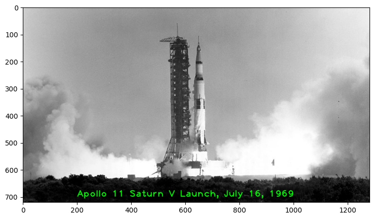

## 04 图像增强

### 使用数学运算的基本图像增强

将数学运算运用到图像处理技术获得不同的结果。大多数情况下，我们使用一些基本数学运算操作来获得图像的增强版本。我们将了解计算机视觉像素管道中经常使用的一些基本操作。下文我们将介绍：

+ 算术运算，例如加法、乘法
+ 阈值和掩蔽 Masking(马赛克)
+ 按位运算，例如 `OR`、`AND`、`XOR`

### 04-01 下载物料

```python
import os
import cv2
import numpy as np
import matplotlib.pyplot as plt
from zipfile import ZipFile
from urllib.request import urlretrieve
from IPython.display import Image

def download_and_unzip(url, save_path):
    print(f"Downloading and extracting assests....", end="")
    urlretrieve(url, save_path)
    try:
        with ZipFile(save_path) as z:
            z.extractall(os.path.split(save_path)[0])
        print("Done")
    except Exception as e:
        print("\nInvalid file.", e)

URL = r"https://www.dropbox.com/s/0oe92zziik5mwhf/opencv_bootcamp_assets_NB4.zip?dl=1"

asset_zip_path = os.path.join(os.getcwd(), f"opencv_bootcamp_assets_NB4.zip")

if not os.path.exists(asset_zip_path):
    download_and_unzip(URL, asset_zip_path)

```

原始图

```python
img_bgr = cv2.imread("New_Zealand_Coast.jpg", cv2.IMREAD_COLOR)
img_rgb = cv2.cvtColor(img_bgr, cv2.COLOR_BGR2RGB)
# Display 18x18 pixel image.
Image(filename="New_Zealand_Coast.jpg")
```

 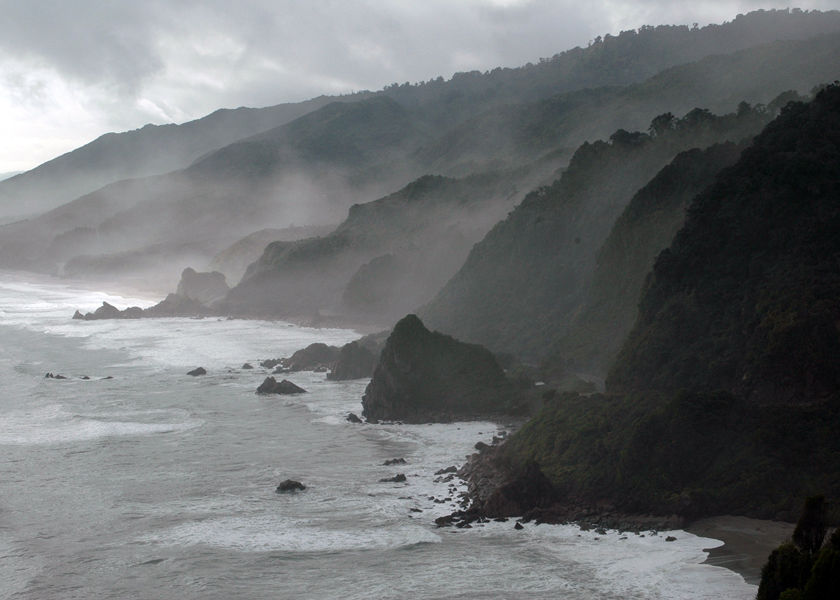

### 04-02 加/减法运算（亮度增强/减少）

我们讨论的第一个操作是简单的加减运算。这会导致图像的亮度增加或减少，因为我们最终会以相同的量增加或减少每个像素的强度值。因此这将导致全局亮度增加/减少。

```python
matrix = np.ones(img_rgb.shape, dtype="uint8") * 50
img_rgb_brighter = cv2.add(img_rgb, matrix)
img_rgb_darker   = cv2.subtract(img_rgb, matrix)

plt.figure(figsize=[18, 5])
plt.subplot(131); plt.imshow(img_rgb_darker);  plt.title("Darker");
plt.subplot(132); plt.imshow(img_rgb);         plt.title("Original");
plt.subplot(133); plt.imshow(img_rgb_brighter);plt.title("Brighter");
```

 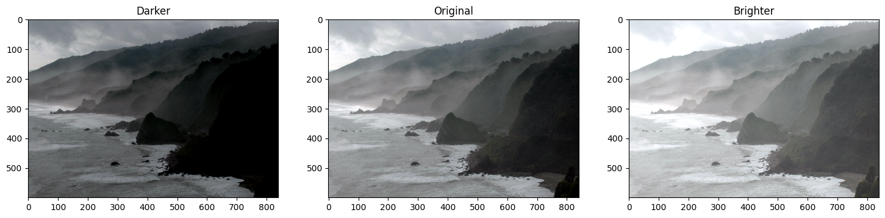

### 04-03 乘法运算（对比度增强）

就像加法可以导致亮度变化一样，乘法可以用来提高图像的对比度。对比度是图像像素强度值的差异。将强度值乘以常数可以使差异变大（如果乘法因子 >1 ）或变小（如果乘法因子 < 1 ）。

```python
matrix1 = np.ones(img_rgb.shape) * 0.8
matrix2 = np.ones(img_rgb.shape) * 1.2
img_rgb_darker   = np.uint8(cv2.multiply(np.float64(img_rgb), matrix1))
img_rgb_brighter = np.uint8(cv2.multiply(np.float64(img_rgb), matrix2))
plt.figure(figsize=[18,5])
plt.subplot(131); plt.imshow(img_rgb_darker);  plt.title("Lower Contrast");
plt.subplot(132); plt.imshow(img_rgb);         plt.title("Original");
plt.subplot(133); plt.imshow(img_rgb_brighter);plt.title("Higher Contrast");
```

 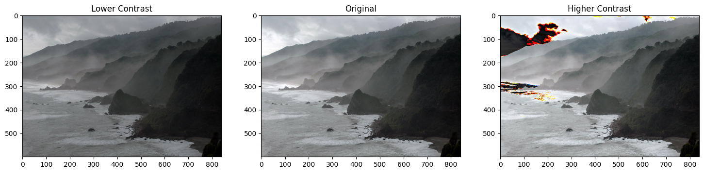

#### 发生了什么？

你能看到相乘后图像某些区域的奇怪颜色吗？问题在于，相乘后，本来就很高的值变得大于 255。因此，出现了溢出问题。我们如何克服这个问题？

#### 使用 `np.clip()函数` 处理溢出

```python
matrix1 = np.ones(img_rgb.shape) * 0.8
matrix2 = np.ones(img_rgb.shape) * 1.2

img_rgb_lower  = np.uint8(cv2.multiply(np.float64(img_rgb), matrix1))
# 下面使用np.clip()
img_rgb_higher = np.uint8(np.clip(cv2.multiply(np.float64(img_rgb), matrix2), 0, 255))
plt.figure(figsize=[18,5])
plt.subplot(131); plt.imshow(img_rgb_lower); plt.title("Lower Contrast");
plt.subplot(132); plt.imshow(img_rgb);       plt.title("Original");
plt.subplot(133); plt.imshow(img_rgb_higher);plt.title("Higher Contrast");
```

 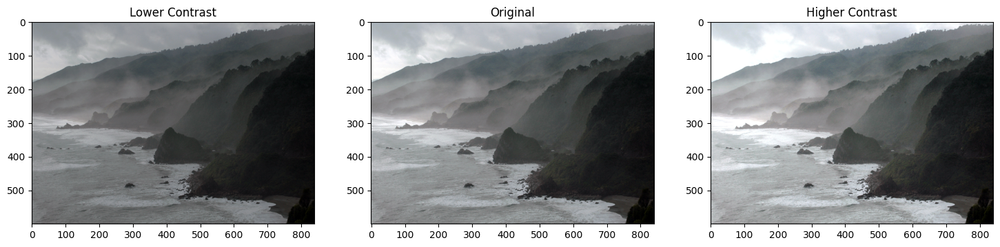

### 04-04 图像阈值处理

二进制图像在图像处理中有很多用例。最常见的用例之一是创建蒙版（边缘）。图像蒙版允许我们处理图像的特定部分，保持其他部分完好无损。图像阈值用于从灰度图像创建二进制图像。您可以使用不同的阈值从同一原始图像创建不同的二值图像。

#### `cv2.threshold()`函数语法

`retval, dst = cv2.threshold( src, thresh, maxval, type[, dst] )`

`dst`：与 `src` 大小、类型相同、通道数相同的输出数组。

该函数有 4 个必需参数：

1. `src`：输入数组（多通道，8位或32位浮点）。
2. 阈值：阈值。
3.  `maxval`：与 `THRESH_BINARY` 和 `THRESH_BINARY_INV `阈值类型一起使用的最大值。
4.  `type`：阈值类型（参见 `ThresholdTypes`）。

#### `cv.adaptiveThreshold()`函数语法

`dst = cv.adaptiveThreshold（src，maxValue，adaptiveMethod，thresholdType，blockSize，C [，dst]）`

`dst` 与 `src` 大小相同、类型相同的目标图像。

该函数有 6 个必需参数：

1.  `src`：源 8 位单通道图像。
2.   `maxValue`：分配给满足条件的像素的非零值
3.  `AdaptiveMethod`：要使用的自适应阈值算法，请参阅 `AdaptiveThresholdTypes`。 `BORDER_REPLICATE | BORDER_REPLICATE | BORDER_ISOLATED `用于处理边界。
4.  `ThresholdType`：阈值类型，必须是 `THRESH_BINARY` 或 `THRESH_BINARY_INV`，请参阅 `ThresholdTypes`。
5.  `blockSize`：用于计算像素阈值的像素邻域的大小：3、5、7 等。
6.  `C`：从平均值或加权平均值中减去常数（参见下面的详细信息）。通常，它是正值，但也可能为零或负值。

```python
img_read = cv2.imread("building-windows.jpg", cv2.IMREAD_GRAYSCALE)
retval, img_thresh = cv2.threshold(img_read, 100, 255, cv2.THRESH_BINARY)
plt.figure(figsize=[18, 5])
plt.subplot(121);plt.imshow(img_read, cmap="gray");  plt.title("Original")
plt.subplot(122);plt.imshow(img_thresh, cmap="gray");plt.title("Thresholded")
print(img_thresh.shape) #(572, 800)
```

 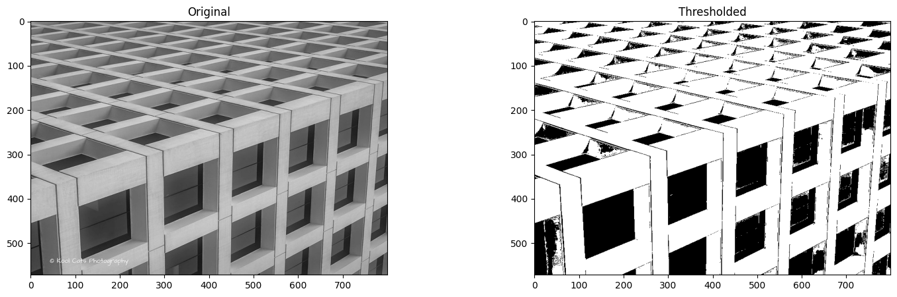

### 04-05 应用：乐谱阅读器

假设您想要构建一个可以读取（解码）乐谱的应用程序。这类似于文本文档的光学字符识别 (OCR)，其目标是识别文本字符。在任一应用程序中，处理管道中的第一步都是隔离文档图像中的重要信息（将其与背景分离）。该任务可以通过阈值技术来完成。让我们看一个例子。

```python
# Read the original image
img_read = cv2.imread("Piano_Sheet_Music.png", cv2.IMREAD_GRAYSCALE)
# Perform global thresholding
retval, img_thresh_gbl_1 = cv2.threshold(img_read, 50, 255, cv2.THRESH_BINARY)
# Perform global thresholding
retval, img_thresh_gbl_2 = cv2.threshold(img_read, 130, 255, cv2.THRESH_BINARY)
# Perform adaptive thresholding 自适应阈值处理！
img_thresh_adp = cv2.adaptiveThreshold(img_read, 255, cv2.ADAPTIVE_THRESH_MEAN_C, cv2.THRESH_BINARY, 11, 7)
# Show the images
plt.figure(figsize=[18,15])
plt.subplot(221); plt.imshow(img_read,        cmap="gray");  plt.title("Original");
plt.subplot(222); plt.imshow(img_thresh_gbl_1,cmap="gray");  plt.title("Thresholded (global: 50)");
plt.subplot(223); plt.imshow(img_thresh_gbl_2,cmap="gray");  plt.title("Thresholded (global: 130)");
plt.subplot(224); plt.imshow(img_thresh_adp,  cmap="gray");  plt.title("Thresholded (adaptive)");
```

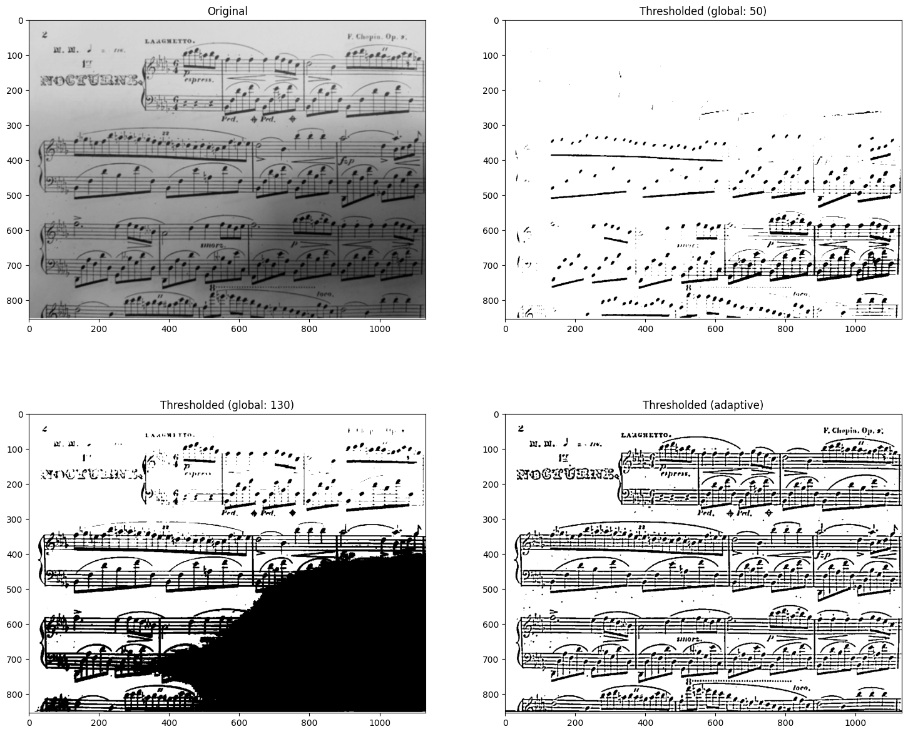

### 04-06 按位运算

函数语法

`cv2.bitwise_and()` 的示例 `API`。其他包括：`cv2.bitwise_or()`、`cv2.bitwise_xor()`、`cv2.bitwise_not()`

`dst = cv2.bitwise_and( src1, src2[, dst[, 掩码]] )`

`dst：与输入数组具有相同大小和类型的输出数组。`

该函数有 2 个必需参数：

1. `src1`：第一个输入数组或标量。
2.   `src2`：第二个输入数组或标量。

一个重要的可选参数是：

    1. `mask`：可选操作掩码，8位单通道数组，指定要更改的输出数组的元素。

先读两张图片：

```python
img_rec = cv2.imread("rectangle.jpg", cv2.IMREAD_GRAYSCALE)
img_cir = cv2.imread("circle.jpg", cv2.IMREAD_GRAYSCALE)
plt.figure(figsize=[20, 5])
plt.subplot(121);plt.imshow(img_rec, cmap="gray")
plt.subplot(122);plt.imshow(img_cir, cmap="gray")
print(img_rec.shape)
```

 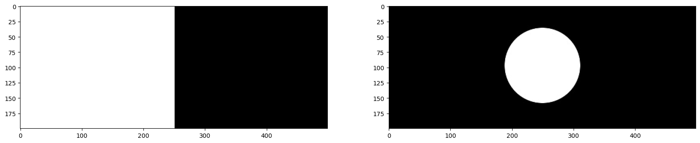

#### `AND`运算

```python
result = cv2.bitwise_and(img_rec, img_cir, mask=None)
plt.imshow(result, cmap="gray")
```

 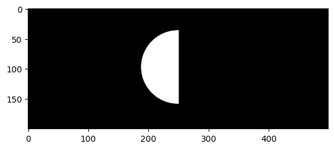

#### `OR`运算

```python
result = cv2.bitwise_or(img_rec, img_cir, mask=None)
plt.imshow(result, cmap="gray")
```

 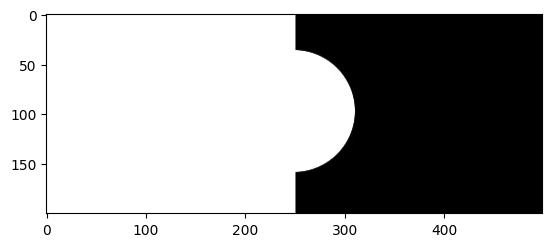

#### `XOR`运算

```python
result = cv2.bitwise_xor(img_rec, img_cir, mask=None)
plt.imshow(result, cmap="gray")
```

 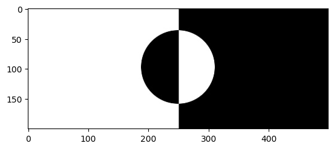

### 04-07 应用：商标处理

下面展示如何使用背景图像填充下面可口可乐徽标的白色字体。

`Image(filename='Logo_Manipulation.png')`

 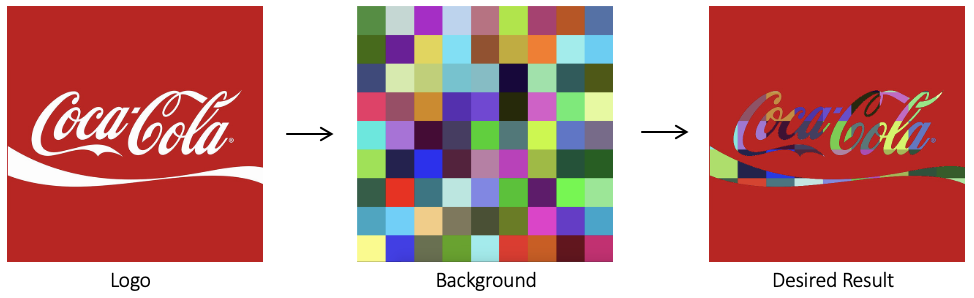

#### 读取前景图

```python
img_bgr = cv2.imread("coca-cola-logo.png")
img_rgb = cv2.cvtColor(img_bgr, cv2.COLOR_BGR2RGB)
plt.imshow(img_rgb)
print(img_rgb.shape)
logo_w = img_rgb.shape[0]
logo_h = img_rgb.shape[1]
```

 

#### 读取背景图

```python
# Read in image of color cheackerboad background
img_background_bgr = cv2.imread("checkerboard_color.png")
img_background_rgb = cv2.cvtColor(img_background_bgr, cv2.COLOR_BGR2RGB)
# Set desired width (logo_w) and maintain image aspect ratio
aspect_ratio = logo_w / img_background_rgb.shape[1]
dim = (logo_w, int(img_background_rgb.shape[0] * aspect_ratio))
# Resize background image to sae size as logo image
img_background_rgb = cv2.resize(img_background_rgb, dim, interpolation=cv2.INTER_AREA)
plt.imshow(img_background_rgb)
print(img_background_rgb.shape)

```

 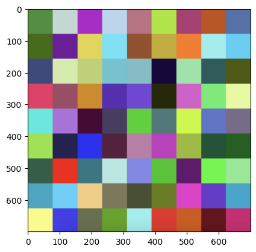

#### 为原始图像创建蒙版

```python
img_gray = cv2.cvtColor(img_rgb, cv2.COLOR_RGB2GRAY)
# Apply global thresholding to creat a binary mask of the logo
retval, img_mask = cv2.threshold(img_gray, 127, 255, cv2.THRESH_BINARY)
plt.imshow(img_mask, cmap="gray")
print(img_mask.shape)
```

 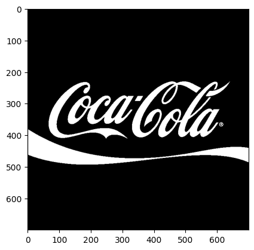

#### 反转蒙版

```python
# Create an inverse mask
img_mask_inv = cv2.bitwise_not(img_mask)
plt.imshow(img_mask_inv, cmap="gray")
```

 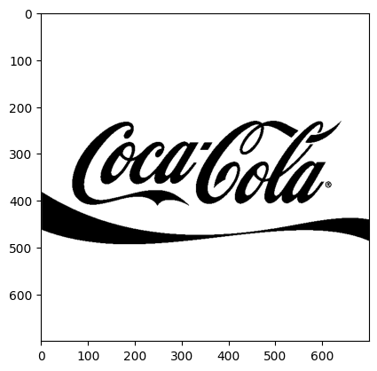

#### 在蒙版上应用背景

```python
# Create colorful background "behind" the logo lettering
img_background = cv2.bitwise_and(img_background_rgb, img_background_rgb, mask=img_mask)
plt.imshow(img_background)
```

 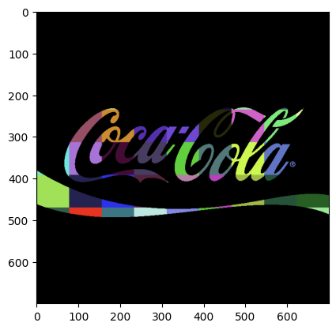

#### 将前景与图像隔离

```python
# Isolate foreground (red from original image) using the inverse mask
img_foreground = cv2.bitwise_and(img_rgb, img_rgb, mask=img_mask_inv)
plt.imshow(img_foreground)
```

 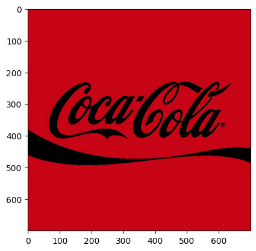

#### 结果：合并前景和背景

```python
# Add the two previous results obtain the final result
result = cv2.add(img_background, img_foreground)
plt.imshow(result)
cv2.imwrite("logo_final.png", result[:, :, ::-1])
```

  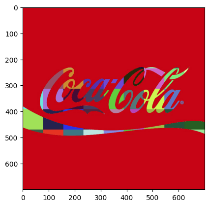

## 05 访问相机

```python
import cv2
import sys

s = 0
if len(sys.argv) > 1:
    s = sys.argv[1]

source = cv2.VideoCapture(s)

win_name = 'Camera Preview'
cv2.namedWindow(win_name, cv2.WINDOW_NORMAL)

while cv2.waitKey(1) != 27: # Escape
    has_frame, frame = source.read()
    if not has_frame:
        break
    cv2.imshow(win_name, frame)

source.release()
cv2.destroyWindow(win_name)
```

 ### 执行代码

```python
conda activate opencv-env
python3 05_accessing_the_camera.py
```

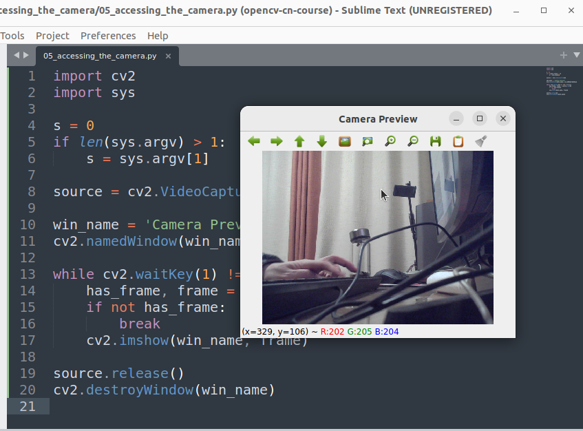

## 06 视频写入

### 06-00 使用 `OpenCV` 写入视频

在构建应用程序时，保存工作的视频演示效果变得很重要，而且许多应用程序本身可能需要保存视频剪辑。例如，在监控应用程序中，您可能必须在看到异常情况时立即保存视频剪辑。下文我们将描述如何使用 `openCV` 将视频保存为 `avi` 和 `mp4` 格式。

### 06-01 下载物料

```python
import os
import cv2
import matplotlib.pyplot as plt
from zipfile import ZipFile
from urllib.request import urlretrieve
from IPython.display import YouTubeVideo, display, HTML
from base64 import b64encode
def download_and_unzip(url, save_path):
    print(f"Downloading and extracting assests....", end="")
    urlretrieve(url, save_path)
    try:
        with ZipFile(save_path) as z:
            z.extractall(os.path.split(save_path)[0])
        print("Done")
    except Exception as e:
        print("\nInvalid file.", e)

URL = r"https://www.dropbox.com/s/p8h7ckeo2dn1jtz/opencv_bootcamp_assets_NB6.zip?dl=1"
asset_zip_path = os.path.join(os.getcwd(), f"opencv_bootcamp_assets_NB6.zip")
if not os.path.exists(asset_zip_path):
    download_and_unzip(URL, asset_zip_path) 
```

### 06-02 从源读取视频

```python
source = 'race_car.mp4'  # source = 0 for webcam
cap = cv2.VideoCapture(source)
if not cap.isOpened():
    print("Error opening video stream or file")
```

#### 06-02-01 读取并显示视频的一帧

```python
ret, frame = cap.read()
plt.imshow(frame[..., ::-1])
```

#### 06-02-03 显示整个视频文件

```python
video = YouTubeVideo("RwxVEjv78LQ", width=700, height=438)
display(video)
```

<iframe width="700" height="438" src="https://www.youtube.com/embed/2Gju7YLfkP0" title="Opencv Bootcamp NB06 race car out x264" frameborder="0" allow="accelerometer; autoplay; clipboard-write; encrypted-media; gyroscope; picture-in-picture; web-share" allowfullscreen></iframe>

### 06-03 使用`OpenCV`写入视频

为了写入视频，您需要创建一个具有正确参数的视频编写器对象。函数语法如下：

`VideoWriter object = cv.VideoWriter(filename, fourcc, fps, frameSize )`

其中，参数如下：

1. 文件名：输出视频文件的名称。
2. `fourcc`：用于压缩帧的编解码器的 4 字符代码。例如，`VideoWriter::fourcc('P','I','M','1') `是  `MPEG-1` 编解码器，`VideoWriter::fourcc('M','J','P','G ')` 是一个 `Motion-jpeg`  编解码器等。代码列表可以在 `Video Codecs by FOURCC` 页面获取。带有 `MP4` 容器的 `FFMPEG` 后端本机使用其他值作为  `fourcc` 代码：请参阅 `ObjectType`，因此您可能会收到来自 `OpenCV` 的有关 `fourcc` 代码转换的警告消息。
3. `fps`：创建的视频流的帧速率。
4. 帧大小：视频帧的大小。

```python
# Default resolutions of the frame are obtained.
# Convert the resolutions from float to integer.
frame_width = int(cap.get(3))
frame_height = int(cap.get(4))
# Define the codec and create VideoWriter object.
out_avi = cv2.VideoWriter("race_car_out.avi", cv2.VideoWriter_fourcc("M", "J", "P", "G"), 10, (frame_width, frame_height))
out_mp4 = cv2.VideoWriter("race_car_out.mp4", cv2.VideoWriter_fourcc(*"XVID"), 10, (frame_width, frame_height))
```

#### 06-03-01 读取帧并写入文件

我们将从赛车视频中读取帧并将其写入到我们在上一步中创建的两个对象中。最后我们应该在任务完成后释放对象。

```python
# Read until video is completed
while cap.isOpened():
    # Capture frame-by-frame
    ret, frame = cap.read()

    if ret:
        # Write the frame to the output files
        out_avi.write(frame)
        out_mp4.write(frame)

    # Break the loop
    else:
        break
        
# When everything done, release the VideoCapture and VideoWriter objects
cap.release()
out_avi.release()
out_mp4.release()

```

为了在 `Google Colab` 上显示视频，我们将安装并使用 `ffmpeg` 包。使用 `ffmpeg`，我们将 `.mp4` 文件的编码从` XVID` 更改为 `H264`

`HTML 5` 可以正确渲染 `H264 `编码的视频，而 `OpenCV` 还没有该编码。这就是为什么我们需要更改它们的编码以便可以渲染它们。目前，`HTML5` 仅支持 `MP4` 文件的重新渲染，因此我们仅更改 `race_car_out.mp4` 文件的编码。

```shell
# Installing ffmpeg
!apt-get -qq install ffmpeg 
# Change video encoding of mp4 file from XVID to h264 
!ffmpeg -y -i "/content/race_car_out.mp4" -c:v libx264 "race_car_out_x264.mp4"  -hide_banner -loglevel error
```

处理完后渲染视频

```python
mp4 = open("/content/race_car_out_x264.mp4", "rb").read()
data_url = "data:video/mp4;base64," + b64encode(mp4).decode()
HTML(f"""<video width=700 controls><source src="{data_url}" type="video/mp4"></video>""")
```

<video src="06_video_writing/race_car.mp4" />


## 07 图像过滤（边缘检测）

```python
import cv2
import sys
import numpy

PREVIEW  = 0  # Preview Mode
BLUR     = 1  # Blurring Filter
FEATURES = 2  # Corner Feature Detector
CANNY    = 3  # Canny Edge Detector

feature_params = dict(maxCorners=500, qualityLevel=0.2, minDistance=15, blockSize=9)
s = 0
if len(sys.argv) > 1:
    s = sys.argv[1]

image_filter = PREVIEW
alive = True

win_name = "Camera Filters"
cv2.namedWindow(win_name, cv2.WINDOW_NORMAL)
result = None

source = cv2.VideoCapture(s)

while alive:
    has_frame, frame = source.read()
    if not has_frame:
        break

    frame = cv2.flip(frame, 1)

    if image_filter == PREVIEW:
        result = frame
    elif image_filter == CANNY:
        result = cv2.Canny(frame, 80, 150)
    elif image_filter == BLUR:
        result = cv2.blur(frame, (13, 13))
    elif image_filter == FEATURES:
        result = frame
        frame_gray = cv2.cvtColor(frame, cv2.COLOR_BGR2GRAY)
        corners = cv2.goodFeaturesToTrack(frame_gray, **feature_params)
        if corners is not None:
            for x, y in numpy.float32(corners).reshape(-1, 2):
                cv2.circle(result, (x, y), 10, (0, 255, 0), 1)

    cv2.imshow(win_name, result)

    key = cv2.waitKey(1)
    if key == ord("Q") or key == ord("q") or key == 27:
        alive = False
    elif key == ord("C") or key == ord("c"):
        image_filter = CANNY
    elif key == ord("B") or key == ord("b"):
        image_filter = BLUR
    elif key == ord("F") or key == ord("f"):
        image_filter = FEATURES
    elif key == ord("P") or key == ord("p"):
        image_filter = PREVIEW

source.release()
cv2.destroyWindow(win_name)
```

<video src="07_image_filter_edge_detection/3.webm" type="video/webm" />

## 08 图像对齐

### 08-01 什么是图像对齐？

将图像与模板对齐。（全能扫描王？）

 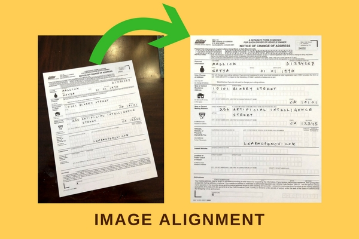

#### 理论知识

1. `Homography`（单应性）单应性是两个平面之间的投影变换，或者是图像的两个平面投影之间的映射。换句话说，单应性是简单的图像变换，描述当相机（或观察到的物体）移动时两个图像之间的相对运动。
2. `opencvd`中单应性将正方形变换为任意四边形。

 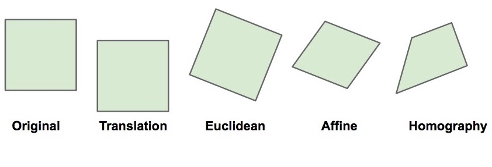

3. 两个平面的图像通过单应性相对应关联
4. 我们需要 4 个对应点的坐标来评估单应性

 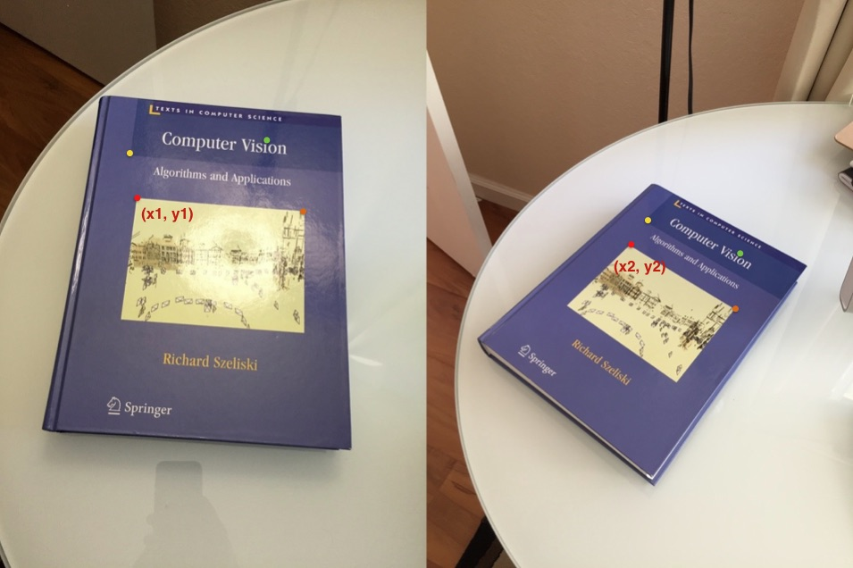

### 08-02 准备物料

```python
import os
import cv2
import numpy as np
import matplotlib.pyplot as plt
from zipfile import ZipFile
from urllib.request import urlretrieve
def download_and_unzip(url, save_path):
    print(f"Downloading and extracting assests....", end="")
    urlretrieve(url, save_path)
    try:
        with ZipFile(save_path) as z:
            z.extractall(os.path.split(save_path)[0])
        print("Done")
    except Exception as e:
        print("\nInvalid file.", e)
URL = r"https://www.dropbox.com/s/zuwnn6rqe0f4zgh/opencv_bootcamp_assets_NB8.zip?dl=1"
asset_zip_path = os.path.join(os.getcwd(), f"opencv_bootcamp_assets_NB8.zip")
if not os.path.exists(asset_zip_path):
    download_and_unzip(URL, asset_zip_path)
```

### 08-03 图像对齐步骤

#### 08-03-01 第一步：读取模板和扫描图像

```python
# Read reference image
refFilename = "form.jpg"
print("Reading reference image:", refFilename)
im1 = cv2.imread(refFilename, cv2.IMREAD_COLOR)
im1 = cv2.cvtColor(im1, cv2.COLOR_BGR2RGB)

# Read image to be aligned
imFilename = "scanned-form.jpg"
print("Reading image to align:", imFilename)
im2 = cv2.imread(imFilename, cv2.IMREAD_COLOR)
im2 = cv2.cvtColor(im2, cv2.COLOR_BGR2RGB)
```

```
Reading reference image: form.jpg
Reading image to align: scanned-form.jpg
```

```python
# Display Images

plt.figure(figsize=[20, 10]); 
plt.subplot(121); plt.axis('off'); plt.imshow(im1); plt.title("Original Form")
plt.subplot(122); plt.axis('off'); plt.imshow(im2); plt.title("Scanned Form")
```

 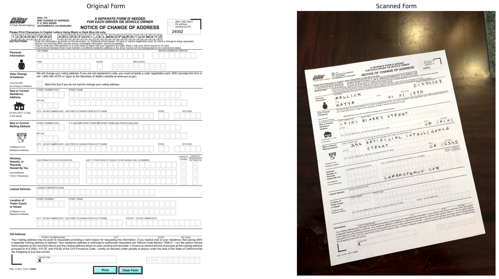

#### 08-03-02 第二步：找到两张图像关键点

将关键点视为角点 ，这些点在图像变换下是稳定的

```python
# Convert images to grayscale
im1_gray = cv2.cvtColor(im1, cv2.COLOR_BGR2GRAY)
im2_gray = cv2.cvtColor(im2, cv2.COLOR_BGR2GRAY)
# Detect ORB features and compute descriptors.
MAX_NUM_FEATURES = 500
orb = cv2.ORB_create(MAX_NUM_FEATURES)
keypoints1, descriptors1 = orb.detectAndCompute(im1_gray, None)
keypoints2, descriptors2 = orb.detectAndCompute(im2_gray, None)
# Display
im1_display = cv2.drawKeypoints(im1, keypoints1, outImage=np.array([]), 
                                color=(255, 0, 0), flags=cv2.DRAW_MATCHES_FLAGS_DRAW_RICH_KEYPOINTS)
im2_display = cv2.drawKeypoints(im2, keypoints2, outImage=np.array([]), 
                                color=(255, 0, 0), flags=cv2.DRAW_MATCHES_FLAGS_DRAW_RICH_KEYPOINTS)
```

```python
plt.figure(figsize=[20,10])
plt.subplot(121); plt.axis('off'); plt.imshow(im1_display); plt.title("Original Form");
plt.subplot(122); plt.axis('off'); plt.imshow(im2_display); plt.title("Scanned Form");
```

 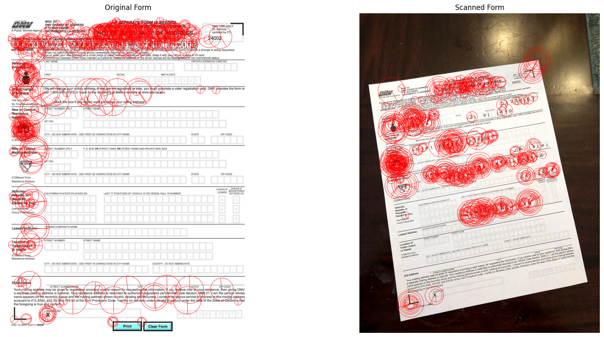

#### 08-03-03 第三步：匹配两幅图像中的关键点

```python
# Match features.
matcher = cv2.DescriptorMatcher_create(cv2.DESCRIPTOR_MATCHER_BRUTEFORCE_HAMMING)
# Converting to list for sorting as tuples are immutable objects.
matches = list(matcher.match(descriptors1, descriptors2, None))
# Sort matches by score
matches.sort(key=lambda x: x.distance, reverse=False)
# Remove not so good matches
numGoodMatches = int(len(matches) * 0.1)
matches = matches[:numGoodMatches]
```

```python
# Draw top matches
im_matches = cv2.drawMatches(im1, keypoints1, im2, keypoints2, matches, None)

plt.figure(figsize=[40, 10])
plt.imshow(im_matches);plt.axis("off");plt.title("Original Form")
```

 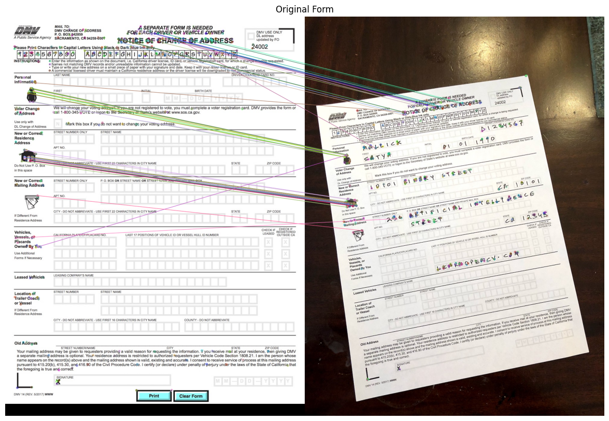

#### 08-03-04 第四步：查找单应性

```python
# Extract location of good matches
points1 = np.zeros((len(matches), 2), dtype=np.float32)
points2 = np.zeros((len(matches), 2), dtype=np.float32)
for i, match in enumerate(matches):
    points1[i, :] = keypoints1[match.queryIdx].pt
    points2[i, :] = keypoints2[match.trainIdx].pt
# Find homography
h, mask = cv2.findHomography(points2, points1, cv2.RANSAC)
```

#### 08-03-05 第五步：扭曲图像

```python
# Use homography to warp image
height, width, channels = im1.shape
im2_reg = cv2.warpPerspective(im2, h, (width, height))

# Display results
plt.figure(figsize=[20, 10])
plt.subplot(121);plt.imshow(im1);    plt.axis("off");plt.title("Original Form")
plt.subplot(122);plt.imshow(im2_reg);plt.axis("off");plt.title("Scanned Form")
#Text(0.5, 1.0, 'Scanned Form')
```

 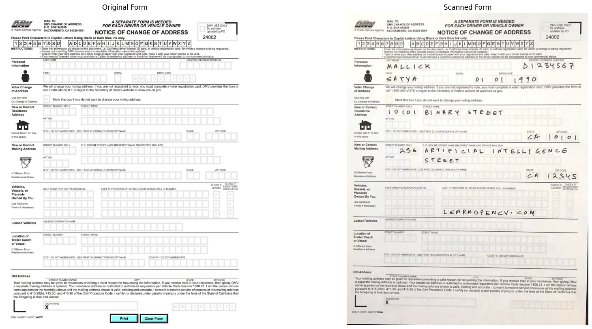

## 09 图像拼接（全景图像）

### 09-01 使用opencv创建全景图像

关键词：Panorama 全景，image stitching 图像拼接

### 09-02 准备物料

```python
import os
import cv2
import math
import glob
import numpy as np
import matplotlib.pyplot as plt
from zipfile import ZipFile
from urllib.request import urlretrieve
def download_and_unzip(url, save_path):
    print(f"Downloading and extracting assests....", end="")
    urlretrieve(url, save_path)
    try:
        with ZipFile(save_path) as z:
            z.extractall(os.path.split(save_path)[0])
        print("Done")

    except Exception as e:
        print("\nInvalid file.", e)
URL = r"https://www.dropbox.com/s/0o5yqql1ynx31bi/opencv_bootcamp_assets_NB9.zip?dl=1"
asset_zip_path = os.path.join(os.getcwd(), f"opencv_bootcamp_assets_NB9.zip")
if not os.path.exists(asset_zip_path):
    download_and_unzip(URL, asset_zip_path)  
```

### 09-03 创建全景步骤

1. 找到所有图像中的关键点
2. 查找成对对应关系
3. 评估（计算）成对单应性
4. 精炼同应性
5. 混合拼接

```python
# Read Images
imagefiles = glob.glob(f"boat{os.sep}*")
imagefiles.sort()

images = []
for filename in imagefiles:
    img = cv2.imread(filename)
    img = cv2.cvtColor(img, cv2.COLOR_BGR2RGB)
    images.append(img)

num_images = len(images)
# Display Images
plt.figure(figsize=[30, 10])
num_cols = 3
num_rows = math.ceil(num_images / num_cols)
for i in range(0, num_images):
    plt.subplot(num_rows, num_cols, i + 1)
    plt.axis("off")
    plt.imshow(images[i])
```

 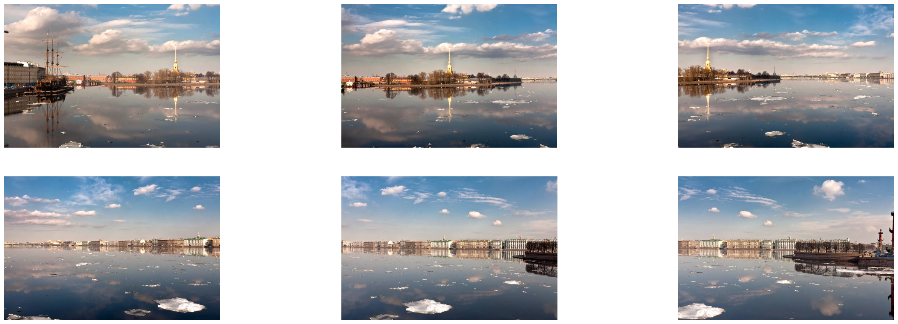

```python
# Stitch Images
stitcher = cv2.Stitcher_create()
status, result = stitcher.stitch(images)

if status == 0:
    plt.figure(figsize=[30, 10])
    plt.imshow(result)
```

 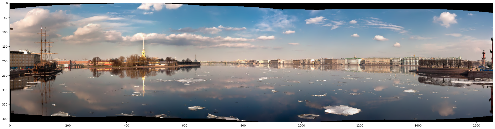

## 10 图像曝光

高动态范围成像（英语：High Dynamic Range Imaging，[简称](https://baike.baidu.com/item/简称/10492947?fromModule=lemma_inlink)HDRI或HDR），在[计算机图形学](https://baike.baidu.com/item/计算机图形学/279486?fromModule=lemma_inlink)与[电影](https://baike.baidu.com/item/电影/31689?fromModule=lemma_inlink)[摄影术](https://baike.baidu.com/item/摄影术/8809259?fromModule=lemma_inlink)中，是用来实现比普通数位图像技术更大`曝光`[动态范围](https://baike.baidu.com/item/动态范围/6327032?fromModule=lemma_inlink)（即更大的明暗差别）的一组技术。高动态范围成像的目的就是要正确地表示真实世界中从太阳光直射到最暗的阴影这样大的范围亮度。

 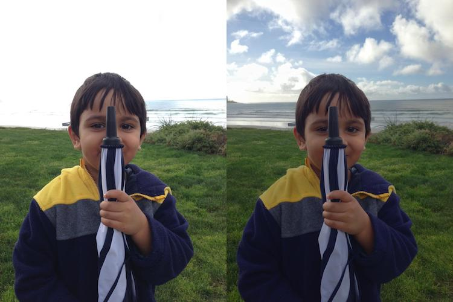

### 10-01 准备物料

```python
# Import Libraries
import os
import cv2
import numpy as np
import matplotlib.pyplot as plt
from zipfile import ZipFile
from urllib.request import urlretrieve
def download_and_unzip(url, save_path):
    print(f"Downloading and extracting assests....", end="")
    urlretrieve(url, save_path)
    try:
        with ZipFile(save_path) as z:
            z.extractall(os.path.split(save_path)[0])
        print("Done")
    except Exception as e:
        print("\nInvalid file.", e)

URL = r"https://www.dropbox.com/s/qa1hsyxt66pvj02/opencv_bootcamp_assets_NB10.zip?dl=1"
asset_zip_path = os.path.join(os.getcwd(), f"opencv_bootcamp_assets_NB10.zip")
if not os.path.exists(asset_zip_path):
    download_and_unzip(URL, asset_zip_path)   
```

### 10-02 基本思想

1. 图像的动态范围限制为每通道 8 位 (0 - 255)
2. 非常亮的像素饱和至 255
3. 非常暗的像素最低为 0

### 10-03 步骤一：捕捉多重曝光 

 

```python
def readImagesAndTimes():
    # List of file names
    filenames = ["img_0.033.jpg", "img_0.25.jpg", "img_2.5.jpg", "img_15.jpg"]

    # List of exposure times
    times = np.array([1 / 30.0, 0.25, 2.5, 15.0], dtype=np.float32)

    # Read images
    images = []
    for filename in filenames:
        im = cv2.imread(filename)
        im = cv2.cvtColor(im, cv2.COLOR_BGR2RGB)
        images.append(im)

    return images, times
```

### 10-04 步骤二：对齐图像

 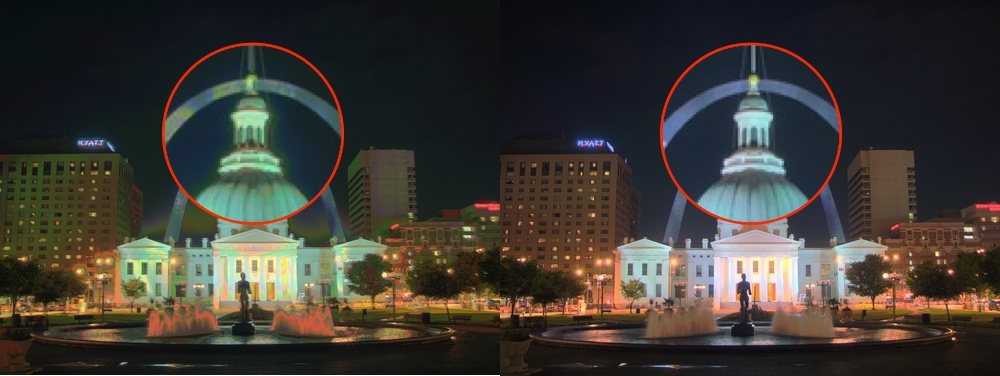

```python
# Read images and exposure times
images, times = readImagesAndTimes()

# Align Images
alignMTB = cv2.createAlignMTB()
alignMTB.process(images, images)
```

### 10-05 步骤三：构建相机响应函数

```python
# Find Camera Response Function (CRF)
calibrateDebevec = cv2.createCalibrateDebevec()
responseDebevec = calibrateDebevec.process(images, times)

# Plot CRF
x = np.arange(256, dtype=np.uint8)
y = np.squeeze(responseDebevec)

ax = plt.figure(figsize=(30, 10))
plt.title("Debevec Inverse Camera Response Function", fontsize=24)
plt.xlabel("Measured Pixel Value", fontsize=22)
plt.ylabel("Calibrated Intensity", fontsize=22)
plt.xlim([0, 260])
plt.grid()
plt.plot(x, y[:, 0], "r", x, y[:, 1], "g", x, y[:, 2], "b")
```

 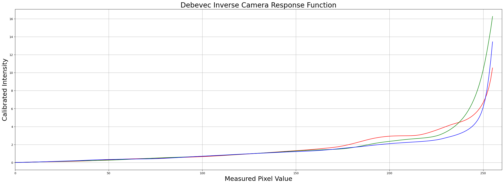

### 10-06 步骤四：将曝光合并到 HDR 图像中

```python
# Merge images into an HDR linear image
mergeDebevec = cv2.createMergeDebevec()
hdrDebevec = mergeDebevec.process(images, times, responseDebevec)
```

### 10-07 步骤五：色调映射

OpenCV 中提供了许多色调映射算法。我们选择 Durand 因为它有更多的自定义控制算法。

```python
# Tonemap using Drago's method to obtain 24-bit color image
tonemapDrago = cv2.createTonemapDrago(1.0, 0.7)
ldrDrago = tonemapDrago.process(hdrDebevec)
ldrDrago = 3 * ldrDrago

plt.figure(figsize=(20, 10));plt.imshow(np.clip(ldrDrago, 0, 1));plt.axis("off")

cv2.imwrite("ldr-Drago.jpg", ldrDrago * 255)
print("saved ldr-Drago.jpg")
```

#### Drago's method 

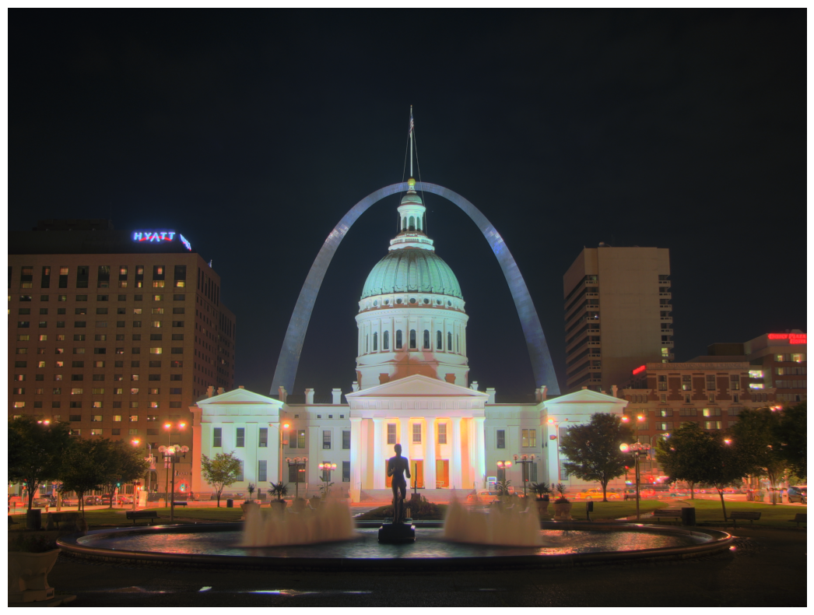

 #### Reinhard's method

```python
# Tonemap using Reinhard's method to obtain 24-bit color image
print("Tonemaping using Reinhard's method ... ")
tonemapReinhard = cv2.createTonemapReinhard(1.5, 0, 0, 0)
ldrReinhard = tonemapReinhard.process(hdrDebevec)

plt.figure(figsize=(20, 10));plt.imshow(np.clip(ldrReinhard, 0, 1));plt.axis("off")

cv2.imwrite("ldr-Reinhard.jpg", ldrReinhard * 255)
print("saved ldr-Reinhard.jpg")
```

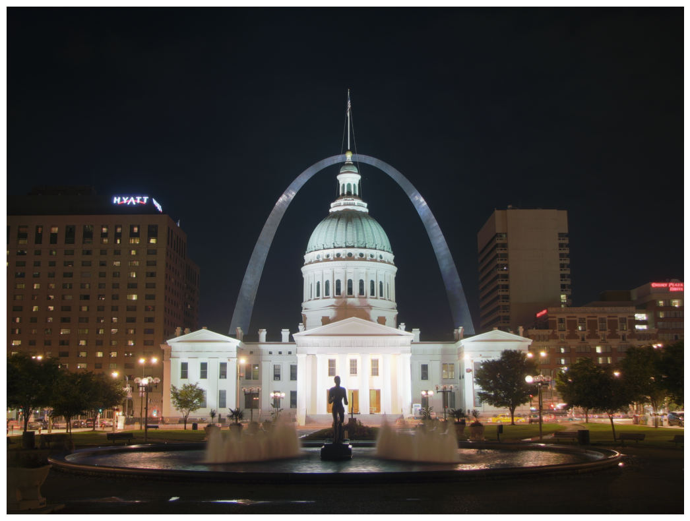

 #### Mantiuk's method

```python
# Tonemap using Mantiuk's method to obtain 24-bit color image
print("Tonemaping using Mantiuk's method ... ")
tonemapMantiuk = cv2.createTonemapMantiuk(2.2, 0.85, 1.2)
ldrMantiuk = tonemapMantiuk.process(hdrDebevec)
ldrMantiuk = 3 * ldrMantiuk

plt.figure(figsize=(20, 10));plt.imshow(np.clip(ldrMantiuk, 0, 1));plt.axis("off")

cv2.imwrite("ldr-Mantiuk.jpg", ldrMantiuk * 255)
print("saved ldr-Mantiuk.jpg")
```

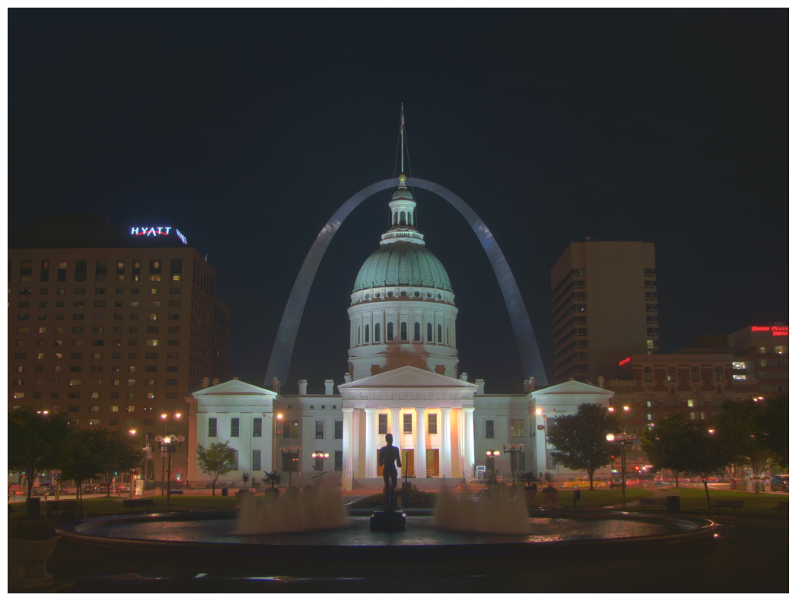

谢谢阅读！