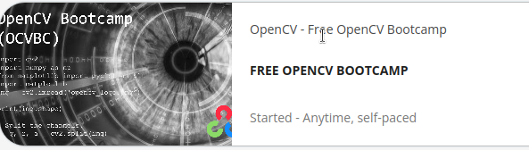
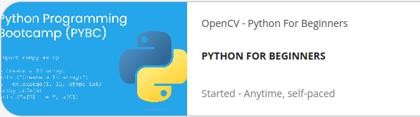
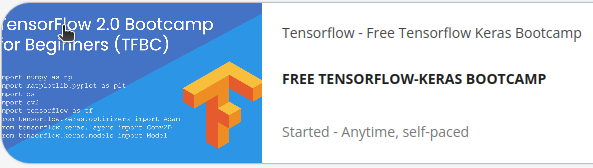
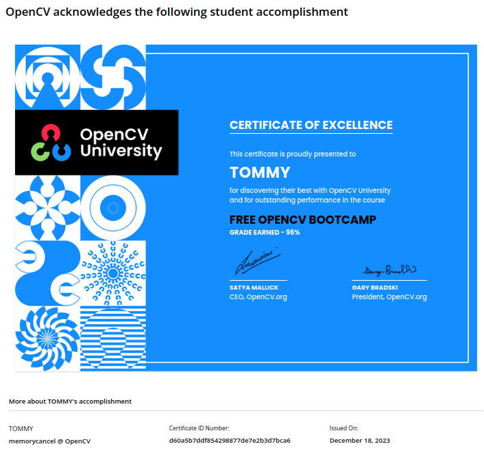
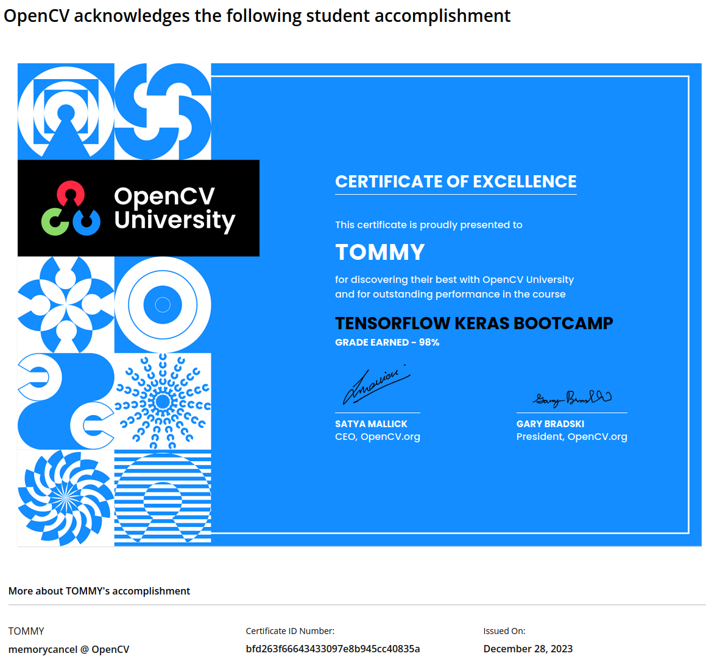

`OpenCV`是家喻户晓的计算机视觉元老级别库，应用于无数领域，本中文教程继承于免费官方教程。

原教程地址：[https://courses.opencv.org/](https://courses.opencv.org/)

| 教程                     | 教程和代码文件夹          | open |
| ------------------------ | ------------------------- | ---- |
| opencv入门训练营         | opencv-python-bootcamp    | free |
| python基础               | python-for-beginners      | free |
| tensorflow深度学习训练营 | tensorflow-keras-bootcamp | free |

 

 

 

 

 
