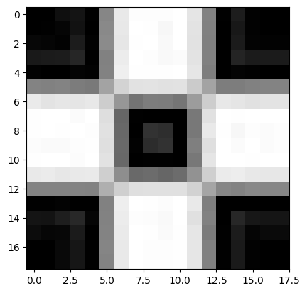
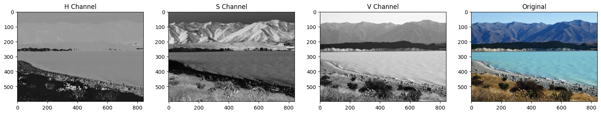
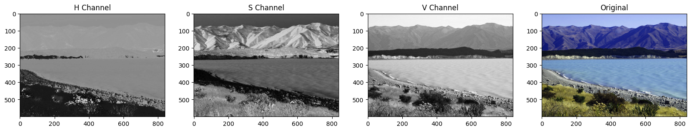
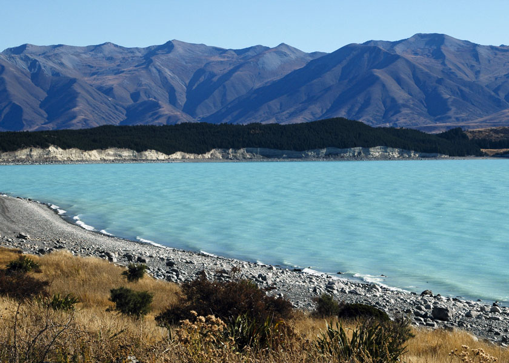
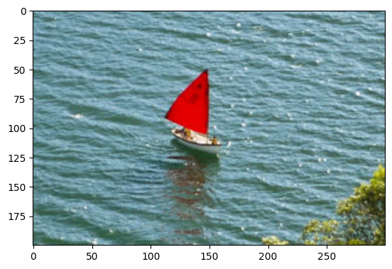
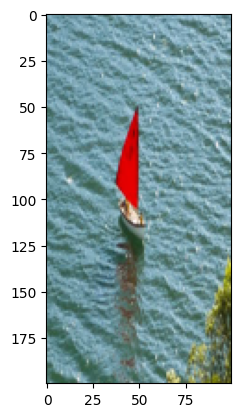
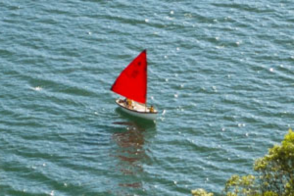
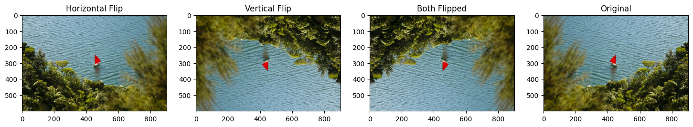
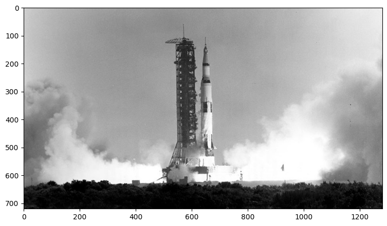
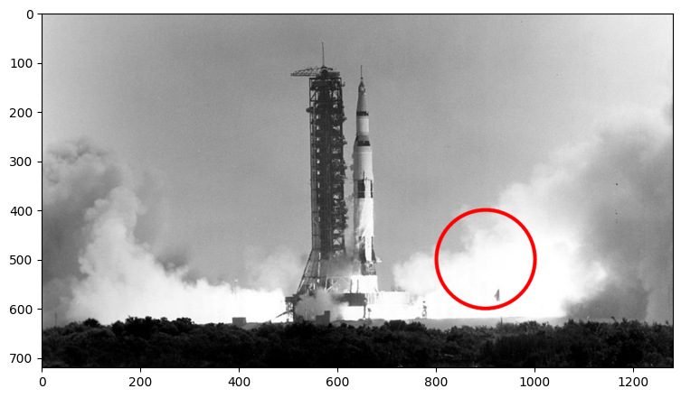

# `OpenCV` 课程

`OpenCV`是家喻户晓的计算机视觉元老级别库，应用于无数领域，下面浅学一下官方教程。

官方教程：https://courses.opencv.org

官方文档：https://docs.opencv.org

## 01 图像基本读写

代码见文件夹：`01_getting_started_with_images`

本笔记本将帮助您迈出使用 `OpenCV` 学习图像处理和计算机视觉的第一步。您将通过一些简单的示例学到以下内容：

+ 读取图像
+ 检查图像属性：数据类型和形状（大小）等
+ 使用 `Numpy` 库，将图像用矩阵表示
+ 彩色图像以及分割/合并图像通道
+ 使用 `matplotlib` 显示图像
+  保存图像

### 01-01 导入库（包括内库和外库）

```python
import os
import cv2
import numpy as np
import matplotlib.pyplot as plt

from zipfile import ZipFile
from urllib.request import urlretrieve

from IPython.display import Image
```

### 01-02 下载资料（图片和代码）

`download_and_unzip(...)`函数用于下载和提取笔记资源。

```python
def download_and_unzip(url, save_path):
    print(f"Downloading and extracting assests....", end="")

    # Downloading zip file using urllib package.
    urlretrieve(url, save_path)

    try:
        # Extracting zip file using the zipfile package.
        with ZipFile(save_path) as z:
            # Extract ZIP file contents in the same directory.
            z.extractall(os.path.split(save_path)[0])

        print("Done")

    except Exception as e:
        print("\nInvalid file.", e)

# 下载：
URL = r"https://www.dropbox.com/s/qhhlqcica1nvtaw/opencv_bootcamp_assets_NB1.zip?dl=1"

asset_zip_path = os.path.join(os.getcwd(), f"opencv_bootcamp_assets_NB1.zip")

# Download if assest ZIP does not exists. 
if not os.path.exists(asset_zip_path):
    download_and_unzip(URL, asset_zip_path) 
```

执行以上程序后会下载获得`opencv_bootcamp_assets_NB1.zip` 文件，其中还包含附加的 `display_image.py` python 脚本。

### 01-03 直接显示图片

我们将使用以下作为我们的示例图像。我们将使用 `ipython` 图像函数来加载和显示图像。

```python
# Display 18x18 pixel image.
Image(filename="checkerboard_18x18.png")
```

 

```python
# Display 84x84 pixel image.
Image(filename="checkerboard_84x84.jpg")
```

 

### 01-03 使用`OpenCV`读取图片

`OpenCV` 允许读取不同类型的图像（`JPG`、`PNG` 等）。您可以加载灰度图像、彩色图像，也可以加载带有 `Alpha` 通道的图像。它使用 `cv2.imread()` 函数，其语法如下：

#### retval = cv2.imread( 文件名[, 标志] )

`retval`：如果加载成功则为图片。否则就是`None`。如果文件名错误或文件已损坏，则可能会发生这种情况。

该函数有 1 个必需的输入参数和 1 个可选标志：

1. 文件名：这可以是绝对路径或相对路径。这是一个强制性的参数。
2. 标志：这些标志用于读取特定格式的图像（例如，灰度/彩色/带 Alpha 通道）。这是一个可选参数，默认值为 `cv2.IMREAD_COLOR` 或 `1`，它将图像加载为彩色图像。

在我们继续一些示例之前，让我们先看一下一些可用的标志:

1. `cv2.IMREAD_GRAYSCALE` 或 `0`：以灰度模式加载图像
2. `cv2.IMREAD_COLOR` 或 `1`：加载彩色图像。图像的任何透明度都将被忽略。这是默认标志。
3. `cv2.IMREAD_UNCHANGED` 或 `-1`： 以Alpha 通道模式加载图像。

```python
# Read image as gray scale.
cb_img = cv2.imread("checkerboard_18x18.png", 0)

# Print the image data (pixel values), element of a 2D numpy array.
# Each pixel value is 8-bits [0,255]
print(cb_img)
```

```shell
[[  0   0   0   0   0   0 255 255 255 255 255 255   0   0   0   0   0   0]
 [  0   0   0   0   0   0 255 255 255 255 255 255   0   0   0   0   0   0]
 [  0   0   0   0   0   0 255 255 255 255 255 255   0   0   0   0   0   0]
 [  0   0   0   0   0   0 255 255 255 255 255 255   0   0   0   0   0   0]
 [  0   0   0   0   0   0 255 255 255 255 255 255   0   0   0   0   0   0]
 [  0   0   0   0   0   0 255 255 255 255 255 255   0   0   0   0   0   0]
 [255 255 255 255 255 255   0   0   0   0   0   0 255 255 255 255 255 255]
 [255 255 255 255 255 255   0   0   0   0   0   0 255 255 255 255 255 255]
 [255 255 255 255 255 255   0   0   0   0   0   0 255 255 255 255 255 255]
 [255 255 255 255 255 255   0   0   0   0   0   0 255 255 255 255 255 255]
 [255 255 255 255 255 255   0   0   0   0   0   0 255 255 255 255 255 255]
 [255 255 255 255 255 255   0   0   0   0   0   0 255 255 255 255 255 255]
 [  0   0   0   0   0   0 255 255 255 255 255 255   0   0   0   0   0   0]
 [  0   0   0   0   0   0 255 255 255 255 255 255   0   0   0   0   0   0]
 [  0   0   0   0   0   0 255 255 255 255 255 255   0   0   0   0   0   0]
 [  0   0   0   0   0   0 255 255 255 255 255 255   0   0   0   0   0   0]
 [  0   0   0   0   0   0 255 255 255 255 255 255   0   0   0   0   0   0]
 [  0   0   0   0   0   0 255 255 255 255 255 255   0   0   0   0   0   0]]
```

### 01-04 显示图片属性

```python
# print the size  of image
print("Image size (H, W) is:", cb_img.shape)
# print data-type of image
print("Data type of image is:", cb_img.dtype)
```

```shell
Image size (H, W) is: (18, 18)
Data type of image is: uint8
```

### 01-05 使用`Matplotlib`显示灰度图片

```python
# Display image.
plt.imshow(cb_img)
# <matplotlib.image.AxesImage at 0x2dd1ffc36d0>
```

 

#### 发生了啥？

即使图像被读取为灰度图像，但在使用 `imshow()` 时，它不一定会以灰度显示。 `matplotlib` 使用不同的颜色映射模式，并且可能未设置灰度颜色映射模式。

```python
# 将颜色映射设置为灰度以便正确渲染。
plt.imshow(cb_img, cmap="gray")
```

 

#### 另外一个例子

```python
# 将图像读取为灰度模式
cb_img_fuzzy = cv2.imread("checkerboard_fuzzy_18x18.jpg", 0)
# print image
print(cb_img_fuzzy)
# Display image.
plt.imshow(cb_img_fuzzy, cmap="gray")
```

```shell
[[  0   0  15  20   1 134 233 253 253 253 255 229 130   1  29   2   0   0]
 [  0   1   5  18   0 137 232 255 254 247 255 228 129   0  24   2   0   0]
 [  7   5   2  28   2 139 230 254 255 249 255 226 128   0  27   3   2   2]
 [ 25  27  28  38   0 129 236 255 253 249 251 227 129   0  36  27  27  27]
 [  2   0   0   4   2 130 239 254 254 254 255 230 126   0   4   2   0   0]
 [132 129 131 124 121 163 211 226 227 225 226 203 164 125 125 129 131 131]
 [234 227 230 229 232 205 151 115 125 124 117 156 205 232 229 225 228 228]
 [254 255 255 251 255 222 102   1   0   0   0 120 225 255 254 255 255 255]
 [254 255 254 255 253 225 104   0  50  46   0 120 233 254 247 253 251 253]
 [252 250 250 253 254 223 105   2  45  50   0 127 223 255 251 255 251 253]
 [254 255 255 252 255 226 104   0   1   1   0 120 229 255 255 254 255 255]
 [233 235 231 233 234 207 142 106 108 102 108 146 207 235 237 232 231 231]
 [132 132 131 132 130 175 207 223 224 224 224 210 165 134 130 136 134 134]
 [  1   1   3   0   0 129 238 255 254 252 255 233 126   0   0   0   0   0]
 [ 20  19  30  40   5 130 236 253 252 249 255 224 129   0  39  23  21  21]
 [ 12   6   7  27   0 131 234 255 254 250 254 230 123   1  28   5  10  10]
 [  0   0   9  22   1 133 233 255 253 253 254 230 129   1  26   2   0   0]
 [  0   0   9  22   1 132 233 255 253 253 254 230 129   1  26   2   0   0]]
```

 

### 01-05 处理彩色图片

到目前为止，我们在讨论中一直使用灰度图像。现在让我们讨论彩色图像。

```python
# 读取可口可乐的LOGO
Image("coca-cola-logo.png")
```

 

### 01-06 读取和显示彩色图片

让我们读取彩色图像并检查参数。注意图像尺寸。

```python
# 读取图片，flag为1 表示彩色模式
coke_img = cv2.imread("coca-cola-logo.png", 1)
# 打印图像的大小
print("Image size (H, W, C) is:", coke_img.shape) # Image size (H, W, C) is: (700, 700, 3)
# 打印数据类型
print("Data type of image is:", coke_img.dtype) # Data type of image is: uint8
```

### 01-07 使用matplot显示彩色图片

```python
plt.imshow(coke_img)
```

 

#### 发生了啥？

上面显示的颜色与实际图像不同。这是因为 matplotlib 需要 `RGB` 格式的图像，而 OpenCV 以 `BGR` 格式存储图像。因此，为了正确显示，我们需要`反转`图像的通道。我们将在下面的部分中讨论`Channels`。

```python
coke_img_channels_reversed = coke_img[:, :, ::-1]
plt.imshow(coke_img_channels_reversed)
```

 

### 01-08 分割和合并颜色通道

+ `cv2.split()` 将一个多通道数组分成多个单通道数组。
+ `cv2.merge() `合并多个数组以形成单个多通道数组。所有输入矩阵必须具有相同的大小。

```python
# 将图像分割split成B、G、R分量
img_NZ_bgr = cv2.imread("New_Zealand_Lake.jpg", cv2.IMREAD_COLOR)
b, g, r = cv2.split(img_NZ_bgr)

# Show the channels
plt.figure(figsize=[20, 5])

plt.subplot(141);plt.imshow(r, cmap="gray");plt.title("Red Channel")
plt.subplot(142);plt.imshow(g, cmap="gray");plt.title("Green Channel")
plt.subplot(143);plt.imshow(b, cmap="gray");plt.title("Blue Channel")

# 将各个通道合并成 BGR 图像
imgMerged = cv2.merge((b, g, r))
# Show the merged output
plt.subplot(144)
plt.imshow(imgMerged[:, :, ::-1])
plt.title("Merged Output")
```

 

### 01-09 转换为不同的色彩空间 `BGR2RGB`

`cv2.cvtColor()` 将图像从一种颜色空间转换为另一种颜色空间。该函数将输入图像从一种颜色空间转换为另一种颜色空间。在进行 RGB  颜色空间转换时，应明确指定通道的顺序（`RGB` 或 `BGR`）。请注意，`OpenCV` 中的默认颜色格式通常称为 RGB，但实际上是  BGR（字节反转）。因此，`标准（24 位）`彩色图像中的第一个字节将是 8  位蓝色分量，第二个字节将是绿色，第三个字节将是红色。第四、第五和第六字节将是第二个像素（蓝色，然后是绿色，然后是红色），依此类推。

函数语法：

`dst = cv2.cvtColor( src, code )`

`dst`：是与`src`大小和深度相同的输出图像。

该函数有 2 个必需参数：

1. `src` 输入图像：8 位无符号、16 位无符号（`CV_16UC`...）或单精度浮点。
2. 代码颜色空间转换代码（请参阅 `ColorConversionCodes`）。

```python
# OpenCV 以与大多数其他应用程序不同,RGB需要进行翻转
img_NZ_rgb = cv2.cvtColor(img_NZ_bgr, cv2.COLOR_BGR2RGB)
plt.imshow(img_NZ_rgb)
```

 

### 01-10 转换成`BGR2HSV`色彩空间

```python
img_hsv = cv2.cvtColor(img_NZ_bgr, cv2.COLOR_BGR2HSV)
h,s,v = cv2.split(img_hsv)
# Show the channels
plt.figure(figsize=[20,5])
plt.subplot(141);plt.imshow(h, cmap="gray");plt.title("H Channel");
plt.subplot(142);plt.imshow(s, cmap="gray");plt.title("S Channel");
plt.subplot(143);plt.imshow(v, cmap="gray");plt.title("V Channel");
plt.subplot(144);plt.imshow(img_NZ_rgb);   plt.title("Original");
```

 

### 01-11 修改图像单个空间

```python
h_new = h + 10
img_NZ_merged = cv2.merge((h_new, s, v))
img_NZ_rgb = cv2.cvtColor(img_NZ_merged, cv2.COLOR_HSV2RGB)
# Show the channels
plt.figure(figsize=[20,5])
plt.subplot(141);plt.imshow(h, cmap="gray");plt.title("H Channel");
plt.subplot(142);plt.imshow(s, cmap="gray");plt.title("S Channel");
plt.subplot(143);plt.imshow(v, cmap="gray");plt.title("V Channel");
plt.subplot(144);plt.imshow(img_NZ_rgb);   plt.title("Original");
```

 

### 01-12 保存图片

保存图像就像在 `OpenCV` 中读取图像一样简单。我们使用带有两个参数的函数 `cv2.imwrite()`。第一个参数是文件名，第二个参数是图像对象。

函数 `imwrite` 将图像保存到指定文件中。图像格式是根据文件扩展名选择的（有关扩展名列表，请参阅  `cv::imread`）。一般来说，使用此函数只能保存 8 位单通道或 3 通道（具有`BGR`通道顺序）图像（有关更多详细信息，请参阅  `OpenCV` 文档）。

函数语法：

`cv2.imwrite( filename, img[, params] )`

该函数有 2 个必需参数：

1. 文件名：这可以是绝对路径或相对路径。
2. `img`：要保存的一个或多个图像。

```py
cv2.imwrite("New_Zealand_Lake_SAVED.png", img_NZ_bgr)
Image(filename='New_Zealand_Lake_SAVED.png') 
```

 

```python
# read the image as Color
img_NZ_bgr = cv2.imread("New_Zealand_Lake_SAVED.png", cv2.IMREAD_COLOR)
print("img_NZ_bgr shape (H, W, C) is:", img_NZ_bgr.shape) #img_NZ_bgr shape (H, W, C) is: (600, 840, 3)
# read the image as Gray scaled
img_NZ_gry = cv2.imread("New_Zealand_Lake_SAVED.png", cv2.IMREAD_GRAYSCALE)
print("img_NZ_gry shape (H, W) is:", img_NZ_gry.shape) # img_NZ_gry shape (H, W) is: (600, 840)
```

## 02 图像基本处理

以下我们将介绍如何执行图像转换，包括：

+ 访问和操作图像像素 Accessing
+ 调整图像大小 Resizing
+ 裁剪 Cropping
+ 翻转 Flipping

### 02-01 下载物料

引入依赖

```python
import os
import cv2
import numpy as np
import matplotlib.pyplot as plt

from zipfile import ZipFile
from urllib.request import urlretrieve

from IPython.display import Image
# 下载函数：
```

```python
def download_and_unzip(url, save_path):
    print(f"Downloading and extracting assests....", end="")
    # Downloading zip file using urllib package.
    urlretrieve(url, save_path)
    try:
        # Extracting zip file using the zipfile package.
        with ZipFile(save_path) as z:
            # Extract ZIP file contents in the same directory.
            z.extractall(os.path.split(save_path)[0])
        print("Done")

    except Exception as e:
        print("\nInvalid file.", e)

URL = r"https://www.dropbox.com/s/rys6f1vprily2bg/opencv_bootcamp_assets_NB2.zip?dl=1"
asset_zip_path = os.path.join(os.getcwd(), f"opencv_bootcamp_assets_NB2.zip")

# Download if assest ZIP does not exists.
if not os.path.exists(asset_zip_path):
    download_and_unzip(URL, asset_zip_path)
```

执行函数：

```shell
conda activate opencv-env
https_proxy=127.0.0.1:7890 python3 02_basic_image_manipulations.py 
```

打开原始棋盘图像：

```python
# 灰度模式读取图像
cb_img = cv2.imread("checkerboard_18x18.png", 0)
# 通过matplotlib以灰度模式展示图片
plt.imshow(cb_img, cmap="gray")
print(cb_img)
```

```shell
[[  0   0   0   0   0   0 255 255 255 255 255 255   0   0   0   0   0   0]
 [  0   0   0   0   0   0 255 255 255 255 255 255   0   0   0   0   0   0]
 [  0   0   0   0   0   0 255 255 255 255 255 255   0   0   0   0   0   0]
 [  0   0   0   0   0   0 255 255 255 255 255 255   0   0   0   0   0   0]
 [  0   0   0   0   0   0 255 255 255 255 255 255   0   0   0   0   0   0]
 [  0   0   0   0   0   0 255 255 255 255 255 255   0   0   0   0   0   0]
 [255 255 255 255 255 255   0   0   0   0   0   0 255 255 255 255 255 255]
 [255 255 255 255 255 255   0   0   0   0   0   0 255 255 255 255 255 255]
 [255 255 255 255 255 255   0   0   0   0   0   0 255 255 255 255 255 255]
 [255 255 255 255 255 255   0   0   0   0   0   0 255 255 255 255 255 255]
 [255 255 255 255 255 255   0   0   0   0   0   0 255 255 255 255 255 255]
 [255 255 255 255 255 255   0   0   0   0   0   0 255 255 255 255 255 255]
 [  0   0   0   0   0   0 255 255 255 255 255 255   0   0   0   0   0   0]
 [  0   0   0   0   0   0 255 255 255 255 255 255   0   0   0   0   0   0]
 [  0   0   0   0   0   0 255 255 255 255 255 255   0   0   0   0   0   0]
 [  0   0   0   0   0   0 255 255 255 255 255 255   0   0   0   0   0   0]
 [  0   0   0   0   0   0 255 255 255 255 255 255   0   0   0   0   0   0]
 [  0   0   0   0   0   0 255 255 255 255 255 255   0   0   0   0   0   0]]
```

 

### 02-02 读取单个像素

让我们看看如何读取图像中的像素。

要访问 `numpy` 矩阵中的任何像素，您必须使用矩阵表示法，例如矩阵 [r,c]，其中 r 是行号，c 是列号。另请注意，该矩阵是从 0 开始索引的。

例如，如果要访问第一个像素，则需要指定matrix[0,0]。让我们看一些例子。我们将从左上角打印一个黑色像素，从顶部中心打印一个白色像素。

```python
# 打印第一行的第一个像素
print(cb_img[0, 0]) # 0
# 打印第一行白方块内的第一个元素
print(cb_img[0, 6]) # 255
```

### 02-03 修改图像像素

我们可以用与上述相同的方式修改像素的强度值（深浅，值越小，颜色越深）。

```python
cb_img_copy = cb_img.copy()
cb_img_copy[2, 2] = 200
cb_img_copy[2, 3] = 200
cb_img_copy[3, 2] = 200
cb_img_copy[3, 3] = 200

# 可以简写为以下一行：
# cb_img_copy[2:3,2:3] = 200

plt.imshow(cb_img_copy, cmap="gray")
print(cb_img_copy)
```

```shell


[[  0   0   0   0   0   0 255 255 255 255 255 255   0   0   0   0   0   0]
 [  0   0   0   0   0   0 255 255 255 255 255 255   0   0   0   0   0   0]
 [  0   0 200 200   0   0 255 255 255 255 255 255   0   0   0   0   0   0]
 [  0   0 200 200   0   0 255 255 255 255 255 255   0   0   0   0   0   0]
 [  0   0   0   0   0   0 255 255 255 255 255 255   0   0   0   0   0   0]
 [  0   0   0   0   0   0 255 255 255 255 255 255   0   0   0   0   0   0]
 [255 255 255 255 255 255   0   0   0   0   0   0 255 255 255 255 255 255]
 [255 255 255 255 255 255   0   0   0   0   0   0 255 255 255 255 255 255]
 [255 255 255 255 255 255   0   0   0   0   0   0 255 255 255 255 255 255]
 [255 255 255 255 255 255   0   0   0   0   0   0 255 255 255 255 255 255]
 [255 255 255 255 255 255   0   0   0   0   0   0 255 255 255 255 255 255]
 [255 255 255 255 255 255   0   0   0   0   0   0 255 255 255 255 255 255]
 [  0   0   0   0   0   0 255 255 255 255 255 255   0   0   0   0   0   0]
 [  0   0   0   0   0   0 255 255 255 255 255 255   0   0   0   0   0   0]
 [  0   0   0   0   0   0 255 255 255 255 255 255   0   0   0   0   0   0]
 [  0   0   0   0   0   0 255 255 255 255 255 255   0   0   0   0   0   0]
 [  0   0   0   0   0   0 255 255 255 255 255 255   0   0   0   0   0   0]
 [  0   0   0   0   0   0 255 255 255 255 255 255   0   0   0   0   0   0]]


```

 

### 02-04 剪裁图像

裁剪图像只需选择图像的特定（像素）区域即可实现。

先用`matplotlib`读取一张图：

```python
img_NZ_bgr = cv2.imread("New_Zealand_Boat.jpg", cv2.IMREAD_COLOR)
img_NZ_rgb = img_NZ_bgr[:, :, ::-1]
plt.imshow(img_NZ_rgb)
# <matplotlib.image.AxesImage at 0x1c6c64c6890>
```

 

#### 裁剪出（Crop out）图像中间位置

```python
cropped_region = img_NZ_rgb[200:400, 300:600]
plt.imshow(cropped_region)
# <matplotlib.image.AxesImage at 0x1c6c648b730>
```

 

### 02-05 调整图像大小

函数 `resize()` 将图像 `src` 的大小调整为指定大小。大小和类型源自 `src`、`dsize`、`fx` 和 `fy`。函数语法如下：

```python
dst = resize( src, dsize[, dst[, fx[, fy[, interpolation]]]] )
```

`dst`：输出图像；它的大小为 `dsize `（当它非零时）或根据 `src.size()`、`fx` 和 `fy` 计算的大小； `dst` 的类型与 `src` 的类型相同。该函数有 2 个必需参数：

1. `src`：输入图像
2. `dsize`：输出图像大小

经常使用的可选参数包括：

    1. `fx`：沿水平轴的比例因子；当它等于 0 时，计算为` (𝚍𝚘𝚞𝚋𝚕𝚎)𝚍𝚜𝚒𝚣𝚎.𝚠𝚒𝚍𝚝𝚑/𝚜𝚛𝚌.𝚌𝚘𝚕𝚜`
    1. `fy`：沿垂直轴的比例因子；当它等于 0 时，计算为 `(𝚍𝚘𝚞𝚋𝚕𝚎)𝚍𝚜𝚒𝚣𝚎.𝚑𝚎𝚒𝚐𝚑𝚝/𝚜𝚛𝚌.𝚛𝚘𝚠𝚜`

输出图像的大小为 `dsize `（当它非零时）或根据 `src.size()`、`fx `和 `fy` 计算的大小； `dst` 的类型与 `src` 的类型相同。

#### 02-05-01 场景一：使用 `fx` 和 `fy` 指定缩放因子

```python
resized_cropped_region_2x = cv2.resize(cropped_region, None, fx=2, fy=2)
plt.imshow(resized_cropped_region_2x)
```

可以观察到坐标都双倍了。

 

#### 02-05-02 场景二：指定输出图像的精确尺寸

```python
desired_width = 100
desired_height = 200
dim = (desired_width, desired_height)
# 将背景图像调整为徽标图像的大小
resized_cropped_region = cv2.resize(cropped_region, dsize=dim, interpolation=cv2.INTER_AREA)
plt.imshow(resized_cropped_region)
```

 

#### 02-05-03 场景三：调整大小同时保持纵横比(按比例缩放)

```python
desired_width = 100
aspect_ratio = desired_width / cropped_region.shape[1]
desired_height = int(cropped_region.shape[0] * aspect_ratio)
dim = (desired_width, desired_height)
resized_cropped_region = cv2.resize(cropped_region, dsize=dim, interpolation=cv2.INTER_AREA)
plt.imshow(resized_cropped_region)
```

 

#### 让我们实际显示（裁剪的）调整大小的图像。

```python
resized_cropped_region_2x = resized_cropped_region_2x[:, :, ::-1]
cv2.imwrite("resized_cropped_region_2x_Image.png", resized_cropped_region_2x)
Image(filename="resized_cropped_region_2x_Image.png")
```

 

### 02-06 翻转图像

函数 `Flip` 以三种不同方式翻转数组（行索引和列索引从 0 开始），函数语法如下：

`dst = cv.flip( src, flipCode )`

`dst`：与 `src` 大小和类型相同的输出数组。该函数有 2 个必需参数：

1. `src`：输入图像
2. `FlipCode`：指定如何翻转数组的标志； 0 表示绕 `x` 轴翻转，正值（例如 1）表示绕 `y` 轴翻转。负值（例如 -1）表示绕两个轴翻转。

```python
img_NZ_rgb_flipped_horz = cv2.flip(img_NZ_rgb, 1)
img_NZ_rgb_flipped_vert = cv2.flip(img_NZ_rgb, 0)
img_NZ_rgb_flipped_both = cv2.flip(img_NZ_rgb, -1)

plt.figure(figsize=(18, 5))
plt.subplot(141);plt.imshow(img_NZ_rgb_flipped_horz);plt.title("Horizontal Flip");
plt.subplot(142);plt.imshow(img_NZ_rgb_flipped_vert);plt.title("Vertical Flip");
plt.subplot(143);plt.imshow(img_NZ_rgb_flipped_both);plt.title("Both Flipped");
plt.subplot(144);plt.imshow(img_NZ_rgb);plt.title("Original");
```

 


## 03 图像标注

在下文中，我们将介绍如何使用 `OpenCV` 对图像进行标注。我们将学习如何对图像执行以下标注。

+ 画线 Lines
+ 画圆圈 Circles
+ 绘制矩形 Rectangles
+ 添加文字 Text

当您想要标注演示结果或进行应用程序演示时，这些非常有用。标注在开发和调试过程中也很有用。（比如画框框标注出ROI）

### 03-01 下载物料

```python
import os
import cv2
import matplotlib
import numpy as np
import matplotlib.pyplot as plt
from zipfile import ZipFile
from urllib.request import urlretrieve
matplotlib.rcParams['figure.figsize'] = (9.0, 9.0)

# 下载函数
def download_and_unzip(url, save_path):
    print(f"Downloading and extracting assests....", end="")
    urlretrieve(url, save_path)
    try:
        with ZipFile(save_path) as z:
            z.extractall(os.path.split(save_path)[0])
        print("Done")
    except Exception as e:
        print("\nInvalid file.", e)

# 下载
URL = r"https://www.dropbox.com/s/48hboi1m4crv1tl/opencv_bootcamp_assets_NB3.zip?dl=1"
asset_zip_path = os.path.join(os.getcwd(), f"opencv_bootcamp_assets_NB3.zip")
if not os.path.exists(asset_zip_path):
    download_and_unzip(URL, asset_zip_path)

image = cv2.imread("Apollo_11_Launch.jpg", cv2.IMREAD_COLOR)

# 展示原始示例图片“阿波罗11号”
plt.imshow(image[:, :, ::-1])
# <matplotlib.image.AxesImage at 0x1bda3bf2d10>
```

 

### 03-02 画线

让我们从在图像上画一条线开始。为此，我们将使用 `cv2.line()` 函数。函数语法:

`img = cv2.line(img, pt1, pt2, 颜色[, 厚度[, 线型[, 移位]]])`

`img`：标注过后的输出图像。

该函数有 4 个必需参数：

1. `img`：我们将在其上画线的图像
2. `pt1`：线段的第一个点（x，y位置）
3. `pt2`：线段的第二个点
4. `color`：将绘制的线的颜色

可选参数包括：

    1. 厚度：指定线条粗细的整数。默认值为 1。
    1. `lineType`：线路类型。默认值为 8，代表 8 条连接线。通常，cv2.LINE_AA（抗锯齿或平滑线）用于 `lineType`。

```python
imageLine = image.copy()
# The line starts from (200,100) and ends at (400,100)
# The color of the line is YELLOW (Recall that OpenCV uses BGR format)
# Thickness of line is 5px
# Linetype is cv2.LINE_AA
cv2.line(imageLine, (200, 100), (400, 100), (0, 255, 255), thickness=5, lineType=cv2.LINE_AA);
plt.imshow(imageLine[:,:,::-1])
```

 

### 03-03 画圈圈

画一个圆圈我们将使用 `cv2.circle` 函数。函数式语法如下：

`img = cv2.circle(img, 中心, 半径, 颜色[, 厚度[, 线型[, 移位]]])`

`img`：已标注的输出图像。

该函数有 4 个必需参数：

1. `img`：我们将在其上画线的图像
2. 中心：圆的中心
3. radius：圆的半径
4. color：将绘制的圆的颜色

（可选）参数:

    1. 厚度：圆形轮廓的厚度（如果为正）。如果为此参数提供`负值`，则会产生`实心圆`。
    1.  `lineType`：圆边界的类型。这与 `cv2.line` 中的 `lineType` 参数完全相同

```python
imageCircle = image.copy()
cv2.circle(imageCircle, (900,500), 100, (0, 0, 255), thickness=5, lineType=cv2.LINE_AA);
plt.imshow(imageCircle[:,:,::-1])
```

 

### 03-04 画矩形

`cv2.rectangle` 函数在图像上绘制矩形。函数语法如下:

`img = cv2.rectangle(img, pt1, pt2, 颜色[, 厚度[, 线型[, 移位]]])`

`img`：已标注的输出图像。

该函数有 4 个必需参数：

1. `img`：要在其上绘制矩形的图像。
2.  `pt1`：矩形的顶点。通常我们在这里使用左上角的顶点。
3. `pt2`：与 `pt1 `相对的矩形的顶点。通常我们在这里使用右下角的顶点。
4. 颜色: 长方形颜色

可选参数:

1. 厚度：圆形轮廓的厚度（如果为正）。如果为此参数提供负值，则会生成填充矩形。
2. `lineType`：圆边界的类型。这与 `cv2.line` 中的 `lineType` 参数完全相同

```python
# Draw a rectangle (thickness is a positive integer)
imageRectangle = image.copy()
cv2.rectangle(imageRectangle, (500, 100), (700, 600), (255, 0, 255), thickness=5, lineType=cv2.LINE_8)
# Display the image
plt.imshow(imageRectangle[:, :, ::-1])
```

 

### 03-05 添加文本

最后，让我们看看如何使用 `cv2.putText` 函数在图像上写入一些文本。函数式语法如下：

`img = cv2.putText（img，文本，org，fontFace，fontScale，颜色[，厚度[，lineType [，bottomLeftOrigin]]]）`

`img`：已标注的输出图像。

该函数有 6 个必需参数：

1. `img`：必须在其上写入文本的图像。
2. `text`：要写入的文本字符串。
3.  `org`：图像中文本字符串的左下角。
4.  `fontFace`：字体类型
5.   `fontScale`：字体比例因子乘以字体特定的基本尺寸。
6.  `颜色`：字体颜色

我们需要了解的其他可选参数包括：

1. 厚度：指定文本线条粗细的整数。默认值为 1。
2.  `lineType`：同上。

```python
imageText = image.copy()
text = "Apollo 11 Saturn V Launch, July 16, 1969"
fontScale = 2.3
fontFace = cv2.FONT_HERSHEY_PLAIN
fontColor = (0, 255, 0)
fontThickness = 2
cv2.putText(imageText, text, (200, 700), fontFace, fontScale, fontColor, fontThickness, cv2.LINE_AA);
plt.imshow(imageText[:, :, ::-1])
```

 


谢谢阅读！