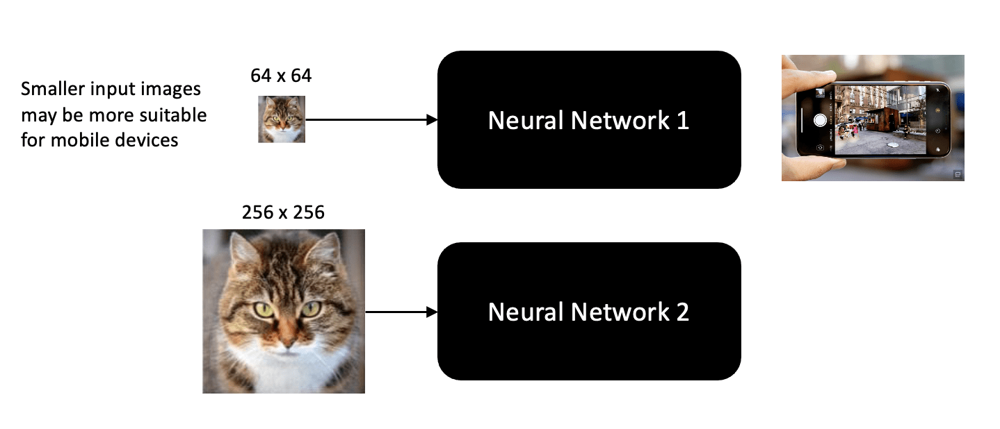
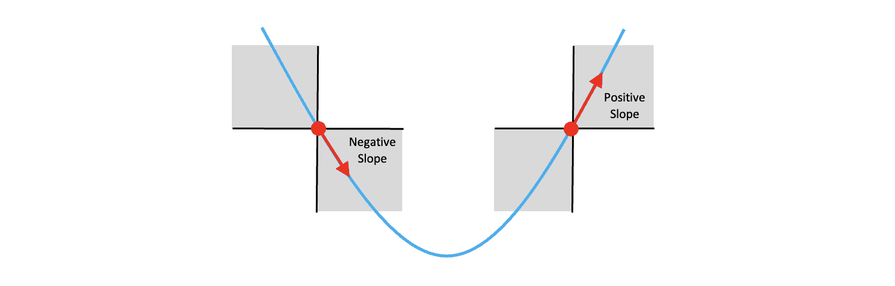
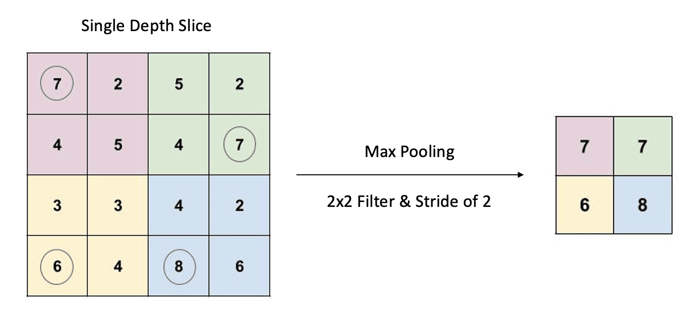

# tensorflow深度学习训练营

## 01 神经网络入门

What and Why 神经网络入门视频

<iframe width="1080" height="608" src="https://www.youtube.com/embed/_5XYLA2HLmo" title="Neural Networks - What They Are &amp; Why They Matter - A 30,000 Feet View for Beginners" frameborder="0" allow="accelerometer; autoplay; clipboard-write; encrypted-media; gyroscope; picture-in-picture; web-share" allowfullscreen></iframe>

 

本教程面向希望进入机器学习和深度学习领域的绝对初学者。我们将简化许多细节，以便您能够掌握最基本的概念。

### 01-00 目录

Table of Contents

1. 理解神经网络为黑匣子
2. 理解神经网络的输出
3. 理解神经网络的输入
4. 如何理解神经网络训练？

### 01-02 理解神经网络为黑匣子

我们首先将神经网络视为黑匣子；你不知道里面有什么，但正如你在这个例子中看到的，我们有一个任意大小、格式或颜色的输入图像，网络的输出是 0 到 1 之间的三个数字，其中每个输出对应是每种类别的概率：输入图像可以是“猫”、“狗”或其他类别（我们简称为“其他”）。

### 01-03 理解神经网络的输出

我们通常将这些类别称为标签（Labels）或类标签（Class Labels）。这个特殊问题称为图像分类（image classification），其中输入是图像，输出是三个可能类别中每一个类别的可能性数值。需要明确的是网络的输出是三个数值（而不是标签本身）。

在此示例中，网络为第一个输出 0.97，为第二个输出 0.01，为第三个输出 0.02。请注意，三个输出之和为 1，因为它们代表概率。由于第一个输出的概率最高，我们说网络预测输入图像是猫。

一般，分配给输入图像的标签是通过从三个输出中选择与最大概率相关联的标签来计算的。因此，如果输出分别为 0.51、0.48 和 0.01，我们仍会将预测标签分配为 Cat，因为 0.51  仍然代表所有三个类别的最高概率。在这种情况下，网络对预测的信心较低。

如果输入图像是猫，完美神经网络将输出  (1,0,0)；如果输入图像是狗，则输出 (0,1,0)；如果输入图像是猫或狗以外的东西，则最终输出  (0,0,1)。事实上，即使训练有素的网络也无法给出如此完美的结果。实际上，执行图像分类的神经网络可能有数百个可能的类别（不仅仅是三个），但分配类标签的过程是相同的。请记住，神经网络可用于许多其他问题类型，但图像分类是一种非常常见的应用，非常适合作为入门级示例。

### 01-04 理解神经网络的输入

现在让我们看一下神经网络的输入，并考虑如何将这些信息表示为数值。您可能已经知道，灰度图像表示为像素值数组，其中每个像素值代表从纯黑到纯白的强度。

 

彩色图像非常相似，只不过它们的每个像素具有三个分量，分别代表红色、绿色和蓝色的颜色强度。因此，在本例中，256 x 256 彩色图像由 196,608 (256x256x3)个数字表示。考虑到这一点，让我们更新我们的图表，以更清楚地反映幕后发生的情况。

 

在这里，我们展示了神经网络期望输入总共有近 200,000  个数字，但我们尚未指定该数据的形状。根据网络的类型，数据可以表示为一维向量；或更紧凑的形式：例如三个二维数组，其中每个数组为  256×256。但无论哪种情况，特定的网络设计都期望数据具有固定的大小和形状。

 

这里要注意的是当设计神经网络时，它们为了接受特定大小和形状的输入而完成的。不同的图像分类网络根据其设计支持的应用程序需要不同大小的输入，这并不罕见。例如，由于与移动设备相关的资源有限，为移动设备设计的网络通常需要较小的输入图像。但这没关系，因为我们需要做的就是**预处理图像**以符合任何特定网络所需的尺寸和形状。~~或者为不同的设备做不同的模型。~~

 

### 01-05 如何理解神经网络训练？

现在让我们来谈谈如何理解神经网络的训练。关于神经网络要了解的主要内容是它们包含许多可调参数，您可以将其理解为黑匣子上的旋钮设置（在技术术语中，这些旋钮设置称为权重weights）。如果你有这样一个黑匣子，但不知道正确的旋钮设置，它基本上是没有用的，但好消息是，你可以通过有条不紊地训练神经网络来找到正确的设置。

  

训练过程类似于幼儿如何了解周围的世界。在日常生活中，孩子吸收大量的视觉信息，并通过反复试验，在父母的帮助下学会识别世界上的物体。训练神经网络来执行图像分类非常相似。它通常需要大量数据并需要多次迭代才能确定神经网络权重的最佳设置。

当你训练神经网络时，你需要向它展示你希望它学习的各种类别的数千个示例，例如猫的图像、狗的图像以及其他类型物体的图像。这种训练称为监督学习（**supervised learning**），因为您向神经网络提供一个类的图像，并明确告诉图像的类别。

  

下面附上一张，监督学习和非监督学习的图：

  

如果网络做出错误的预测，我们会计算与错误预测相关的误差，并且该误差用于调整网络中的权重，从而提高后续预测的准确性。

  

在下一个单元中，我们将更深入地研究神经网络的训练方式，包括如何对标记的训练数据进行建模、如何使用损失函数（loss functions ）以及用于更新神经网络权重的技术（称为梯度下降**gradient descent**）。


## 02 训练神经网络的基础知识

<iframe width="899" height="506" src="https://www.youtube.com/embed/4E2_rkP3owI" title="Deep Learning Using Keras – Training Neural Network" frameborder="0" allow="accelerometer; autoplay; clipboard-write; encrypted-media; gyroscope; picture-in-picture; web-share" allowfullscreen></iframe>

使用**Keras**进行深度学习，训练神经网络。

Keras是什么？ Keras是**一种用Python编写的高级神经网络应用程序编程接口（API）**，它是开源的。 它建立在CNTK、TensorFlow和Theano等框架之上，旨在通过深度神经网络实现快速实验。 Keras优先考虑其代码的灵活性和适应性，它不处理较低级别的计算，而是将其分配给后端库。

 

在本单元中，我们将介绍针对图像分类问题训练神经网络所需的基本要素。我们仍然将内部网络架构视为黑匣子，以便我们可以专注于训练神经网络所需的其他基本组件和概念。

### 02-00 目录

1. 简介
2. 标记训练数据和 One-Hot 编码
3. 损失函数 Loss functions
4. 梯度下降 Gradient Descent（优化Optimizations）
5. 权重(Weights)更新计算示例
6. 完整的训练循环
7. 训练图(Plots)
8. 使用经过训练的模型进行推理(Inference)
9. 结论

### 02-01 简介

在上一单元中，我们介绍了神经网络的大概全貌，主要关注输入和输出以及如何解释图像分类问题的结果。我们还了解到，神经网络包含必须通过训练过程进行适当调整的权重。在这篇文章中，我们将更深入地研究神经网络的训练方式，而不涉及特定网络架构的细节。这将使我们能够在概念层面上理解模型训练过程。

1. 如何对标记过的（labeled）训练数据进行建模。
2. 如何使用损失函数来量化输入和预测输出之间的误差。
3. 如何使用梯度下降来更新网络中的权重。

### 02-02 标注训练数据和 One-Hot 编码

让我们仔细看看图像分类任务中标记的训练数据是如何表示的。带标签的训练数据由图像及其相应的现实（分类）标签组成。如果网络被设计为对来自三个类别（例如猫、狗、其他）的对象进行分类，我们将需要来自所有三个类别的训练样本。通常每个类别都需要数千个样本。

包含分类标签的数据集可以将标签表示为字符串（“Cat”、“Dog”、“Other”）或整数（0,1,2）。但是，在通过神经网络处理数据集之前，标签必须数字表示。当数据集包含整数标签（例如，0、1、2）来表示类时，会提供一个类标签文件，用于定义从类名称到数据集中的整数表示的映射。这允许在需要时将整数映射回类名。如下所示的类映射。

```text
Label    Description
  0          Cat
  1          Dog
  2          Other
```

这种类型的标签编码称为整数编码，因为使用唯一的整数对类标签进行编码。但是，当类标签之间没有关系时，建议使用One-Hot Encoding。  One-hot  编码是一种将分类标签表示为二进制向量（仅包含零和一）的技术。在此示例中，我们有三个不同的类（猫、狗和其他），因此我们可以使用长度为 3  的向量以数字方式表示每个类，其中其中一个条目为 1，其他条目均为 0。

```text
Cat   Dog  Other
 1     0     0
 0     1     0
 0     0     1
```

顺序是任意的，但它需要在整个数据集中保持一致。

我们首先考虑一个训练样本，如下图所示，它由输入图像和该图像的类标签组成。对于每个输入训练样本，网络将生成一个由三个数字组成的预测，表示输入图像对应于给定类别的概率。概率最高的输出决定了预测结果。在这种情况下，网络（错误地）预测输入图像是“狗”，因为网络的第二个输出具有最高的概率。请注意，网络的输入只是图像。每个输入图像的类标签用于计算损失，如下一节所述。

 

### 02-03 损失函数 Loss Function

所有神经网络都使用**损失函数**来量化给定训练样本的预测输出与真实值之间的**误差**。正如我们将在下一节中看到的，损失函数可用于指导学习过程（即以提高未来预测准确性的方式更新网络权重network weights）。

量化网络输出与预期结果之间的误差的一种方法是计算误差平方和  (`SSE`)，如下所示。这也称为`损失`(`LOSS`)。在下面的示例中，我们通过计算实际标签值与预测标签值的差来计算单个训练样本的误差。然后对每一项进行平方，三项之和代表总误差，在本例中为 0.6638。
$$
SSE=(1−0.37)^2+(0−0.50)^2+(0−0.13)^2=0.6638
$$
在实践中训练神经网络时，在更新网络权重之前，会使用许多图像来计算损失。因此，下一个方程通常用于计算多个训练图像的均方误差 (MSE)。 MSE  只是所有使用的图像的 SSE 的平均值。用于更新权重的图像数量称为批量大小(**batch size**)（批量大小 32  通常是一个很好的默认值）。一批图像的处理称为一次“迭代”（**iteration**）。
$$
\large{\text{MSE} = \frac{1}{n}  \sum_{i=1}^{n}(y_{i} - y^{'}_{i})^2 = \text{mean(SSE)}}
$$
mean表示求平均值。

### 02-04 梯度下降Gradient Descent（优化）

现在我们已经熟悉了损失函数的概念，我们准备好介绍用于更新神经网络中权重的优化过程。幸运的是，有一种方法可以调整神经网络的权重，称为梯度下降(Gradient Descent)。为简单起见，我们将仅使用一个名为 W 的可调参数来说明这个概念，并且假设损失函数是凸函数，因此形状像碗，如图所示。

PS：在学习考研数学和深度学习时我发现凹凸函数网上的叫法不同，在高等数学中下图被叫做凹函数，但是外国教授却叫凸函数（convex function）。这是因为数分和高数对于凸凹函数的定义是反的。

 

损失函数的值显示在垂直轴上，我们的单个可训练权重的值显示在水平轴上。假设当前的权重估计为 
$$
\normalsize{W_{e1}}
$$
参考左图，如果我们计算当前权重估计对应的点处的损失函数的斜率，We1
，我们可以看到斜率（梯度）为负。在这种情况下，我们需要增加权重以接近 Wo 指示的最佳值。所以我们需要沿着与梯度符号相反的方向移动。

另一方面，如果我们当前的权重估计，We1>Wo（如右图所示），梯度将为正，我们需要减少当前权重的值以更接近最佳值Wo。

请注意，在这两种情况下，我们仍然需要沿着与梯度符号相反的方向移动。

在继续之前，请注意，在这两个图中，我们绘制的代表梯度（斜率）的箭头都指向右侧。在一种情况下，箭头指向右下，而在另一种情况下，箭头指向右上。但不要对两个箭头都指向右侧的事实感到困惑，重要的是梯度的符号，

 

请记住，直线的斜率定义为运行过程中的上升，当权重位于最佳值左侧时，函数的斜率为负，而当权重位于最佳值右侧时，函数的斜率为正。所以梯度的符号很重要。

 

在上述两种情况下，我们都需要在与梯度符号相反的方向上调整权重。考虑到这些概念，我们可以证明以下方程可用于在正确的方向上更新权重，而不管权重的当前值相对于最佳值如何。

 

考虑这个问题的最好方法是，梯度的符号决定了我们需要移动的方向。但是我们需要移动的量需要用一个称为学习率（**Learning Rate**）的参数来调整，该参数通常是一个**很小的数字**(小于 1)。学习率是我们在训练之前需要指定的东西，而不是网络学习的东西。像这样的参数通常称为超参数(**hyperparameters**)，以将它们与可训练参数trainable parameters （例如网络权重weights）区分开来。

实际上，损失函数有很多维度，通常不是凸函数，而是有很多峰和谷。一般情况下，损失函数的斜率称为梯度，是网络中所有权重的函数。但用于更新权重的方法在概念上与此处描述的相同。

  

### 02-05 权重更新计算示例

为了使这一点更加具体，让我们进行一个更新权重的示例计算。这里，我们假设当前权重为 We1，其值为 0.38。我们还将假设学习率为  0.01，并且损失函数在 We1 点的斜率等于 -0.55。使用上面的更新方程，我们可以轻松计算出新的权重估计值，我们将其称为  We2。这个计算得到了简化，因为我们只在一个维度上工作，很容易扩展到多个维度。

PS: *A gradient is a vector, and slope is a scalar*. 上面算的是一维的，所以就是slope，扩展到多个维度就是gradient梯度，如上图所示，所以梯度是一个多维的坡度，而slope斜率是一维平坡。

  

~~我们还没有讨论的一件事是如何实际计算损失函数相对于网络权重的梯度。~~幸运的是，这是通过一种称为反向传播**backpropagation**的算法来处理的，该算法内置于深度学习框架中，例如 TensorFlow、Keras 和 PyTorch，因此您不需要自己实现。

### 02-06 完整的训练闭环

现在我们已经涵盖了与训练神经网络相关的所有基本要素，我们可以在下图中总结该过程。

  

这里，左边是输入图像，右边是网络的输出，我们将其称为 y′。我们使用真实标签 y 以及网络的预测输出来计算损失。请注意，我们没有具体显示网络的多个输出，但应该理解的是 y′ 和 y是向量，其长度等于网络正在训练的类的数量。

计算损失后，我们可以计算损失相对于权重的梯度，然后可以将其用于更新网络中的权重。**这是一个重要的图表，它高度概括了神经网络的训练过程。**

### 02-07 训练曲线 Plots

现在我们已经知道如何更新网络中的权重，值得强调的是，训练神经网络是一个迭代过程，通常需要将整个训练集多次通过网络。

每次整个训练数据集通过网络时，我们将其称为训练时期（**training epoch**）。训练神经网络通常需要许多训练周期，直到损失随着额外训练而停止减少。正如您在下面的第一张图中所看到的，随着训练的进行，损失减少的速度逐渐减小，这表明模型正在接近其学习能力。

  

绘制训练准确度图也很常见，正如您所期望的那样，随着损失的减少，准确度往往会增加，如第二张图所示。

  

有许多与训练神经网络相关的重要细节，我们在第一篇文章中没有介绍，但随着本系列的进展，我们将继续介绍有关该主题的更多高级概念。

注意：我们尚未讨论的一个重要主题是数据分割（**data splitting**）。这涉及到验证数据集的概念，**用于在训练过程中评估训练模型的质量（正确率）**。这是一个重要且核心的主题，将在后续文章中介绍。

### 02-08 使用经过训练的模型执行推理

现在我们已经介绍了如何训练神经网络的过程，有必要谈谈我们将如何使用它。一旦我们有了训练有素的网络，我们就可以为其提供未知内容的图像，并使用该网络来预测该图像属于哪个类别。这反映在下图中，我们所需要的只是想要分类的未知内容的图像。对未知数据进行预测（make prediction）通常称为使用网络进行推理（perform inference）。

 

### 02-09 结论

让我们总结一下与训练神经网络相关的要点。

+ 训练神经网络以执行图像分类等监督学习任务需要标记过的训练数据(labled)。
+ 在大多数情况下，建议对分类数据使用 One-Hot 标签编码。（[1,0,0],[0,1,0],[0,0,1]）
+ 训练神经网络需要一个损失函数，用于量化网络输出和预期输出之间的误差。
+ 损失函数的梯度是使用称为反向传播backpropagation的算法计算的，该算法内置于 TensorFlow 和 PyTorch 等深度学习框架中。
+ 梯度下降以迭代方式用于更新神经网络的权重。
+ 训练图像的子集（批量大小batch size）用于执行权重更新。这称为训练时期内epoch的迭代。
+ 训练时期包括通过网络处理整个训练数据集。因此，训练时期的迭代次数等于训练图像的数量除以批量大小。
+ 每个训练周期代表训练过程的完整过程，直到损失函数稳定。注意：在实践中，我们不仅仅依靠训练损失来评估训练模型的质量。还需要验证损失，我们将在后续文章中介绍这一点。


## 03 线性回归建模

<iframe width="899" height="506" src="https://www.youtube.com/embed/yuAZQJ5BnJk" title="Linear Regression Tutorial using Tensorflow and Keras" frameborder="0" allow="accelerometer; autoplay; clipboard-write; encrypted-media; gyroscope; picture-in-picture; web-share" allowfullscreen></iframe>

### 学习如何使用 Keras 进行线性回归建模

在研究深度神经网络之前，我们将介绍简单（线性）神经网络的基本组成部分。我们将从线性回归的主题开始。由于线性回归可以建模为神经网络，因此它提供了一个很好的示例来介绍神经网络的基本组件。回归Regression是监督学习的一种形式，旨在对一个或多个输入变量（特征）与连续（目标）变量之间的关系进行建模。我们假设输入变量 x 和目标变量 y  之间的关系可以表示为输入的加权和（即模型的参数是线性的）。简而言之，线性回归旨在学习一种**将一个或多个输入特征映射到单个数值目标值的函数**。

 

### 03-00目录

1. 了解数据集
2. 线性回归模型
3. 神经网络概念和术语
4. 在 Keras 中建模神经网络
5. 结论

```py
import numpy as np
from tensorflow.keras.models import Sequential
from tensorflow.keras.layers import Dense, Input, Activation
from tensorflow.keras.datasets import boston_housing
from tensorflow.keras import layers

import tensorflow as tf
import matplotlib.pyplot as plt

SEED_VALUE = 42

# Fix seed to make training deterministic.
np.random.seed(SEED_VALUE)
tf.random.set_seed(SEED_VALUE)
```

### 03-01 了解数据集

#### 03-01-01 加载波士顿住房数据集

在本文中，我们将使用波士顿住房数据集。该数据集包含美国人口普查局收集的有关马萨诸塞州波士顿住房的信息。它已在文献中广泛用于基准算法，并且由于其数据量小也适合演示目的。该数据集包含 14 个独特属性，其中包括给定郊区房屋的中值（千美元价格）。我们将使用该数据集作为示例，说明如何开发一个模型，使我们能够根据数据集中的单个属性（房屋中的平均房间数）来预测房屋的中位价格。

Keras 提供了 load_data() 函数来加载该数据集。数据集通常分为训练`train`和测试`test`集，load_data() 函数为每个数据集返回一个元组。每个元组包含一个二维特征数组（例如 X_train）和一个向量，该向量包含数据集中每个样本的关联目标值（例如 y_train）。例如，X_train 中的行代表数据集中的各种样本，列代表各种特征。在本笔记本中，我们将仅利用训练数据来演示如何训练模型。然而，在实践中，使用测试数据来了解训练后的模型在未见过的数据上的表现非常重要。

```python
# Load the Boston housing dataset.
(X_train, y_train), (X_test, y_test) = boston_housing.load_data()

print(X_train.shape)
print("\n")
print("Input features: ", X_train[0])
print("\n")
print("Output target: ", y_train[0])
```

```text
Downloading data from https://storage.googleapis.com/tensorflow/tf-keras-datasets/boston_housing.npz
57026/57026 [==============================] - 0s 0us/step
(404, 13)

Input features:  [  1.23247   0.        8.14      0.        0.538     6.142    91.7
   3.9769    4.      307.       21.      396.9      18.72   ]
Output target:  15.2
```

#### 03-01-02 从数据集中提取特征

在此笔记本中，我们将仅使用数据集中的单个特征，因此为了简单起见，我们将特征数据存储在一个新变量中。

```python
boston_features = {
    "Average Number of Rooms": 5,
}

X_train_1d = X_train[:, boston_features["Average Number of Rooms"]]
print(X_train_1d.shape)

X_test_1d = X_test[:, boston_features["Average Number of Rooms"]]
# (404,)
```

#### 03-01-03 绘制特征点

在这里，我们绘制了房屋的中位价格与单一特征（“平均房间数 Average Number of Rooms'”）的关系。

```python
plt.figure(figsize=(15, 5))
plt.xlabel("Average Number of Rooms")
plt.ylabel("Median Price [$K]")
plt.grid("on")
plt.scatter(X_train_1d[:], y_train, color="green", alpha=0.5)
# <matplotlib.collections.PathCollection at 0x7f21bbde9d60>
```

 

### 03-02 线性回归模型

让我们首先清楚地了解我们正在努力实现的目标。下图显示了单个自变量（房间数量）和因变量（房屋中位价格）的训练数据。我们希望使用线性回归来为这些数据开发一个可靠的模型。在此示例中，模型只是一条由斜率 (m) 和 y 截距 (b) 定义的直线。

 

### 03-03 神经网络概念和术语

下图显示了如何将该模型表示为简单（单神经元）网络。我们将使用这个简单的示例来介绍神经网络组件和术语。输入数据 (x)  由单个特征（房间的平均数量）组成，预测输出 (y′)  是标量（房屋的预测中位价格）。请注意，数据集中的每个数据样本代表波士顿郊区的统计数据。模型参数（m 和  b）在训练过程中迭代学习。您可能已经知道，模型参数可以通过封闭形式的**普通最小二乘法** (Ordinary Least Squares-OSL)  来计算。然而，我们也可以使用称为梯度下降**Gradient Descent**的数值技术迭代地解决这个问题，这是神经网络训练的基础。此处我们不介绍梯度下降的细节，但重要的是要了解它是一种用于调整模型参数的迭代技术。

 

该网络仅包含一个神经元，该神经元接受单个输入 (x) 并产生单个输出  (y′)，即房屋的预测（平均）价格。单个神经元有两个可训练参数，即线性模型的斜率slope (m) 和 y 轴截距y-intercept   (b)。这些参数通常分别称为权重weight和偏差bias。在回归问题中，模型通常具有多个输入特征，其中每个输入都有一个关联的权重  (wi)，但在本例中，我们将仅使用单个输入特征来预测输出。因此，一般来说，一个神经元通常具有多个权重（w1、w2、w3 等）和一个偏置项  (b)。在此示例中，您可以将神经元视为 mx+b 的数学计算，它产生预测值 y′。

下面显示了同一模型的稍微更正式的图表。在这里，我们引入了反馈循环**feedback loop** 的概念，它显示了模型参数（w和b) 在训练过程中更新。最初，模型参数被初始化为小的随机值。在训练过程中，当训练数据通过网络传递时，模型的预测值 (y′)  会与数据集中给定样本的真实值 (y)  进行比较。该差异用作计算损失，然后用作网络中的反馈，以改进预测的方式调整模型参数。这个过程涉及两个步骤，称为梯度下降和反向传播。在这个阶段，了解其工作原理的数学细节并不重要，但重要的是要了解训练模型的迭代过程。

 

我们使用的损失函数可以有多种形式。在这个例子中，我们将使用均方误差（MSE），这是回归问题中非常常见的损失函数。
$$
J = \frac{1}{m}\sum_{i=1}^{m} (y_{i}' - y_{i})^2
$$
**基本思想是我们希望最小化该函数的值**，该函数表示我们的模型和训练数据集之间的误差。在上式中，m是训练样本的数量。

### 03-04 在 Keras 中建模神经网络

上一节中的网络图代表了最简单的神经网络。该网络有一个由输出 wx+b 的单个神经元组成的单层。对于每个训练样本，预测输出 y′

与训练数据的实际值进行比较，并计算损失。然后可以使用损失来微调（更新）模型参数。

与训练神经网络相关的所有细节均由 Keras 处理，总结如下工作流程：

1. 使用 Keras 中的预定义层构建/定义网络模型。
2. 使用 model.compile() 编译模型
3. 使用 model.fit() 训练模型
4. 预测输出 model.predict()

#### 03-04-01 定义 Keras 模型

```python
model = Sequential()

# Define the model consisting of a single neuron. 包含一个单神经元
model.add(Dense(units=1, input_shape=(1,)))

# Display a summary of the model architecture.
model.summary()
```

```text
Model: "sequential"
_________________________________________________________________
 Layer (type)                Output Shape              Param #   
=================================================================
 dense (Dense)               (None, 1)                 2                               
=================================================================
Total params: 2
Trainable params: 2
Non-trainable params: 0
```

#### 03-04-02 编译模型

```python
model.compile(optimizer=tf.keras.optimizers.RMSprop(learning_rate=0.005), loss="mse")
```

#### 03-04-03 训练模型

```python
history = model.fit(
    X_train_1d, 
    y_train, 
    batch_size=16, 
    epochs=101, 
    validation_split=0.3,
)
```

```text
Epoch 1/101
18/18 [==============================] - 1s 18ms/step - loss: 218.3039 - val_loss: 266.6791
Epoch 2/101
18/18 [==============================] - 0s 5ms/step - loss: 200.4328 - val_loss: 248.9743
...
...
...
Epoch 100/101
18/18 [==============================] - 0s 3ms/step - loss: 53.9164 - val_loss: 74.0994
Epoch 101/101
18/18 [==============================] - 0s 3ms/step - loss: 53.8947 - val_loss: 74.0549
```

#### 03-04-04 绘制训练结果

```python
def plot_loss(history):
    plt.figure(figsize=(20,5))
    plt.plot(history.history['loss'], 'g', label='Training Loss')
    plt.plot(history.history['val_loss'], 'b', label='Validation Loss')
    plt.xlim([0, 100])
    plt.ylim([0, 300])
    plt.xlabel('Epoch')
    plt.ylabel('Loss')
    plt.legend()
    plt.grid(True)

plot_loss(history)
```

 

上面的损耗曲线相当典型。首先，请注意有两条曲线，一条用于训练损失，一条用于验证损失。两者最初都很大，然后稳步下降，最终趋于平稳，在大约 30 个 epoch 后没有进一步改善。由于模型仅在训练数据上进行训练，因此训练损失低于验证损失也是相当典型的。

#### 03-04-05 使用模型进行预测

我们现在可以使用Keras 中的predict() 方法进行单个预测。在此示例中，我们将值列表传递给模型（表示平均房间数），模型为每个输入返回房屋价格的预测值。

```python
# Predict the median price of a home with [3, 4, 5, 6, 7] rooms.
x = [3, 4, 5, 6, 7]
y_pred = model.predict(x)
for idx in range(len(x)):
    print(f"Predicted price of a home with {x[idx]} rooms: ${int(y_pred[idx] * 10) / 10}K")
```

```text
1/1 [==============================] - 0s 99ms/step
Predicted price of a home with 3 rooms: $11.0K
Predicted price of a home with 4 rooms: $14.4K
Predicted price of a home with 5 rooms: $17.9K
Predicted price of a home with 6 rooms: $21.3K
Predicted price of a home with 7 rooms: $24.8K
```

#### 03-04-06 绘制模型和数据

```python
# Generate feature data that spans the range of interest for the independent variable.
x = np.linspace(3, 9, 10)

# Use the model to predict the dependent variable.
y = model.predict(x)
# 1/1 [==============================] - 0s 44ms/step

def plot_data(x_data, y_data, x, y, title=None):
    plt.figure(figsize=(15,5))
    plt.scatter(x_data, y_data, label='Ground Truth', color='green', alpha=0.5)
    plt.plot(x, y, color='k', label='Model Predictions')
    plt.xlim([3,9])
    plt.ylim([0,60])
    plt.xlabel('Average Number of Rooms')
    plt.ylabel('Price [$K]')
    plt.title(title)
    plt.grid(True)
    plt.legend()

```

训练集：

```python
plot_data(X_train_1d, y_train, x, y, title='Training Dataset')
```

 

测试集：

```python
plot_data(X_test_1d, y_test, x, y, title='Test Dataset')
```

 

### 03-05 结论

本文我们在简单神经网络的背景下介绍了线性回归模型。我们展示了如何使用 Keras 来建模和训练网络以学习线性模型的参数以及如何可视化模型预测。


## 04 使用 MLP 进行 MNIST 数字分类

### 在 Keras 中使用前馈网络进行图像分类

下面我们将介绍与涉及两个以上类别的一般分类问题相关的几个新概念。当类的数量超过两个时，这有时被称为多项式回归或 softmax  回归。具体来说，我们将了解如何使用前馈多层感知器（Multilayer Perceptron Network）网络对 MNIST 数据集中的手写数字进行分类。 ~~MLP  并不是处理图像数据的首选方式，但这可以作为引入一些新概念的一个很好的例子~~。 MNIST 手写数字数据集包含在 Tensorflow  中，可以轻松导入和加载，如下所示。使用此数据集和简单的前馈网络，我们将演示一种如何处理图像数据并构建对数字 [0,9] 进行分类的网络的方法。

 

### 04-00 目录

1. 加载 MNIST 数据集
2. 数据集预处理
3. 模型架构
4. 模型实现
5. 模型评估
6. 结论

准备导入必须的库和准备种子数据

```python
import random
import matplotlib.pyplot as plt
import matplotlib
import numpy as np
import tensorflow as tf

from tensorflow.keras import layers
from tensorflow.keras import Sequential
from tensorflow.keras.layers import Dense, Dropout
from tensorflow.keras.datasets import mnist
from tensorflow.keras.utils import to_categorical

from matplotlib.ticker import MultipleLocator, FormatStrFormatter

plt.rcParams["axes.titlesize"] = 16
plt.rcParams["axes.labelsize"] = 14
plt.rcParams["image.cmap"] = "gray"

from tensorflow.keras.datasets import fashion_mnist

SEED_VALUE = 42

# Fix seed to make training deterministic.
random.seed(SEED_VALUE)
np.random.seed(SEED_VALUE)
tf.random.set_seed(SEED_VALUE)
```

### 04-01 加载并分割 MNIST 数据集

MNIST 数据集包含 70,000 张图像，分为 60,000 张用于训练，10,000 张用于测试。保留一部分数据用于验证可以通过进一步划分训练数据来完成。如下所示，我们从训练数据中提取 10,000 个样本用于验证。

```python
(X_train_all, y_train_all), (X_test, y_test) = mnist.load_data()

X_valid = X_train_all[:10000]
X_train = X_train_all[10000:]

y_valid = y_train_all[:10000]
y_train = y_train_all[10000:]

print(X_train.shape)
print(X_valid.shape)
print(X_test.shape)
#Downloading data from https://storage.googleapis.com/tensorflow/tf-keras-datasets/mnist.npz
#11490434/11490434 [==============================] - 2s 0us/step
#(50000, 28, 28)
#(10000, 28, 28)
#(10000, 28, 28)

plt.figure(figsize=(18, 5))
for i in range(3):
    plt.subplot(1, 3, i + 1)
    plt.axis(True)
    plt.imshow(X_train[i], cmap="gray")
    plt.subplots_adjust(wspace=0.2, hspace=0.2)

```

 

### 04-02 数据集预处理

#### 04-02-01 输入特征变换和归一化

由于我们现在使用图像作为输入，因此我们需要找到一些逻辑方法将图像数据表示为一组特征。对于该数据集来说，一种实际上效果相当好的简单方法是假设像素强度是特征。将图像数据转换为我们可以处理的一组特征的一种方法是将 2D 数组展平为 1D 数组。 28x28 输入图像因此成为包含 784 个特征的一维数组。请注意，我们还将像素强度标准化为 [0, 1]  范围内。这在处理图像数据时很常见，这有助于更有效地训练模型。另外，需要明确的是，使用像素强度作为特征是一种幼稚低级的方法，我们在这里故意使用这种方法是为了让事情变得简单。正如我们将在后续文章中看到的，我们将了解卷积神经网络 (CNN)，它使用更先进的技术来表示和处理神经网络中的图像数据。

```python
X_train = X_train.reshape((X_train.shape[0], 28 * 28))
X_train = X_train.astype("float32") / 255

X_test = X_test.reshape((X_test.shape[0], 28 * 28))
X_test = X_test.astype("float32") / 255

X_valid = X_valid.reshape((X_valid.shape[0], 28 * 28))
X_valid = X_valid.astype("float32") / 255
```

#### 04-02-02 标签编码选项

在处理分类数据时，在通过机器学习算法处理数据之前，需要将目标标签表示为数值。标签编码是将类标签从字符串转换为数值的过程。对于如何对每个类别的标签进行数字编码，我们有几个选项。我们可以使用序数整数编码，其中为每个类分配一个整数，或者我们可以使用一种称为 one-hot  编码的技术，该技术使用单独的二进制向量对每个类标签进行编码。根据数据集的不同，一种方法可能优于另一种方法，但在大多数情况下，通常使用  one-hot 编码。由于这是一篇介绍性文章，我们将简要演示每种编码的样子，以便您熟悉这两种表示形式。

##### A 整数标签编码

包含分类标签的数据集可以在内部将标签表示为字符串或整数。然而，在通过神经网络处理数据集之前，标签必须数字表示。当数据集包含分类数据的整数标签时，会提供一个类标签文件，该文件定义从类名称到数据集中的整数表示的映射，以便在需要时可以将整数映射回类名称。作为一个具体示例，请考虑下面显示的 Fashion MNIST 数据集的字典映射。

```text
Label   Description
0       T-shirt/top
1       Trouser
2       Pullover
3       Dress
4       Coat
5       Sandal
6       Shirt
7       Sneaker
8       Bag
9       Ankle boot
```

Fashion MNIST  数据集本身包含整数标签，我们可以通过加载数据集并打印出一些标签来验证这一点，如下面代码单元的输出所示。这种类型的标签编码称为整数编码，因为使用唯一的整数对类（字符串）标签进行编码。但是，当类标签彼此没有关系时，通常建议改用 One-Hot Encoding，这将在下一节中介绍。

```python
# Load the Fashion MNIST dataset.
((X_train_fashion, y_train_fashion), (_, _)) = fashion_mnist.load_data()

# The labels in the Fashion MNIST dataset are encoded as integers.
print(y_train_fashion[0:9])

#Downloading data from https://storage.googleapis.com/tensorflow/tf-keras-datasets/train-labels-idx1-ubyte.gz
#29515/29515 [==============================] - 0s 1us/step
#Downloading data from https://storage.googleapis.com/tensorflow/tf-keras-datasets/train-images-idx3-ubyte.gz
#26421880/26421880 [==============================] - 3s 0us/step
#Downloading data from https://storage.googleapis.com/tensorflow/tf-keras-datasets/t10k-labels-idx1-ubyte.gz
#5148/5148 [==============================] - 0s 0us/step
#Downloading data from https://storage.googleapis.com/tensorflow/tf-keras-datasets/t10k-images-idx3-ubyte.gz
#4422102/4422102 [==============================] - 1s 0us/step

#[9 0 0 3 0 2 7 2 5]
```

##### B One-Hot标签编码

One-hot 编码是一种将分类标签表示为 one-hot 编码向量的技术。因此，我们可以使用 Keras 中的  to_categorical()  函数作为预处理步骤，将每个标签表示为二进制向量，而不是将类标签表示为唯一的整数。在这种情况下，每个标签都转换为二进制向量，其中向量的长度等于类的数量。除了与整数标签相对应的元素之外，所有条目都设置为零。

```python
y_train_onehot = to_categorical(y_train_fashion[0:9])
print(y_train_onehot)
```

```text
[[0. 0. 0. 0. 0. 0. 0. 0. 0. 1.]
 [1. 0. 0. 0. 0. 0. 0. 0. 0. 0.]
 [1. 0. 0. 0. 0. 0. 0. 0. 0. 0.]
 [0. 0. 0. 1. 0. 0. 0. 0. 0. 0.]
 [1. 0. 0. 0. 0. 0. 0. 0. 0. 0.]
 [0. 0. 1. 0. 0. 0. 0. 0. 0. 0.]
 [0. 0. 0. 0. 0. 0. 0. 1. 0. 0.]
 [0. 0. 1. 0. 0. 0. 0. 0. 0. 0.]
 [0. 0. 0. 0. 0. 1. 0. 0. 0. 0.]]
```

注意：由于 MNIST 数字数据集中的标签具有直接对应于类标签的整数标签（即整数 4 对应于类标签  4），因此技术上不需要类映射文件。此外，由于整数标签具有自然排序，因此我们可以直接使用整数标签。但由于最常使用 one-hot  编码，我们将继续以这种方式对标签进行编码，如下所示。

```python
# Convert integer labels to one-hot encoded vectors.
y_train = to_categorical(y_train)
y_valid = to_categorical(y_valid)
y_test  = to_categorical(y_test)
```

### 04-03 模型架构

#### 04-03-01 深度神经网络架构

下面显示的网络架构有多层。一个输入层、两个隐藏层和一个输出层。关于此架构有几点需要注意。

1. 输入数据：图像输入数据从二维数组 [28x28] 预处理（展平）为长度 [784x1] 的一维向量，其中该输入向量中的元素是归一化像素强度。网络的输入有时被称为输入“层”，但从技术上讲，它不是网络中的层，因为没有与之相关的可训练参数。
2. 隐藏层：我们有两个隐藏层，其中包含一定数量的神经元（我们需要指定）。这些层中的每个神经元都有一个非线性激活函数（例如 ReLU、Sigmoid 等）。
3. 输出层：现在，我们在输出层中有 10 个神经元来表示 10 个不同的类别（数字：0 到 9），而不是回归示例中的单个神经元。
4. 密集层：网络中的所有层都是完全连接的，这意味着给定层中的每个神经元都与前一层中的每个神经元完全连接（或密集）。与每层关联的权重以粗体表示，以指示这些矩阵包含网络中相邻层之间的所有连接的每个权重。
5. Softmax 函数：输出层中每个神经元的值通过 softmax 函数传递，以生成数据集中十个数字中每个数字的概率得分。
6. 网络输出：网络输出（y′) 是一个长度为 10 的向量，包含每个输出神经元的概率。预测类标签只需要传递 (y′)通过argmax函数来确定预测标签的索引。
7. 损失函数：使用的损失函数是交叉熵损失，这通常是分类问题的首选损失函数。它是根据地面实况标签（y) 和网络的输出概率 (y′)。注意 y 和 y′都是长度等于类数的向量。

尽管该图看起来与线性回归示例中的单层感知器有很大不同，但就训练和预测期间发生的处理而言，它基本上非常相似。我们仍然根据网络的预测输出和输入的真实标签来计算损失。反向传播用于计算损失相对于网络权重的梯度。优化器（实现梯度下降）用于更新神经网络中的权重。

 

### 04-04 模型实现

在这里，我们使用 Keras 定义模型架构，该架构具有两个密集层（每个密集层有 128 个神经元）和一个有 10  个神经元的输出层。输出层中的每个神经元对应于数据集中的类别标签（0 到  9），其中每个神经元的输出表示输入图像对应于与该神经元关联的类别的概率。例如，如果第 5 个神经元的输出为 0.87，则意味着输入图像为 4  的概率为 87%（因为第一类为 0，因此第 5 个神经元代表数字 4）。

请注意，第一个隐藏层的输入形状为 [784,1]，因为  28x28 图像被展平为长度为 784 的向量。每个隐藏层中的神经元都具有称为“ReLU”的激活函数，它代表“整流线性单元”  。然后，输出层中的神经元通过“softmax”函数，该函数对原始输出进行转换（标准化），可以将其解释为如上所述的概率。

我们不会在这篇文章中介绍 softmax 函数或交叉熵损失函数的细节，因为这些是更高级的主题，但简单地说，softmax  函数对网络的输出进行归一化并将其转换为概率。交叉熵损失函数计算预测输出概率和地面真实标签之间的损失。预测的输出概率距离目标标签越远，损失就越高。

#### 04-04-01 定义模型

```python
# Instantiate the model.
model = tf.keras.Sequential()

# Build the model.
model.add(Dense(128, activation='relu', input_shape=(X_train.shape[1],)))
model.add(Dense(128, activation='relu'))
model.add(Dense(10,  activation="softmax"))

# Display the model summary.
model.summary()
```

```text
Model: "sequential"
_________________________________________________________________
 Layer (type)                Output Shape              Param #   
=================================================================
 dense (Dense)               (None, 128)               100480    
                                                                 
 dense_1 (Dense)             (None, 128)               16512     
                                                                 
 dense_2 (Dense)             (None, 10)                1290      
                                                                 
=================================================================
Total params: 118,282
Trainable params: 118,282
Non-trainable params: 0
```

#### 04-04-02 编译模型

此步骤定义将在训练循环中使用的优化器**Optimizer**和损失函数**Loss Function**。我们也可以在这里指定要跟踪的任何其他指标。

优化器：这里，我们将使用 Keras 中的 RMSProp 优化器。

损失函数：如上所述，分类问题的首选损失函数是交叉熵。但根据标签的编码方式，我们需要指定交叉熵损失函数的正确形式。如果标签是one-hot编码的，那么你应该将损失函数指定为categorical_crossentropy，如果标签是整数编码的，那么你应该使用sparse_categorical_crossentropy。进行二元分类时，应该使用binary_crossentropy作为损失函数。由于我们在本例中使用 one-hot 编码，因此我们将损失函数指定为 categorical_crossentropy。

指标**Metrics**：最后，我们还指定准确性作为训练期间记录的附加指标，以便我们可以在训练完成后绘制它。训练损失和验证损失会自动记录，因此无需指定。

```python
model.compile(
    optimizer="rmsprop",
    loss="categorical_crossentropy",
    metrics=["accuracy"],
)
```

#### 04-04-03 训练模型

为了训练模型，我们调用 Keras 中的 fit()  方法。请注意，由于我们将原始训练数据分为训练数据集和验证数据集，因此我们需要使用validation_data  =（X_valid，y_valid））显式指定验证数据集。回想一下本系列之前关于线性回归的文章，我们还可以选择使用validation_split参数来自动保留训练数据的随机部分用作验证数据。因此，在这里，我们演示如何显式使用单独的验证数据集。

```python
training_results = model.fit(X_train, 
                             y_train, 
                             epochs=21, 
                             batch_size=64, 
                             validation_data=(X_valid, y_valid));
```

```text
Epoch 1/21
782/782 [==============================] - 12s 6ms/step - loss: 0.2833 - accuracy: 0.9173 - val_loss: 0.1755 - val_accuracy: 0.9450
Epoch 2/21
782/782 [==============================] - 3s 3ms/step - loss: 0.1203 - accuracy: 0.9634 - val_loss: 0.1276 - val_accuracy: 0.9622
...
...
...
Epoch 20/21
782/782 [==============================] - 3s 3ms/step - loss: 0.0033 - accuracy: 0.9989 - val_loss: 0.1924 - val_accuracy: 0.9743
Epoch 21/21
782/782 [==============================] - 3s 3ms/step - loss: 0.0034 - accuracy: 0.9988 - val_loss: 0.1595 - val_accuracy: 0.9780
```

### 04-05 绘制训练结果

下面介绍一个方便的函数，用于绘制训练和验证损失以及训练和验证准确性。它有一个必需的参数，绘制指标列表。

```python
def plot_results(metrics, title=None, ylabel=None, ylim=None, metric_name=None, color=None):
    
    fig, ax = plt.subplots(figsize=(15, 4))

    if not (isinstance(metric_name, list) or isinstance(metric_name, tuple)):
        metrics = [metrics,]
        metric_name = [metric_name,]
        
    for idx, metric in enumerate(metrics):    
        ax.plot(metric, color=color[idx])
    
    plt.xlabel("Epoch")
    plt.ylabel(ylabel)
    plt.title(title)
    plt.xlim([0, 20])
    plt.ylim(ylim)
    # Tailor x-axis tick marks
    ax.xaxis.set_major_locator(MultipleLocator(5))
    ax.xaxis.set_major_formatter(FormatStrFormatter('%d'))
    ax.xaxis.set_minor_locator(MultipleLocator(1))
    plt.grid(True)
    plt.legend(metric_name)   
    plt.show()
    plt.close()
```

可以从 fit 方法返回的历史对象中访问损失和准确性指标。我们使用预定义的字典键访问指标，如下所示。

```python
# Retrieve training results.
train_loss = training_results.history["loss"]
train_acc  = training_results.history["accuracy"]
valid_loss = training_results.history["val_loss"]
valid_acc  = training_results.history["val_accuracy"]

plot_results(
    [train_loss, valid_loss],
    ylabel="Loss",
    ylim=[0.0, 0.5],
    metric_name=["Training Loss", "Validation Loss"],
    color=["g", "b"],
)

plot_results(
    [train_acc, valid_acc],
    ylabel="Accuracy",
    ylim=[0.9, 1.0],
    metric_name=["Training Accuracy", "Validation Accuracy"],
    color=["g", "b"],
)
```

 

 

### 04-05 模型评估

#### 04-05-01 对样本测试图像进行预测

我们现在可以预测所有测试图像的结果，如下面的代码所示。在这里，我们调用predict()方法来预测，然后从测试集中选择特定索引并打印出每个类别的预测分数。您可以通过将测试索引设置为各种值来试验下面的代码，并查看最高分数如何与正确值相关联。

```python
predictions = model.predict(X_test)
index = 0  # up to 9999
print("Ground truth for test digit: ", y_test[index])
print("\n")
print("Predictions for each class:\n")
for i in range(10):
    print("digit:", i, " probability: ", predictions[index][i])
```

```text
313/313 [==============================] - 1s 1ms/step
Ground truth for test digit:  [0. 0. 0. 0. 0. 0. 0. 1. 0. 0.]


Predictions for each class:

digit: 0  probability:  9.819607e-24
digit: 1  probability:  2.4064698e-18
digit: 2  probability:  1.4520596e-13
digit: 3  probability:  2.4951994e-13
digit: 4  probability:  1.5394617e-26
digit: 5  probability:  9.713211e-23
digit: 6  probability:  4.6183826e-30
digit: 7  probability:  1.0
digit: 8  probability:  1.8647681e-26
digit: 9  probability:  1.4221963e-17
```

#### 04-05-01 混淆矩阵

混淆矩阵是一种非常常见的度量，用于总结分类问题的结果。该信息以表格或矩阵的形式呈现，其中一个轴代表每个类别的真实标签，另一个轴代表来自网络的预测标签。表中的条目表示实验中的实例数（有时表示为百分比而不是计数）。在 TensorFlow 中生成混淆矩阵是通过调用函数 tf.math.confusion_matrix()  来完成的，该函数采用两个必需参数，即真实标签列表和关联的预测标签。

```python
# Generate predictions for the test dataset.
predictions = model.predict(X_test)

# For each sample image in the test dataset, select the class label with the highest probability.
predicted_labels = [np.argmax(i) for i in predictions]
# 313/313 [==============================] - 0s 1ms/step
```

```python
# Convert one-hot encoded labels to integers.
y_test_integer_labels = tf.argmax(y_test, axis=1)

# Generate a confusion matrix for the test dataset.
cm = tf.math.confusion_matrix(labels=y_test_integer_labels, predictions=predicted_labels)

# Plot the confusion matrix as a heatmap.
plt.figure(figsize=[15, 8])
import seaborn as sn

sn.heatmap(cm, annot=True, fmt="d", annot_kws={"size": 14})
plt.xlabel("Predicted")
plt.ylabel("Truth")
plt.show()
```

 

### 04-06 结论

我们介绍了一种简单的方法，用于对图像数据进行建模，以便在密集连接的网络中分类。在下一个课程，我们将了解专门用于处理图像数据的卷积神经网络（CNN）。以下链接包含几个著名的 CNN 架构的非常好的交互式基于网络的动画，这是开始熟悉它们的好地方。

https://tensorspace.org/html/playground/lenet.html

## 05 CNN 基础知识


在本单元中，我们将在图像分类问题的背景下学习卷积神经网络（CNN）。我们首先介绍 CNN  的基本结构，然后在研究常用的各种层类型时深入研究详细操作。出于说明目的，下图显示了著名的 CNN（VGG-16）的网络架构。该图显示了  CNN 的一般结构，通常包括一系列卷积块，后面跟着许多全连接层。卷积块从输入图像中提取有意义的特征，通过全连接层进行分类任务。

 

### 05-00 目录

1. 动机
2. 卷积神经网络（CNN）架构组件
3. 卷积块和池化层
4. 全连接分类器
5. 总结

### 05-01 动机WHY CNN

在上一个图像分类单元中，我们使用密集连接的多层感知器（MLP）网络对手写数字进行分类。然而，使用全连接MLP网络处理图像的一个问题是**图像数据通常相当大**，这导致可训练参数的数量大幅增加。由于多种原因，这可能会导致训练此类网络变得困难。

#### 05-01-01 MLP 不是平移不变的

使用 MLP 处理图像数据的一个问题是它们不是平移不变的。这意味着如果图像的主要内容发生变化，网络会做出不同的反应。由于 MLP 对移位图像的响应不同，下面的示例说明了此类图像如何使分类问题复杂化并产生不可靠的结果。

 

#### 05-01-02 MLP 容易过度拟合

使用 MLP 处理图像数据的另一个问题是 MLP  对图像中的每个输入像素使用单个神经元。因此，网络中的权重数量很快变得难以管理（特别是对于具有多个通道的大图像）。以尺寸为 (224x244x3) 的彩色图像为例。 MLP 中的输入层将有 150,528 个神经元。如果我们只有三个中等大小的隐藏层，每个隐藏层有 128  个神经元，后面跟着输入层，那么网络中的可训练参数将超过 3000  亿个！对于这样的网络来说，不仅训练时间会非常长，而且由于可训练参数的数量如此之多，模型也很容易过度拟合训练数据。

 

#### 05-01-03 so！卷积神经网络 (CNN)

幸运的是，有更好的方法来处理图像数据。卷积神经网络 (CNN)  的开发是为了更有效和高效地处理图像数据。这主要是由于使用了卷积运算来从图像中提取特征。这是卷积层的一个关键特征，称为**参数共享**，其中相同的权重用于处理输入图像的不同部分。这使我们能够检测当内核在图像上移动时平移不变的特征模式。与全连接层相比，这种方法通过显着减少可训练参数的总数来提高模型效率。

---

现在让我们看看 VGG-16，以研究架构组件以及与各个层相关的操作。

### 05-02 卷积神经网络（CNN）架构组件

#### 05-02-01 VGG-16 CNN 架构

在较高层面上，CNN 架构包含一个**上游特征提取器**，后面跟着一个**下游分类器**。特征提取部分有时被称为网络的“主干”或“主体”。分类器有时被称为网络的“头”。

在本节中，我们将介绍构成两个网络组件基础的所有层类型。为了方便讨论，我们将参考VGG-16 CNN架构，如下图所示。该模型以五个卷积块开始，构成模型的特征提取部分。卷积块是一个通用术语，用于描述 CNN  中的层序列，这些层经常在特征提取器中重复使用。特征提取器后面是分类器，它将提取的特征转换为最终输出层中的类预测。 VGG-16 在  ImageNet 数据集上进行训练，该数据集包含 1,000  个类。因此，输出层包含1000个神经元，其值代表输入图像对应于每个类别的概率。因此，概率最高的输出是预测的类别。

 

请注意，架构中描述的层每个都有空间维度和深度维度。这些维度代表数据流经网络时的形状。 VGG-16 网络专门设计用于接受输入形状为  224x224x3 的彩色图像，其中 3 代表 RGB  颜色通道。当输入数据通过网络时，数据的形状发生变化。空间维度（有意减少）同时数据深度增加。数据的深度称为通道数。

### 05-03 卷积块和池化层

下图是直观地描述网络各层的另一种方式。对于 VGG-16，有五个卷积块（Conv-1 到  Conv-5）。卷积块内的特定层可能因架构而异。然而，卷积块通常包含一个或多个 2D  卷积层，后面跟着一个池化层。有时也会合并其他层，但为了简单起见，我们将重点关注这两种层类型。**请注意，我们已明确指定网络的最后一层为  SoftMax。该层将 softmax 函数应用于网络中最后一个全连接层 (FC-8) 的输出。它将网络的原始输出值转换为 [0,1]  范围内的标准化值，我们可以将其解释为每个类别的概率得分。**

 

#### 05-03-01 卷积层

**卷积层可以被认为是 CNN 的“眼睛”。**卷积层中的神经元寻找特定特征。在最基本的层面上，卷积层的输入是一个二维数组，它可以是网络的输入图像，也可以是网络中前一层的输出。第一个卷积层的输入是输入图像。输入图像通常是灰度图像（单通道）或彩色图像（3 通道）。

对于 VGG-16，输入是形状为 (224x224x3) 的彩色图像。在这里，我们描述了卷积层的高级视图。卷积层使用过滤器来处理输入数据。滤波器在输入上移动，并在每个滤波器位置执行卷积运算，产生一个数字。然后将该值传递给激活函数，激活函数的输出将填充输出中的相应条目，也称为激活映射 (224x224x1)。您可以将**激活图视为包含通过卷积过程输入的特征的摘要。**

 

#### 05-03-02 卷积运算（输入*内核）

在我们更详细地描述卷积层之前，我们首先需要绕一点弯路来解释卷积运算是如何执行的。在卷积层中，使用一个小滤波器来处理输入数据。在此示例中，我们展示了 (6x6) 输入如何与 (3x3)  滤波器进行卷积。这里我们展示一个图像处理中常用的简单过滤器。过滤器中的元素统称为内核。在这里，我们将使用图像处理中经常使用的众所周知的内核，称为 Sobel 内核，旨在检测垂直边缘。然而，值得注意的是，在 CNN 中，内核中的元素是网络在训练过程中学习到的权重。

卷积运算包括将内核放置在输入的一部分上，并将滤波器的元素与输入的相应元素相乘。结果值是一个数字，表示给定滤波器位置的卷积运算的输出。通过在输入图像上滑动过滤器来重复该过程，直到将过滤器放置在每个输入部分上。一次滑动滤镜一个像素相当于步幅为  1。过滤器位置以深蓝色显示。该区域也称为感受野。请注意，过滤器的中心以绿色表示。在每个滤波器位置执行的卷积运算只是滤波器值与输入数据中感受野中的相应值的点积。

为前两个过滤器位置提供了示例计算，以便您可以确认您对操作的理解。请注意，在每个过滤器位置，该操作都会生成一个放置在输出中相应位置的数字（即输出中对应于覆盖在输入切片上的感受野中心的位置）。

 

#### 05-03-03 卷积输出空间大小

请注意，卷积的输出具有比输入切片更小的空间尺寸。这与过滤器如何放置在输入上有关，以便它不会超出输入的边界。然而，填充技术通常用于填充输入图像，以使输出与输入的大小相同。使用大于 1  的步幅也会减少卷积运算的输出大小。然而，在本笔记本的其余部分（为了简单起见），我们将假设一个填充配置来维持卷积层中数据的空间大小。所有深度学习框架都提供了如何处理边界的选项。我们不会在这里介绍这些细节，但您应该知道这些选项的存在。

#### 05-03-04 Sobel 内核示例

这里我们展示了 Sobel Colonel 如何检测垂直边缘的具体示例。回想一下，上面定义的卷积运算是核值与相应输入值的加权和。由于 Sobel  核在左列中具有正值，在中间列中具有零，在右列中具有负值，因此当核在图像上从左向右移动时，卷积运算是以下导数的数值近似：水平方向，因此产生的输出检测垂直边缘。这是特定内核如何检测图像中的各种结构（例如边缘）的示例。其他内核可用于检测水平线/边缘或对角线/边缘。在 CNN 中，这个概念得到了概括。由于内核权重是在训练过程中学习的，因此 CNN 可以学习检测支持图像分类的多种类型的特征。

 

https://setosa.io/ev/image-kernels/

#### 05-03-05 卷积层属性

回想一下，卷积运算的输出通过激活函数来生成所谓的激活图。卷积层通常包含许多过滤器，这意味着每个卷积层都会生成多个激活图。当图像数据通过卷积块时，最终效果是对数据进行变换和重塑。在我们继续之前，值得注意以下几点。

1. 滤波器（通道）的深度必须与输入数据的深度（即输入中的通道数）相匹配。
2. 滤波器的空间尺寸是一种设计选择，但 3x3 很常见（有时是 5x5）。
3. 滤波器的数量也是一种设计选择，它决定了输出中生成的激活图的数量。
4. 多个激活图有时统称为“包含多个通道的激活图”。但我们经常将每个通道称为激活图。
5. 过滤器中的每个通道都称为内核，因此您可以将过滤器视为内核的容器。
6. 单通道滤波器只有一个内核。因此，在这种情况下，过滤器和内核是同一个。
7. 过滤器/内核中的权重被初始化为小的随机值，并在训练期间由网络学习。
8. 卷积层中可训练参数的数量取决于滤波器的数量、滤波器的大小以及输入中的通道数。

#### 05-03-06 具有单个过滤器的卷积层

现在让我们看一个简单卷积层的具体示例。假设输入图像的大小为（224x224x3）。滤波器的空间大小是一种设计选择，但它的深度必须为三才能匹配输入图像的深度。在此示例中，我们使用尺寸为 (3x3x3) 的单个过滤器。

 

这里我们选择仅使用一个过滤器。因此，过滤器包含三个内核，其中每个内核有九个可训练权重。该滤波器中共有 27 个可训练权重，加上一个偏置项，总共  28 个可训练参数。因为我们只选择了一个过滤器，所以输出的深度是 1，这意味着我们只生成一个所示的单个通道激活图。当我们将此单个（3  通道）滤波器与（3  通道）输入进行卷积时，将分别对每个通道执行卷积运算。然后将所有三个通道的加权和加上偏置项传递给激活函数，该函数的输出在输出激活图中表示为单个数字（以蓝色显示）。

总而言之，过滤器中的通道数必须与输入中的通道数匹配。卷积层中滤波器的数量（设计选择）决定了卷积层生成的激活图的数量。

在实践中，卷积层通常包含许多滤波器。为了强化这一点，请考虑具有 32 个滤波器的卷积层。这样的层将产生 32 个激活图。相邻（后续）卷积层可以包含任意数量的滤波器（设计选择）。但这些滤波器中的通道数必须为 32，以匹配输入的深度（前一层的输出）。

#### 05-03-07 具有两个滤波器的卷积层

下一个示例代表了更一般的情况。首先，请注意输入的深度为 3，但这不一定对应于颜色通道。这只是意味着我们有一个具有三个通道的输入张量。请记住，当我们提到输入时，我们不一定指的是神经网络的输入。而是该卷积层的输入可以代表网络中前一层的输出。

在本例中，我们选择使用两个过滤器。由于输入深度为 3，因此每个过滤器的深度必须为 3。这意味着有 54 个可训练权重，因为每个过滤器包含 27 个权重。每个过滤器还有一个偏差项，因此我们总共有 56 个可训练参数。

 

#### 05-03-08 过滤器学习检测结构

您可以将卷积层中的每个过滤器视为学习输入数据的一些特殊且独特的东西。请记住，每个过滤器都包含在训练过程中学习到的权重。网络中任意点的激活图中的各个通道表示从输入图像中提取的特征。在这里，我们展示了具有各种线性（边缘）分量的输入图像。在此示例中，我们有一个带有三个滤波器的卷积层。每个过滤器学习检测不同的结构元素（即水平线、垂直线和对角线）。更准确地说，这些“线”代表图像中的边缘结构。在输出激活图中，我们强调与每个过滤器相关的高度激活的神经元。

 

#### 05-03-09 CNN 学习分层特征

2013 年，一篇开创性论文《可视化和理解卷积网络》阐明了 CNN 表现如此出色的原因。他们引入了一种新颖的可视化技术，可以深入了解 CNN 模型中中间层的功能。

在下图中，我们举了论文中的两个例子来说明第一层中的滤波器学习检测边缘和颜色斑点等基本结构元素，而网络中更深的层能够检测更复杂的组合结构。

 

以下注释来自原始论文：

​    充分训练的模型中特征的可视化。验证数据中特征映射的随机子集中的前 9  个激活，使用我们的反卷积网络方法投影到像素空间。我们的重建不是来自模型的样本：它们是来自验证集的重建模式，这些模式在给定的特征图中导致高激活。对于每个特征图，我们还显示相应的图像块。

#### 05-03-10 最大池化层

在 CNN  架构中，通常会通过池化层定期减小数据的空间维度。池化层通常在一系列卷积层之后使用，以减少激活图的空间大小。您可以将其视为总结激活图中特征的一种方式。使用池化层将减少网络中的参数数量，因为后续层的输入大小会减少。这是一个理想的效果，因为训练所需的计算量也减少了。此外，使用较少的参数通常有助于减轻过度拟合的影响。

 

池化是一种使用 2D 滑动过滤器的缩小规模形式。过滤器根据称为步幅的可配置参数传递输入切片。步长是滤波器在输入切片上从一个位置移动到下一个位置的像素数。池化操作有两种类型：平均池化和最大池化。然而，最大池化是最常见的。

对于任何给定的过滤器位置，输入切片中的相应值将通过 max() 操作传递。然后将最大值记录在输出中。如上面的示例所示，我们有一个 4x4 输入切片、一个 2x2 过滤器和 2 的步幅。因此，相应的输出是输入切片的 2x2 缩小表示。

与卷积滤波器相反，池化层中的滤波器没有可训练的参数。过滤器指定用于执行 max() 操作的窗口的大小。

#### 05-03-11 卷积块细节（示例）

现在让我们看看网络开头的一个非常简单的卷积块是什么样子的。为了简单起见，我们展示了包含单个滤波器的单个卷积层。该层的输入是输入图像。对于 VGG-16，这是由三个 RGB 通道指示的彩色图像。在卷积层之后，添加最大池化层以减少激活图的空间维度。

该图与 VGG-16 等 CNN 架构中使用的卷积块之间的唯一区别是，通常有两个或三个连续的卷积层，后面跟着一个最大池化层。卷积层通常包含至少 32 个滤波器。

 

#### 05-03-12 CNN 中的神经元连接

由于 CNN  的复杂性，大多数图表并未描绘单个神经元及其加权连接。很难直观地描述这一点，因为滤波器中的权重由卷积层输入中的多个神经元共享。然而，请注意，输出激活图中的每个神经元仅通过滤波器的九个权重连接到输入体积中的九个神经元。换句话说，输出层中的每个神经元仅查看由滤波器的空间大小定义的输入图像的一小部分。输入图像中的该区域称为感受野（以绿色显示）。感受野定义了给定滤波器位置的输出和输入之间连接性的空间范围。

总而言之，卷积层的输入神经元通过滤波器中的共享权重连接到激活图中的神经元。

### 05-04全连接分类器

CNN 架构中的全连接（密集）层将特征转换为类别概率。在 VGG-16 的情况下，最后一个卷积块 (Conv-5) 的输出是一系列形状为 (7x7x512) 的激活图。作为参考，我们指出了架构中关键点的通道数量。

 

在特征提取器中最后一个卷积层的数据可以流经分类器之前，需要将其展平为长度为 25,088 的一维向量。展平后，这个一维层完全连接到 FC-6，如下所示。

 

让我们尝试直观地了解为什么需要全连接层并且非常适合分类任务。请记住，网络输出层中的神经元数量等于类的数量。每个输出神经元都与一个特定的类别相关联。每个神经元的值（在 softmax 层之后）表示该神经元的关联类别对应于与输入图像关联的类别的概率。

#### CNN 为何可行的第一感觉

经过训练的 CNN  网络的最终卷积层的激活图表示有关特定图像内容的有意义的信息。请记住，特征图中的每个空间位置与原始输入图像都具有空间关系。因此，在分类器中使用全连接层允许分类器处理整个图像的内容。以完全连接的方式将最后一个卷积层的展平输出连接到分类器，使分类器能够考虑来自整个图像的信息。

注意：通过分类器处理激活图需要展平 Conv-5 的输出，但它不会改变数据的原始空间解释。这只是为了处理目的而重新打包数据。

为了使这一点更具体，我们假设我们有一个经过训练的模型（网络中的所有权重都是固定的）。现在考虑汽车和大象的输入图像。由于每张图像的数据都是通过网络处理的，因此由于输入图像内容的差异，最后一个卷积层得到的特征图看起来会有很大不同。当通过分类器处理最终的特征激活图时，组合特征图和训练的权重将导致与每种输入图像类型相关的特定输出神经元的更高激活。全连接层之间的（名义上的）虚线代表导致输出神经元最高激活的路径（即，每层的大权重与高激活相结合）。实际上，扁平化激活图与分类器中的第一个全连接层之间存在超过 1 亿个连接。值得强调的是，下面两个示例中的权重是相同的（它们代表经过训练的网络）。下图中的数据是为了说明概念而抽象的。

 

对于比玩具问题更大的任何问题，我们不可能内化导致成功映射的数千个数学运算，但在较高层面上，我们了解网络中的权重是通过最小化损失以有原则的方式进行训练的函数，学习有意义的特征并在稍后的输出中“激发”适当的神经元。这就是此类网络如何将特征映射到类概率的本质。

### 05-05 总结

我们在本笔记本中涵盖了很多材料，所以让我们总结一下要点。

+ 专为分类任务设计的 CNN 包含上游特征提取器和下游分类器。
+ 特征提取器包含具有类似结构的卷积块，该卷积块由一个或多个卷积层和后面的最大池层组成。
+ 卷积层从前一层中提取特征并将结果存储在激活图中。
+ 卷积层中滤波器的数量是模型架构中的设计选择，但滤波器中内核的数量由输入张量的深度决定。
+ 卷积层输出的深度（激活图的数量）由层中滤波器的数量决定。
+ 池化层通常用在卷积块的末尾来缩小激活图的大小。这减少了网络中可训练参数的总数，从而减少了所需的训练时间。此外，这也有助于减轻过度拟合。
+ 网络的分类器部分使用一个或多个密集连接层将提取的特征转换为类别概率。
+ 当类的数量超过两个时，使用 SoftMax 层将分类器的原始输出标准化到范围 [0,1]。这些归一化值可以解释为输入图像对应于每个输出神经元的类标签的概率。

注意：步幅和填充 Stride and Padding

在本单元中，我们没有讨论与卷积层中的步幅和填充选项相关的细节。这些参数可以影响数据流经网络时的空间形状。在许多架构中，这些选项被配置为使得激活图具有与层的输入大小相同的空间大小。但是，您应该意识到步幅和填充选项可能会影响数据的空间大小。 Github 上有关卷积网络的页面是一个很好的资源，涵盖了与卷积运算相关的许多细节，特别是步幅和填充的效果。


## 06 使用 CNN 进行 CIFAR-10 分类

<iframe width="899" height="506" src="https://www.youtube.com/embed/nYFybn7GXp8" title="Mastering Deep Learning: Implementing a Convolutional Neural Network from Scratch with Keras" frameborder="0" allow="accelerometer; autoplay; clipboard-write; encrypted-media; gyroscope; picture-in-picture; web-share" allowfullscreen></iframe>

### 在 TensorFlow 和 Keras 中实现 CNN

在本笔记本中，我们将学习如何使用 Keras 从头开始实现卷积神经网络 (CNN)。在这里，我们展示了一个与 VGG-16  结构类似但层数更少的 CNN 架构。我们将学习如何对该架构进行建模并在名为 CIFAR-10  的小型数据集上对其进行训练。我们还将以此为契机引入一种称为 Dropout 的新图层类型，该图层类型通常在模型中用于减轻过度拟合的影响。


### 06-00 目录

1. 加载CIFAR-10数据集
2. 数据集预处理
3. 数据集和训练配置参数
4. Keras 中的 CNN 模型实现
5. 将 Dropout 添加到模型中
6. 保存和加载模型
7. 模型评估
8. 结论

```py
import os
import random
import numpy as np
import matplotlib.pyplot as plt

import tensorflow as tf
from tensorflow.keras import Sequential
from tensorflow.keras.layers import Dense, Conv2D, MaxPooling2D, Dropout, Flatten

from tensorflow.keras.datasets import cifar10
from tensorflow.keras.utils import to_categorical
from matplotlib.ticker import (MultipleLocator, FormatStrFormatter)
from dataclasses import dataclass

SEED_VALUE = 42

# Fix seed to make training deterministic.
random.seed(SEED_VALUE)
np.random.seed(SEED_VALUE)
tf.random.set_seed(SEED_VALUE)
```

### 06-01 加载CIFAR-10数据集

CIFAR-10 数据集由 10 个类别的 60,000 张彩色图像组成，每个类别有 6,000 张图像。有 50,000 张训练图像和 10,000 张测试图像。下面显示了几个示例图像以及类名称。


CIFAR-10 数据集包含在 TensorFlow 中，因此我们可以使用 load_data() 函数加载数据集（如下面的代码单元所示），并确认样本数量和数据的形状。

```python
(X_train, y_train), (X_test, y_test) = cifar10.load_data()

print(X_train.shape)
print(X_test.shape)

# (50000, 32, 32, 3)
# (10000, 32, 32, 3)
```

#### 06-01-01 显示数据集中的示例图像

检查数据集中的一些图像总是一个好主意，如下所示。请记住，CIFAR-10 中的图像非常小，只有 32x32 像素，因此虽然它们没有很多细节，但这些图像中仍然有足够的信息来支持图像分类任务。

```python
plt.figure(figsize=(18, 8))

num_rows = 4
num_cols = 8

# plot each of the images in the batch and the associated ground truth labels.
for i in range(num_rows * num_cols):
    ax = plt.subplot(num_rows, num_cols, i + 1)
    plt.imshow(X_train[i, :, :])
    plt.axis("off")
```


### 06-02 数据集预处理

在这里，我们将图像数据标准化为范围 [0,1]。这在处理图像数据时很常见，这有助于更有效地训练模型。我们还将整数标签转换为 one-hot 编码标签，如之前视频中所述。

```python
# Normalize images to the range [0, 1].
X_train = X_train.astype("float32") / 255
X_test  = X_test.astype("float32")  / 255

# Change the labels from integer to categorical data.
print('Original (integer) label for the first training sample: ', y_train[0])

# Convert labels to one-hot encoding.
y_train = to_categorical(y_train)
y_test  = to_categorical(y_test)

print('After conversion to categorical one-hot encoded labels: ', y_train[0])
# Original (integer) label for the first training sample:  [6]
# After conversion to categorical one-hot encoded labels:  [0. 0. 0. 0. 0. 0. 1. 0. 0. 0.]
```

### 06-03 数据集和训练配置参数

在描述模型实现和训练之前，我们将通过使用 python 中的 dataclasses 模块创建简单的 DatasetConfig 和  TrainingConfig  类来组织多个数据和训练配置参数，从而在训练过程中应用更多的结构。这允许我们为配置参数创建数据结构，如下所示。这样做的好处是我们可以在一个地方进行任何所需的更改。

```python
@dataclass(frozen=True)
class DatasetConfig:
    NUM_CLASSES:  int = 10
    IMG_HEIGHT:   int = 32
    IMG_WIDTH:    int = 32
    NUM_CHANNELS: int = 3
    
@dataclass(frozen=True)
class TrainingConfig:
    EPOCHS:        int = 31
    BATCH_SIZE:    int = 256
    LEARNING_RATE: float = 0.001 
```

### 06-04 Keras 中的 CNN 模型实现

在本节中，我们将在 Keras 中定义一个简单的 CNN 模型，并在 CIRFAR-10 数据集上对其进行训练。回想一下之前的笔记本，在 Keras 中定义和训练模型所需的以下步骤。

1. 使用 Keras 中的预定义层构建/定义网络模型
2. 使用 model.compile() 编译模型
3. 使用 model.fit() 训练模型

#### 06-04-01 模型结构

在我们讨论编码细节之前，让我们首先看一下我们提出的模型的总体结构。请注意，该模型具有与 VGG-16  类似的结构，但层数更少，输入图像尺寸小得多，因此可训练参数也少得多。该模型包含三个卷积块，后跟一个全连接层和一个输出层。作为参考，我们在架构中的关键点包含了通道数量。我们还指出了每个卷积块末尾激活图的空间大小。这是一个很好的视觉效果，可以在学习下面的代码时参考。


为了方便起见，我们将在函数中定义模型。请注意，该函数有一个可选参数：模型的输入形状。我们首先通过调用equential()方法来实例化模型。这允许我们通过一次添加一层来顺序构建模型。请注意，我们定义了三个卷积块，并且它们的结构非常相似。

#### 06-04-02 定义卷积块

让我们从第一个卷积块中的第一个卷积层开始。为了在 Keras 中定义卷积层，我们调用 Conv2D()  函数，该函数接受多个输入参数。首先，我们将图层定义为具有 32 个过滤器。每个过滤器的内核大小为 3（解释为 3x3）。我们使用名为 same  的填充选项，它将填充输入张量，以便卷积运算的输出具有与输入相同的空间大小。这不是必需的，但很常用。如果您没有显式指定此填充选项，则默认行为没有填充，因此，卷积层输出的空间大小将略小于输入大小。我们在网络中除输出层之外的所有层中使用 ReLU 激活函数。

对于第一个卷积层，我们需要指定输入的形状，但对于所有后续层，这不是必需的，因为输入的形状是根据先前层的输出的形状自动计算的，所以我们有两个卷积层，每个层有 32 个滤波器，然后我们使用窗口大小为 (2x2) 的最大池化层，因此第一个卷积块的输出形状为 (16x16  x32)。接下来，我们有第二个卷积块，它与第一个卷积块几乎相同，不同之处在于每个卷积层中有 64 个滤波器，而不是 32  个，最后，第三个卷积块是第二个卷积块的精确副本。


注意：每个卷积层中的滤波器数量是您需要进行试验的。过滤器数量越多，模型的学习能力就越大，但这也需要与可用于训练模型的数据量进行平衡。添加太多过滤器（或层）可能会导致过度拟合，这是训练模型时遇到的最常见问题之一。

```python
def cnn_model(input_shape=(32, 32, 3)):
    
    model = Sequential()
    
    #------------------------------------
    # Conv Block 1: 32 Filters, MaxPool.
    #------------------------------------
    model.add(Conv2D(filters=32, kernel_size=3, padding='same', activation='relu', input_shape=input_shape))
    model.add(Conv2D(filters=32, kernel_size=3, padding='same', activation='relu'))
    model.add(MaxPooling2D(pool_size=(2, 2)))

    #------------------------------------
    # Conv Block 2: 64 Filters, MaxPool.
    #------------------------------------
    model.add(Conv2D(filters=64, kernel_size=3, padding='same', activation='relu'))
    model.add(Conv2D(filters=64, kernel_size=3, padding='same', activation='relu'))
    model.add(MaxPooling2D(pool_size=(2, 2)))

    #------------------------------------
    # Conv Block 3: 64 Filters, MaxPool.
    #------------------------------------
    model.add(Conv2D(filters=64, kernel_size=3, padding='same', activation='relu'))
    model.add(Conv2D(filters=64, kernel_size=3, padding='same', activation='relu'))
    model.add(MaxPooling2D(pool_size=(2, 2)))
    
    #------------------------------------
    # Flatten the convolutional features.
    #------------------------------------
    model.add(Flatten())
    model.add(Dense(512, activation='relu'))
    model.add(Dense(10, activation='softmax'))
    
    return model
```

#### 06-04-03 定义分类器

在为分类器定义全连接层之前，我们需要首先展平最后一个卷积层（其空间形状为 4x4，有 64 个通道）生成的二维激活图。这是通过调用 flatten() 函数创建长度为 1024  的一维向量来完成的。然后，我们添加一个包含 512 个神经元的密集连接层和一个包含 10 个神经元的全连接输出层，因为我们的数据集中有 10  个类。为了避免任何混淆，我们还提供了全连接层的详细图表。


#### 06-04-04 创建模型

现在，我们可以通过调用上面的函数来创建模型的实例，并使用summary()方法将模型摘要显示到控制台。

```python
# Create the model.
model = cnn_model()
model.summary()
```

输出

```text
Model: "sequential"
_________________________________________________________________
 Layer (type)                Output Shape              Param #   
=================================================================
 conv2d (Conv2D)             (None, 32, 32, 32)        896       
                                                                 
 conv2d_1 (Conv2D)           (None, 32, 32, 32)        9248      
                                                                 
 max_pooling2d (MaxPooling2D  (None, 16, 16, 32)       0         
 )                                                               
                                                                 
 conv2d_2 (Conv2D)           (None, 16, 16, 64)        18496     
                                                                 
 conv2d_3 (Conv2D)           (None, 16, 16, 64)        36928     
                                                                 
 max_pooling2d_1 (MaxPooling  (None, 8, 8, 64)         0         
 2D)                                                             
                                                                 
 conv2d_4 (Conv2D)           (None, 8, 8, 64)          36928     
                                                                 
 conv2d_5 (Conv2D)           (None, 8, 8, 64)          36928     
                                                                 
 max_pooling2d_2 (MaxPooling  (None, 4, 4, 64)         0         
 2D)                                                             
                                                                 
 flatten (Flatten)           (None, 1024)              0         
                                                                 
 dense (Dense)               (None, 512)               524800    
                                                                 
 dense_1 (Dense)             (None, 10)                5130      
                                                                 
=================================================================
Total params: 669,354
Trainable params: 669,354
Non-trainable params: 0
```

#### 06-04-05 编译模型

下一步是编译模型，其中我们指定优化器类型和损失函数以及我们希望在训练期间记录的任何其他指标。这里我们指定 RMSProp 作为梯度下降的优化器类型，并使用交叉熵损失函数，它是分类问题的标准损失函数。我们特别使用  categorical_crossentropy，因为我们的标签是 one-hot  编码的。最后，我们将准确性指定为训练期间记录的附加指标。损失函数的值总是默认记录的，但是如果你想要准确性，你需要指定它。

```python
model.compile(
    optimizer="rmsprop",
    loss="categorical_crossentropy",
    metrics=["accuracy"],
)
```

#### 06-04-06 训练模型

由于数据集不包含验证数据集，并且我们之前没有拆分训练数据集来创建验证数据集，因此我们将使用下面的validation_split参数，以便自动保留30%的训练数据集用于验证。此方法保留数据集的最后 30% 用于训练。这是一种非常方便的方法，但如果训练数据集有任何特定的顺序（例如按类排序），您将需要在分割之前采取措施随机化顺序。

```python
history = model.fit(X_train,
                    y_train,
                    batch_size=TrainingConfig.BATCH_SIZE, 
                    epochs=TrainingConfig.EPOCHS, 
                    verbose=1, 
                    validation_split=.3,
                   )
```

输出

```text
Epoch 1/31

2023-01-28 15:10:11.445741: W tensorflow/core/platform/profile_utils/cpu_utils.cc:128] Failed to get CPU frequency: 0 Hz
2023-01-28 15:10:11.849023: I tensorflow/core/grappler/optimizers/custom_graph_optimizer_registry.cc:113] Plugin optimizer for device_type GPU is enabled.

137/137 [==============================] - ETA: 0s - loss: 1.9926 - accuracy: 0.2704

2023-01-28 15:10:15.583877: I tensorflow/core/grappler/optimizers/custom_graph_optimizer_registry.cc:113] Plugin optimizer for device_type GPU is enabled.

137/137 [==============================] - 5s 29ms/step - loss: 1.9926 - accuracy: 0.2704 - val_loss: 1.7339 - val_accuracy: 0.3640
Epoch 2/31
...
...
...
ss: 2.0920 - val_accuracy: 0.7137
Epoch 30/31
137/137 [==============================] - 3s 25ms/step - loss: 0.0543 - accuracy: 0.9837 - val_loss: 2.1936 - val_accuracy: 0.7253
Epoch 31/31
137/137 [==============================] - 3s 25ms/step - loss: 0.0520 - accuracy: 0.9834 - val_loss: 2.1732 - val_accuracy: 0.7227
```

#### 06-04-07 绘制训练结果

下面的函数是一个方便的函数，用于绘制训练和验证损失以及训练和验证准确性。它有一个必需的参数，它是要绘制的指标列表。

```python
def plot_results(metrics, title=None, ylabel=None, ylim=None, metric_name=None, color=None):
    fig, ax = plt.subplots(figsize=(15, 4))

    if not (isinstance(metric_name, list) or isinstance(metric_name, tuple)):
        metrics = [metrics,]
        metric_name = [metric_name,]

    for idx, metric in enumerate(metrics):
        ax.plot(metric, color=color[idx])

    plt.xlabel("Epoch")
    plt.ylabel(ylabel)
    plt.title(title)
    plt.xlim([0, TrainingConfig.EPOCHS - 1])
    plt.ylim(ylim)
    # Tailor x-axis tick marks
    ax.xaxis.set_major_locator(MultipleLocator(5))
    ax.xaxis.set_major_formatter(FormatStrFormatter("%d"))
    ax.xaxis.set_minor_locator(MultipleLocator(1))
    plt.grid(True)
    plt.legend(metric_name)
    plt.show()
    plt.close()
```

可以从 fit 方法返回的历史对象中访问损失和准确性指标。我们使用预定义的字典键访问指标，如下所示。

```python
# Retrieve training results.
train_loss = history.history["loss"]
train_acc  = history.history["accuracy"]
valid_loss = history.history["val_loss"]
valid_acc  = history.history["val_accuracy"]

plot_results(
    [train_loss, valid_loss],
    ylabel="Loss",
    ylim=[0.0, 5.0],
    metric_name=["Training Loss", "Validation Loss"],
    color=["g", "b"],
)

plot_results(
    [train_acc, valid_acc],
    ylabel="Accuracy",
    ylim=[0.0, 1.0],
    metric_name=["Training Accuracy", "Validation Accuracy"],
    color=["g", "b"],
)
```

 

 

我们的基线模型的结果表明该模型过度拟合。请注意，经过大约十个时期的训练后，验证损失会增加，而训练损失会继续下降。这意味着网络可以很好地学习如何对训练数据进行建模，但不能很好地推广到未见过的测试数据。准确度图显示了类似的趋势，其中验证准确度在大约 10 个 epoch 后趋于平稳，而随着训练的进行，训练准确度继续接近  100%。这是训练神经网络时的常见问题，发生的原因有多种。原因之一是该模型可以适应训练数据集的细微差别，特别是当训练数据集较小时。

### 06-05 将 Dropout 添加到模型中

为了帮助缓解这个问题，我们可以采用一种或多种正则化策略来帮助模型更好地泛化**regularization**。正则化技术有助于限制模型的灵活性，使其不会过度拟合训练数据。一种方法称为 **Dropout**，它内置于 Keras 中。 Dropout 在 Keras  中作为一种特殊的层类型实现，在训练过程中随机丢弃一定百分比的神经元。当在卷积层中使用dropout时，它通常在最大池化层之后使用，具有消除特征图中一定比例的神经元的效果。当在全连接层之后使用时，全连接层中一定比例的神经元将被丢弃。

 

在下图中，我们在每个卷积块的末尾以及分类器中的密集层之后添加了一个 dropout 层。 Dropout 函数的输入参数是在训练过程中从前一层（随机）丢弃的神经元的比例。

 

#### 06-05-01 定义模型（带 Dropout）

```python
def cnn_model_dropout(input_shape=(32, 32, 3)):
    
    model = Sequential()
    
    #------------------------------------
    # Conv Block 1: 32 Filters, MaxPool.
    #------------------------------------
    model.add(Conv2D(filters=32, kernel_size=3, padding='same', activation='relu', input_shape=input_shape))
    model.add(Conv2D(filters=32, kernel_size=3, padding='same', activation='relu'))
    model.add(MaxPooling2D(pool_size=(2, 2)))
    model.add(Dropout(0.25))

    #------------------------------------
    # Conv Block 2: 64 Filters, MaxPool.
    #------------------------------------
    model.add(Conv2D(filters=64, kernel_size=3, padding='same', activation='relu'))
    model.add(Conv2D(filters=64, kernel_size=3, padding='same', activation='relu'))
    model.add(MaxPooling2D(pool_size=(2, 2)))
    model.add(Dropout(0.25))

    #------------------------------------
    # Conv Block 3: 64 Filters, MaxPool.
    #------------------------------------
    model.add(Conv2D(filters=64, kernel_size=3, padding='same', activation='relu'))
    model.add(Conv2D(filters=64, kernel_size=3, padding='same', activation='relu'))
    model.add(MaxPooling2D(pool_size=(2, 2)))
    model.add(Dropout(0.25))
    
    #------------------------------------
    # Flatten the convolutional features.
    #------------------------------------
    model.add(Flatten())
    model.add(Dense(512, activation='relu'))
    model.add(Dropout(0.5))
    model.add(Dense(10, activation='softmax'))
    
    return model
```

#### 06-05-02 创建模型（带 Dropout）

```python
# Create the model.
model_dropout = cnn_model_dropout()
model_dropout.summary()
```

输出

```text
Model: "sequential_1"
_________________________________________________________________
 Layer (type)                Output Shape              Param #   
=================================================================
 conv2d_6 (Conv2D)           (None, 32, 32, 32)        896       
                                                                 
 conv2d_7 (Conv2D)           (None, 32, 32, 32)        9248      
                                                                 
 max_pooling2d_3 (MaxPooling  (None, 16, 16, 32)       0         
 2D)                                                             
                                                                 
 dropout (Dropout)           (None, 16, 16, 32)        0         
                                                                 
 conv2d_8 (Conv2D)           (None, 16, 16, 64)        18496     
                                                                 
 conv2d_9 (Conv2D)           (None, 16, 16, 64)        36928     
                                                                 
 max_pooling2d_4 (MaxPooling  (None, 8, 8, 64)         0         
 2D)                                                             
                                                                 
 dropout_1 (Dropout)         (None, 8, 8, 64)          0         
                                                                 
 conv2d_10 (Conv2D)          (None, 8, 8, 64)          36928     
                                                                 
 conv2d_11 (Conv2D)          (None, 8, 8, 64)          36928     
                                                                 
 max_pooling2d_5 (MaxPooling  (None, 4, 4, 64)         0         
 2D)                                                             
                                                                 
 dropout_2 (Dropout)         (None, 4, 4, 64)          0         
                                                                 
 flatten_1 (Flatten)         (None, 1024)              0         
                                                                 
 dense_2 (Dense)             (None, 512)               524800    
                                                                 
 dropout_3 (Dropout)         (None, 512)               0         
                                                                 
 dense_3 (Dense)             (None, 10)                5130      
                                                                 
=================================================================
Total params: 669,354
Trainable params: 669,354
Non-trainable params: 0
```

#### 06-05-03 编译模型（带 Dropout）

```python
model_dropout.compile(
    optimizer="rmsprop",
    loss="categorical_crossentropy",
    metrics=["accuracy"],
)
```

#### 06-05-04 训练模型（使用 Dropout）

```python
history = model_dropout.fit(X_train,
                            y_train,
                            batch_size=TrainingConfig.BATCH_SIZE, 
                            epochs=TrainingConfig.EPOCHS, 
                            verbose=1, 
                            validation_split=.3,
                           )
```

输出

```text
Epoch 1/31

2023-01-28 15:12:00.834189: I tensorflow/core/grappler/optimizers/custom_graph_optimizer_registry.cc:113] Plugin optimizer for device_type GPU is enabled.

137/137 [==============================] - ETA: 0s - loss: 2.1302 - accuracy: 0.2181

2023-01-28 15:12:04.886589: I tensorflow/core/grappler/optimizers/custom_graph_optimizer_registry.cc:113] Plugin optimizer for device_type GPU is enabled.

137/137 [==============================] - 5s 32ms/step - loss: 2.1302 - accuracy: 0.2181 - val_loss: 1.9788 - val_accuracy: 0.2755
Epoch 2/31
137/137 [==============================] - 4s 28ms/step - loss: 1.7749 - accuracy: 0.3647 - val_loss: 1.8633 - val_accuracy: 0.3332
Epoch 3/31
...
...
...
Epoch 29/31
137/137 [==============================] - 4s 28ms/step - loss: 0.4626 - accuracy: 0.8359 - val_loss: 0.6721 - val_accuracy: 0.7832
Epoch 30/31
137/137 [==============================] - 4s 28ms/step - loss: 0.4584 - accuracy: 0.8380 - val_loss: 0.6638 - val_accuracy: 0.7847
Epoch 31/31
137/137 [==============================] - 4s 27ms/step - loss: 0.4427 - accuracy: 0.8449 - val_loss: 0.6598 - val_accuracy: 0.7863
```

#### 06-05-05 绘制训练结果（使用 Dropout）

```python
# Retrieve training results.
train_loss = history.history["loss"]
train_acc  = history.history["accuracy"]
valid_loss = history.history["val_loss"]
valid_acc  = history.history["val_accuracy"]

plot_results(
    [train_loss, valid_loss],
    ylabel="Loss",
    ylim=[0.0, 5.0],
    metric_name=["Training Loss", "Validation Loss"],
    color=["g", "b"],
)

plot_results(
    [train_acc, valid_acc],
    ylabel="Accuracy",
    ylim=[0.0, 1.0],
    metric_name=["Training Accuracy", "Validation Accuracy"],
    color=["g", "b"],
)
```

 

 

在上图中，训练曲线与验证曲线非常接近。另外，请注意，与不包含 dropout 的基线模型相比，我们实现了更高的验证准确性。两组训练图如下所示以供比较。

 

### 06-06 保存和加载模型

保存和加载模型非常方便。这使您能够开发和训练模型，将其保存到文件系统，然后在将来的某个时间加载它以供使用。本节将介绍保存和加载模型的基本操作。

#### 06-06-01 保存模型

您可以使用 save()  方法轻松保存模型，该方法会将模型以“SavedModel”格式保存到文件系统中。此方法在文件系统上创建一个文件夹。在此文件夹中，模型架构和训练配置（包括优化器、损失和指标）存储在 saving_model.pb 中。 Variables/  文件夹包含一个标准训练检查点文件，其中包括模型的权重。我们将在后面的模块中深入研究这些细节。现在，让我们保存经过训练的模型，然后我们将使用不同的名称将其加载到下一个代码单元中，并继续在笔记本的其余部分中使用它。

```python
# Using the save() method, the model will be saved to the file system in the 'SavedModel' format.
model_dropout.save("model_dropout")
```

```text
WARNING:absl:Found untraced functions such as _jit_compiled_convolution_op, _jit_compiled_convolution_op, _jit_compiled_convolution_op, _jit_compiled_convolution_op, _jit_compiled_convolution_op while saving (showing 5 of 6). These functions will not be directly callable after loading.

INFO:tensorflow:Assets written to: model_dropout/assets

INFO:tensorflow:Assets written to: model_dropout/assets
```

#### 06-06-02 加载模型

```python
from tensorflow.keras import models
reloaded_model_dropout = models.load_model('model_dropout')
```

### 06-07 模型评估

我们可以采取一些措施来进一步评估训练后的模型。我们可以在测试数据集上计算模型的准确性。我们可以直观地检查数据集中图像子集的结果，并绘制数据集的混淆矩阵。让我们看一下这三个例子。

#### 06-07-01 在测试数据集上评估模型

可以使用一行代码来计算模型在测试数据集上的准确性，如下所示。在这里，我们使用模型调用评估（）方法，传入测试数据集的图像和标签。该方法为我们返回测试数据集的损失函数值及其准确性。所以在这里我们看到文本数据集的准确率为 71.7%。

```python
test_loss, test_acc = reloaded_model_dropout.evaluate(X_test, y_test)
print(f"Test accuracy: {test_acc*100:.3f}")
```

```text
10/313 [..............................] - ETA: 3s - loss: 0.6138 - accuracy: 0.8125

2023-01-28 15:14:01.538697: I tensorflow/core/grappler/optimizers/custom_graph_optimizer_registry.cc:113] Plugin optimizer for device_type GPU is enabled.

313/313 [==============================] - 3s 9ms/step - loss: 0.6736 - accuracy: 0.7833
Test accuracy: 78.330
```

#### 06-07-02 对样本测试图像进行预测

在这里，我们创建了一个便利函数，它允许我们在数据集中的图像子集上评估模型并直观地显示结果。

```python
def evaluate_model(dataset, model):
    class_names = [
        "airplane",
        "automobile",
        "bird",
        "cat",
        "deer",
        "dog",
        "frog",
        "horse",
        "ship",
        "truck",
    ]
    num_rows = 3
    num_cols = 6

    # Retrieve a number of images from the dataset.
    data_batch = dataset[0 : num_rows * num_cols]

    # Get predictions from model.
    predictions = model.predict(data_batch)

    plt.figure(figsize=(20, 8))
    num_matches = 0

    for idx in range(num_rows * num_cols):
        ax = plt.subplot(num_rows, num_cols, idx + 1)
        plt.axis("off")
        plt.imshow(data_batch[idx])

        pred_idx = tf.argmax(predictions[idx]).numpy()
        truth_idx = np.nonzero(y_test[idx])

        title = str(class_names[truth_idx[0][0]]) + " : " + str(class_names[pred_idx])
        title_obj = plt.title(title, fontdict={"fontsize": 13})

        if pred_idx == truth_idx:
            num_matches += 1
            plt.setp(title_obj, color="g")
        else:
            plt.setp(title_obj, color="r")

        acc = num_matches / (idx + 1)
    print("Prediction accuracy: ", int(100 * acc) / 100)

    return

evaluate_model(X_test, reloaded_model_dropout)
```

```text
1/1 [==============================] - 0s 100ms/step

2023-01-28 15:14:04.581217: I tensorflow/core/grappler/optimizers/custom_graph_optimizer_registry.cc:113] Plugin optimizer for device_type GPU is enabled.

Prediction accuracy:  0.88
```

 

#### 06-07-03 混淆矩阵

混淆矩阵是一种非常常见的度量，用于总结分类问题的结果。该信息以表格或矩阵的形式呈现，其中一个轴代表每个类别的真实标签，另一个轴代表来自网络的预测标签。表中的条目表示实验中的实例数（有时表示为百分比而不是计数）。在 TensorFlow 中生成混淆矩阵是通过调用函数 tf.math.confusion_matrix()  来完成的，该函数需要两个必需参数：真实标签列表和关联的预测标签。

```python
# Generate predictions for the test dataset.
predictions = reloaded_model_dropout.predict(X_test)

# For each sample image in the test dataset, select the class label with the highest probability.
predicted_labels = [np.argmax(i) for i in predictions]
# 313/313 [==============================] - 1s 4ms/step


# Convert one-hot encoded labels to integers.
y_test_integer_labels = tf.argmax(y_test, axis=1)

# Generate a confusion matrix for the test dataset.
cm = tf.math.confusion_matrix(labels=y_test_integer_labels, predictions=predicted_labels)

# Plot the confusion matrix as a heatmap.
plt.figure(figsize=[12, 6])
import seaborn as sn

sn.heatmap(cm, annot=True, fmt="d", annot_kws={"size": 12})
plt.title("Confusion Matrix")
plt.xlabel("Predicted")
plt.ylabel("Truth")
plt.show()
```

 

混淆矩阵是模型在类级别性能的内容丰富的表示。它可以提供非常丰富的信息，可以帮助您更好地了解模型在哪些方面表现良好以及在哪些方面可能比较困难。例如，有几件事立即脱颖而出。十个类别中的两个类别比其他类别更容易被错误分类：狗和猫。更具体地说，在很大一部分时间里，模型会将这两个类相互混淆。让我们仔细看看。猫的真实标签为 3，狗的真实标签为 5。请注意，当输入图像是猫（索引 3）时，它通常最容易被错误分类为狗，有 176 个错误分类样本。当输入图像是狗（索引  5）时，错误分类最多的示例是猫，有 117 个样本。

另请注意，最后一行代表卡车，最常与汽车混淆。因此，考虑到所涉及的类的相似性，所有这些观察结果都具有直观意义。

### 06-08 结论

在本笔记本中，我们学习了如何使用  TensorFlow 和 Keras 定义和训练简单的卷积神经网络。我们展示了模型对训练数据的过度拟合，并且我们学习了如何使用 dropout  层来减少过度拟合并提高模型在验证数据集上的性能。我们还介绍了如何在文件系统中保存和加载模型。最后，我们回顾了用于在测试数据集上评估模型的三种技术。


## 07 使用预先训练好的 ImageNet 模型进行图像分类

 <iframe width="899" height="506" src="https://www.youtube.com/embed/VIYnV5zXals" title="Mastering Image Classification with Pre-Trained ImageNet Models in TensorFlow &amp; Keras" frameborder="0" allow="accelerometer; autoplay; clipboard-write; encrypted-media; gyroscope; picture-in-picture; web-share" allowfullscreen></iframe>

### TensorFlow 和 Keras 中预训练的 ImageNet 模型

在下文中，我们将学习如何使用预先训练的模型来执行图像分类。我们已经了解了如何训练一个简单的神经网络来对 CIFAR-10  数据集中的图像进行分类，但这是一项相对简单的任务，因为只有 10 个类别。另一方面，对大量对象类型进行分类将需要包含数百万个参数的更大网络。感谢 ImageNet 项目，Keras 中提供了预训练模型，这些模型经过训练可以检测 1,000  个不同类别的对象。只需几行代码，我们将学习如何使用这些开箱即用的预训练模型来执行图像分类，而无需训练。

 

### 07-00 目录

1. ImageNet 和 ILSVRC
2. Keras 中的预训练模型
3. 读取并显示示例图像
4. 预训练模型设置
5. 使用预训练模型进行预测
6. 结论

### 07-01 ImageNet 和 ILSVRC

ImageNet项目是一个大型视觉数据库，专为视觉对象识别软件研究而设计。这个项目的想法是由人工智能研究员李飞飞在 15 年前提出的。 ImageNet 团队于 2009 年首次展示了他们的数据集。

自 2010 年以来，ImageNet  项目每年举办一次软件竞赛，研究团队评估他们的计算机视觉算法是否适用于各种视觉识别任务，例如对象分类和对象定位。训练数据是 ImageNet  的子集，包含属于 1,000 个类别的 120 万张图像。 2012 年，深度学习成为人们关注的焦点，当时 Alex Krizhevsky  和他的团队以 11% 的优势赢得了比赛。 (所以命名为 AlexNet )ILSVRC 和 Imagenet 有时可以互换使用。

ImageNet  数据集有多种子集用于不同的环境。 ImageNet 最常用的子集之一是“ImageNet 大规模视觉识别挑战赛 (ILSVRC)  2012-2017 图像分类和定位数据集”。这在研究文献中也被称为 ImageNet-1K 或 ILSVRC2017，反映了涉及 1,000  个类别的原始 ILSVRC 挑战。

### 07-02 Keras 中的预训练模型

ILSVRC 的获奖者非常慷慨地向开源社区发布他们的模型。 Keras 中提供了许多模型，例如  AlexNet、VGGNet、Inception、ResNet、Xception 等等。除了 ILSVRC  获奖者之外，许多研究小组也分享了他们为类似任务训练的模型，例如 MobileNet、SqueezeNet 等。在 ImageNet  上训练的所有模型都是用于将图像分类为 1,000 个类别之一。

Keras 捆绑了许多预先训练的分类模型。从 Keras 2.11 版本开始，有 19 种不同的预训练模型可用，其中一些版本还包含许多变体。型号列表可在此处找到。这里我们将使用以下预训练模型对几个样本测试图像进行预测。

- VGG16
- ResNet50
- InceptionV3 

要使用 Keras 中的任何预训练模型，需要执行四个基本步骤：

1. 加载预训练模型
2. 使用模型中可访问的专用预处理函数 preprocess_input() 对输入图像进行预处理
3. 调用模型的predict()方法来生成预测
4. 使用模型中可访问的专用后处理函数decode_predictions() 对预测进行解码

#### 07-02-01 实例化模型

这里我们将使用 ResNet50  模型来描述该方法。这里我们调用内置模型ResNet50()来实例化ResNet50预训练模型。请注意，该函数有几个可选参数，它们为使用模型提供了很大的灵活性。但是，默认设置允许您直接使用开箱即用的模型对 ImageNet 数据集中的 1,000 个类执行图像分类。

```python
model_resnet50 = tf.keras.applications.resnet50.ResNet50(include_top=True, 
                                                         weights='imagenet', 
                                                         input_tensor=None,
                                                         input_shape=None, 
                                                         pooling=None, 
                                                         classes=1000,
                                                         classifier_activation='softmax',
                                                        )
```

#### 07-02-02 预处理输入

当这些模型在 ImageNet  数据集上进行训练时，输入图像以特定方式进行预处理。除了调整图像大小以符合网络的预期大小之外，图像通常以零为中心并进行归一化。使用这些模型时，重要的是要以与处理训练图像相同的方式对输入图像进行预处理。为了方便起见，Keras 中的每个模型都包含一个专用的预处理函数 preprocess_input。这里 x 表示包含图像数据的浮点 numpy.array 或  tf.Tensor。

```python
tf.keras.applications.resnet50.preprocess_input(x, data_format=None)
```

#### 07-02-03 调用模型的predict()方法

对输入图像进行预处理后，我们可以将它们传递给模型的 Predict() 方法，如下所示。由于 TensorFlow 和 Keras  批量处理图像数据，因此即使我们一次处理一张图像，我们也需要向图像添加批量维度。举个例子，ResNet50期望彩色图像的形状为[224,224,3]，但我们必须添加批量维度，以便图像批量具有形状：[B,H,W,C]，即使我们打算处理一次一张图像。我们将在下面进一步了解这是如何完成的。

```python
preds = model_resnet50.predict(image_batch)
```

Predict() 方法返回的预测将包含 NumPy 数组中所有 1,000 个类的类概率。

#### 07-02-04 解码预测

幸运的是，有一个方便的函数可用于解码模型返回的预测。您可以使用特定于模型的函数 resnet50.decode_predictions 或 imagenet_utils 版本（均如下所示），它将按降序合并前 k 个预测。

```python
decoded_preds = tf.keras.applications.resnet50.decode_predictions(
    preds, 
    top=5
)

decoded_preds = tf.keras.applications.imagenet_utils.decode_predictions(
    preds, 
    top=5
)
```

这些函数返回前 k 个（默认 = 5）预测的列表，以及类 ID 和类描述（名称）。这使得解析和报告结果变得容易。

### 07-03 读取并显示示例图像

```python
import tensorflow as tf
import matplotlib.pyplot as plt
import glob as glob
import os

from zipfile import ZipFile
from urllib.request import urlretrieve

def download_and_unzip(url, save_path):
    print(f"Downloading and extracting assests....", end="")

    # Downloading zip file using urllib package.
    urlretrieve(url, save_path)

    try:
        # Extracting zip file using the zipfile package.
        with ZipFile(save_path) as z:
            # Extract ZIP file contents in the same directory.
            z.extractall(os.path.split(save_path)[0])

        print("Done")

    except Exception as e:
        print("\nInvalid file.", e)
        


URL = r"https://www.dropbox.com/s/8srx6xdjt9me3do/TF-Keras-Bootcamp-NB07-assets.zip?dl=1"

asset_zip_path = os.path.join(os.getcwd(), "TF-Keras-Bootcamp-NB07-assets.zip")

# Download if assest ZIP does not exists. 
if not os.path.exists(asset_zip_path):
    download_and_unzip(URL, asset_zip_path)   

# Store all the image paths in a list.
image_paths = sorted(glob.glob("images" + os.sep + "*.png"))
print(image_paths)

plt.figure(figsize=(18, 6))
for idx, image_path in enumerate(image_paths):
    image = plt.imread(image_path)
    plt.subplot(2,4,idx+1)
    plt.imshow(image)
    plt.axis('off')

```

 

### 07-04 预训练模型设置

我们现在准备将模型加载到内存中并创建一个便利函数来实现所需的处理。

#### 07-04-01 加载模型

在这里，我们将每个模型加载到内存中，并显示每个模型的输入形状。

```python
model_vgg16        = tf.keras.applications.vgg16.VGG16()
model_resnet50     = tf.keras.applications.resnet50.ResNet50()
model_inception_v3 = tf.keras.applications.inception_v3.InceptionV3()
```

```text
Downloading data from https://storage.googleapis.com/tensorflow/keras-applications/vgg16/vgg16_weights_tf_dim_ordering_tf_kernels.h5
553467096/553467096 [==============================] - 2s 0us/step
Downloading data from https://storage.googleapis.com/tensorflow/keras-applications/resnet/resnet50_weights_tf_dim_ordering_tf_kernels.h5
102967424/102967424 [==============================] - 0s 0us/step
Downloading data from https://storage.googleapis.com/tensorflow/keras-applications/inception_v3/inception_v3_weights_tf_dim_ordering_tf_kernels.h5
96112376/96112376 [==============================] - 1s 0us/step
```

```python
print(model_vgg16.input_shape)
print(model_resnet50.input_shape)
print(model_inception_v3.input_shape)
```

```text
(None, 224, 224, 3)
(None, 224, 224, 3)
(None, 299, 299, 3)
```

第一个（未指定）维度是批量大小，其次是空间大小和通道数。当我们使用这些模型处理图像时，我们可以自由指定批次中的图像数量，但每个图像的形状必须符合上面指示的尺寸。

#### 07-04-02 创建用于批处理的便捷函数

由于我们使用 Keras API，因此使用模型所需的代码非常少。为了方便起见，我们将创建一个函数来自动执行处理每个图像所需的处理步骤。

1. 读取图像
2. 根据模型要求对图像进行所需的预处理
3. 向图像张量添加批量维度
4. 调用模型的predict()方法进行预测
5. 解码预测以查找前 k 个预测的类名称和置信度得分
6. 显示结果

```python
def process_images(model, image_paths, size, preprocess_input, display_top_k=False, top_k=2):
    
    plt.figure(figsize=(20,7))
    for idx, image_path in enumerate(image_paths):
    
        # Read the image using TensorFlow.
        tf_image = tf.io.read_file(image_path)

        # Decode the above `tf_image` from a Bytes string to a numeric Tensor.
        decoded_image = tf.image.decode_image(tf_image)

        # Resize the image to the spatial size required by the model.
        image_resized = tf.image.resize(decoded_image, size)

        # Add a batch dimension to the first axis (required). 
        image_batch = tf.expand_dims(image_resized, axis=0)

        # Pre-process the input image.
        image_batch = preprocess_input(image_batch)

        # Forward pass through the model to make predictions.
        preds = model.predict(image_batch)

        # Decode (and rank the top-k) predictions. 
        # Returns a list of tuples: (class ID, class description, probability)
        decoded_preds = tf.keras.applications.imagenet_utils.decode_predictions(
            preds=preds,
            top=5
        )
        
        if display_top_k == True:
            for jdx in range(top_k):
                print("Top {} predicted class:   Pr(Class={:20} [index={:4}]) = {:5.2f}".format(
                    jdx + 1, decoded_preds[0][jdx][1], jdx, decoded_preds[0][jdx][2] * 100))
    
        plt.subplot(2,4,idx+1)
        plt.imshow(decoded_image)
        plt.axis('off')
        label = decoded_preds[0][0][1]
        score = decoded_preds[0][0][2] * 100
        title = label + ' ' + str('{:.2f}%'.format(score))
        plt.title(title, fontsize=16)
```

### 07-05 使用预训练模型进行预测

我们现在准备使用上面定义的函数进行预测。

#### 07-05-01 VGG-16

```python
model = model_vgg16
size = (224, 224) 

preprocess_input = tf.keras.applications.vgg16.preprocess_input

process_images(model, image_paths, size, preprocess_input)
```

```text
1/1 [==============================] - 1s 1s/step
Downloading data from https://storage.googleapis.com/download.tensorflow.org/data/imagenet_class_index.json
35363/35363 [==============================] - 0s 0us/step
1/1 [==============================] - 1s 609ms/step
1/1 [==============================] - 1s 806ms/step
1/1 [==============================] - 1s 772ms/step
1/1 [==============================] - 1s 1s/step
1/1 [==============================] - 1s 1s/step
1/1 [==============================] - 1s 674ms/step
1/1 [==============================] - 1s 606ms/step
```

 

#### 07-05-02 Resnet-50

```python
model = model_resnet50
size = (224, 224)

preprocess_input = tf.keras.applications.resnet50.preprocess_input

process_images(model, image_paths, size, preprocess_input)
```

```text
1/1 [==============================] - 1s 1s/step
1/1 [==============================] - 0s 147ms/step
1/1 [==============================] - 0s 147ms/step
1/1 [==============================] - 0s 150ms/step
1/1 [==============================] - 0s 150ms/step
1/1 [==============================] - 0s 134ms/step
1/1 [==============================] - 0s 135ms/step
1/1 [==============================] - 0s 161ms/step
```

 

#### 07-05-03 Inception-V3

对于最后一个模型，我们将使用可选输入参数 display_top_k=True 来显示每个图像的前两个预测。

```python
model = model_inception_v3
size = (299, 299)

preprocess_input = tf.keras.applications.inception_v3.preprocess_input

process_images(model, image_paths, size, preprocess_input, display_top_k=True)
```

```text
1/1 [==============================] - 1s 1s/step
Top 1 predicted class:   Pr(Class=ballplayer           [index=   0]) = 69.22
Top 2 predicted class:   Pr(Class=baseball             [index=   1]) = 30.62
1/1 [==============================] - 0s 186ms/step
Top 1 predicted class:   Pr(Class=anemone_fish         [index=   0]) = 92.48
Top 2 predicted class:   Pr(Class=sea_anemone          [index=   1]) =  2.61
1/1 [==============================] - 0s 182ms/step
Top 1 predicted class:   Pr(Class=African_elephant     [index=   0]) = 89.94
Top 2 predicted class:   Pr(Class=tusker               [index=   1]) =  7.94
1/1 [==============================] - 0s 200ms/step
Top 1 predicted class:   Pr(Class=forklift             [index=   0]) = 98.95
Top 2 predicted class:   Pr(Class=golfcart             [index=   1]) =  0.07
1/1 [==============================] - 0s 181ms/step
Top 1 predicted class:   Pr(Class=ice_cream            [index=   0]) = 99.60
Top 2 predicted class:   Pr(Class=cradle               [index=   1]) =  0.08
1/1 [==============================] - 0s 183ms/step
Top 1 predicted class:   Pr(Class=lemon                [index=   0]) = 97.06
Top 2 predicted class:   Pr(Class=orange               [index=   1]) =  2.12
1/1 [==============================] - 0s 186ms/step
Top 1 predicted class:   Pr(Class=magnetic_compass     [index=   0]) = 97.08
Top 2 predicted class:   Pr(Class=stopwatch            [index=   1]) =  0.37
1/1 [==============================] - 0s 178ms/step
Top 1 predicted class:   Pr(Class=ice_bear             [index=   0]) = 84.80
Top 2 predicted class:   Pr(Class=brown_bear           [index=   1]) =  0.47
```

 

请注意，模型预测的第二个最可能的类别在上面显示的每种情况下都很有意义。例如，棒球运动员的第二个选择是棒球，磁性罗盘的第二个选择是stop_watch。请记住，ImageNet 数据集中有 1,000 个类别，尽管这些都是非常清晰且独特的图像，但许多类别与其他类别共享特征，因此这些结果非常令人印象深刻。

### 07-06 结论

在本笔记本中，我们学习了如何使用 Keras  中的三种不同的预训练模型执行图像分类。在后续笔记本中，您将了解有关利用预训练模型为特定应用程序自定义模型的更多信息。这是一种非常常见的技术，称为迁移学习，我们从预先训练的模型开始，然后用新图像重新训练模型的一部分。为了使这一点更加具体，假设您需要对 ImageNet 中不存在的对象类型进行分类。您可以从预先训练的 ImageNet  模型开始，然后使用您感兴趣的类的训练图像重新训练模型的一部分。我们将在即将推出的笔记本中探讨此主题。

作为实验，我们鼓励您使用此笔记本对自己的图像进行分类并查看模型的表现。


## 08 迁移学习和微调 

Transfer Learning and Fine-tuning

<iframe width="899" height="506" src="https://www.youtube.com/embed/10uDPsdAUdY" title="The Ultimate Guide to Fine-Tuning Pre-Trained Models in TensorFlow &amp; Keras." frameborder="0" allow="accelerometer; autoplay; clipboard-write; encrypted-media; gyroscope; picture-in-picture; web-share" allowfullscreen></iframe>

### 释放 Tensorflow 和 Keras 中微调预训练模型的力量

Unlock the Power of Fine-Tuning Pre-Trained Models in Tensorflow & Keras

在下文中，我们将探索如何利用可用于您自己的数据集的预训练模型的可配置自定义选项。当您的数据集和计算资源有限时，这尤其有用。我们将首先总结利用预训练模型的几个可配置项，但真正的力量来自微调，这是本文的重点。

 

我们将使用 VGG-16 网络在图像分类的背景下演示微调，但我们此处介绍的概念并不特定于任何特定模型或任务。当您的数据集和/或计算资源有限时，微调特别有用。但是，在详细介绍微调之前，我们将首先总结利用预训练模型的几个选项，其中包括：

1. 使用开箱即用的预训练模型
2. 从头开始训练模型
3. 迁移学习
4. 微调

在下面的实现中，我们将使用德国交通标志识别基准 (GTSRB) 的修改版本，这是一个著名的分类数据集，包含 43  个类别的德国交通标志。整个数据集（训练和测试）包含超过 50,000  张图像。然而，为了展示微调在小型数据集上的威力，我们提取了一小部分原始数据集，每个类仅包含 40 个样本（28 个用于训练，12  个用于验证）。为了评估模型的泛化能力，我们将使用包含 12,630 个样本的原始测试数据集。

### 08-00 目录

1. 培训选项概述
2. 下载并解压数据集
3. 数据集和训练配置
4. 创建训练和验证数据集
5. 创建测试数据集
6. 建模VGG-16（用于微调））
7. 模型评估
8. 结论

### 08-01 预训练模型用例概述

在我们继续进行微调的编码实现之前，查看下表会有所帮助，该表总结了几个用例。在之前的笔记本中，我们展示了如何使用预训练的 ImageNet 模型来执行分类。

#### 08-01-01 预训练的 ImageNet 模型

如果您需要对包含 ImageNet  中许多类的广泛内容执行图像分类，那么使用预训练模型是一个很好的选择。顾名思义，无需训练；您只需加载模型并对预处理的输入图像进行预测即可。  Keras 中有许多预训练模型可供您选择。有关更多详细信息，请参阅我们之前关于此主题的文章。

对于您的应用程序包含 ImageNet 中未包含的特定类的情况，您有三个附加选项。 Keras 应用程序 API 可以方便地访问许多 CNN 分类模型，您可以将其加载到内存中、进行自定义和训练。

 

以下部分总结了每个选项的过程。值得强调的是，对于下面的每种训练方法，都需要为您的自定义数据集定义一个新的分类器，因为 Keras 中的预训练模型假设 ImageNet 分类器具有 1,000 个输出。我们稍后将在本笔记本中介绍如何在编码实现中执行此操作。

#### 08-01-02 从头开始训练

如果您需要为新数据集自定义模型，一种选择是加载模型并从头开始训练。从头开始训练时，整个模型使用随机权重进行初始化，并从头开始进行训练（使用重新定义的分类器）。

从头开始训练模型需要大量数据和大量计算资源，尽管这取决于模型的大小。尽管如此，它仍然是一个需要考虑的重要因素，特别是如果您没有太多数据并且为您的应用程序获取带标签的训练数据很困难。存在更好的选择，但作为参考，我们在这个小数据集上从头开始训练 VGG-16 模型，以建立基准性能。没有尝试调整超参数，但我们确实在分类器中使用了 dropout  层，这是为了减轻如此小的数据集的过度拟合所需要的。我们稍后会回到这些图并将它们与微调结果进行比较。

 

尽管我们添加了 dropout 层，但仍然有证据表明模型过度拟合，因为验证损失比训练损失高很多。对于如此小的数据集，模型很难很好地学习以泛化到未见过的数据。

这里值得一提的是，初始损失应该有点接近随机机会。对于分类交叉熵，损失是正确类别概率的负对数。最初，我们预计正确类别的概率大致等于 (1/43)，因此初始损失应该接近 3.76。
$$
loss = -log(\frac{1}{43}) = 3.76
$$
这是一个很好的健全性检查，我们可以在上面的损失图中确认这一点。

#### 08-01-03 迁移学习

迁移学习是一种重新利用预训练模型来对新数据集进行预测的简单方法。这个概念很简单。我们使用模型的预训练特征提取器（卷积基）并重新训练新的分类器来学习新数据集的新权重。这有时被称为“冻结”特征提取器中的层，这意味着我们加载预先训练的权重，并且在训练过程中不会尝试进一步修改它们。该理论认为，预先训练的 ImageNet 特征提取器已经学习了用于检测许多不同对象类型的有价值的特征。我们假设这些特征足够通用，我们只需要重新训练网络的分类器部分。

 

与从头开始训练相比，这种方法需要更少的数据和计算资源。请记住，训练模型通常需要多次迭代才能确定最终模型的一组合适的超参数，因此实验和迭代所需的时间将大大增加。由于预先训练的模型是在数百万张图像上进行训练的，因此我们有必要尝试并利用这种固有的能力。迁移学习使您可以快速研究如何针对新数据集自定义预训练模型。然而，有时重新训练分类器还不够。这就是微调非常有用的地方。

通过微调，我们希望专门利用预训练模型的较低级别特征，但为“微调”卷积基础的最后几层提供一定的灵活性，以便为数据集提供最佳的定制。因此，我们“冻结”初始层（即，使它们不可训练）并让模型训练特征提取器的最后几层以及分类器。请注意，特征提取器中的所有层都初始化为 ImageNet  权重。一旦训练开始，特征提取器最后几层的权重就会进一步更新，这就是这种方法被称为微调的原因。另外，请注意，分类器中的权重被初始化为小的随机值，因为我们希望分类器学习对新内容进行分类所需的新权重。

在本笔记本的其余部分中，我们将重点关注微调实现。我们还将花一些时间准备测试数据集，该数据集的格式与训练和验证数据集不同。这提供了一个很好的机会来探索用于管理在文件系统上以不同方式组织的图像数据的方法和技术。

先准备好库

```python
import os
import pathlib
import random
import numpy as np
import matplotlib.pyplot as plt

import zipfile
import requests
import glob as glob

import tensorflow as tf
from tensorflow import keras
from tensorflow.keras import layers
from tensorflow.keras import Sequential
from tensorflow.keras.layers import Dense, Conv2D, MaxPooling2D, Dropout, Flatten
from tensorflow.keras.utils import image_dataset_from_directory

from matplotlib.ticker import MultipleLocator, FormatStrFormatter
from dataclasses import dataclass

from zipfile import ZipFile
from urllib.request import urlretrieve

SEED_VALUE = 41

# Fix seed to make training deterministic.
random.seed(SEED_VALUE)
np.random.seed(SEED_VALUE)
tf.random.set_seed(SEED_VALUE)
```

### 08-02 下载和解压数据集

德国交通标志识别基准 (GTSRB) 是一个著名的分类数据集，包含 43 个类别的德国交通标志。整个数据集（训练和测试）包含超过 50,000 张图像。仅训练集就包含超过 39,000 张图像。

为了演示如何在数据集大小有限的情况下利用预训练模型，我们创建了 GTSRB 数据集的小型版本，其中每个类仅包含 40  个图像。值得注意的是，数据集中的许多图像都取自视频帧。因此，原始训练数据集中的许多图像几乎是重复的。因此，我们通过对每 n  个图像样本进行采样来创建数据集的小型版本，以维护各种图像，而不是使用每个类别的前 40  个样本。此外，为了方便起见，我们从训练数据集中创建了一个单独的验证数据集。训练数据集每类包含 28 个图像，验证数据集每类包含 12  个图像。以下代码单元将下载数据集并将其提取到本地系统。

```python
def download_and_unzip(url, save_path):
    print(f"Downloading and extracting assests....", end="")

    # Downloading zip file using urllib package.
    urlretrieve(url, save_path)

    try:
        # Extracting zip file using the zipfile package.
        with ZipFile(save_path) as z:
            # Extract ZIP file contents in the same directory.
            z.extractall(os.path.split(save_path)[0])

        print("Done")

    except Exception as e:
        print("\nInvalid file.", e)

URL = r"https://www.dropbox.com/s/uzgh5g2bnz40o13/dataset_traffic_signs_40_samples_per_class.zip?dl=1"

dataset_path   = os.path.join(os.getcwd(), "dataset_traffic_signs_40_samples_per_class")
asset_zip_path = os.path.join(os.getcwd(), "dataset_traffic_signs_40_samples_per_class.zip")

# Download if assest ZIP does not exists. 
if not os.path.exists(asset_zip_path):
    download_and_unzip(URL, asset_zip_path)
```

### 08-03 数据集和训练配置

这里我们可以使用Python dataclasses模块创建两个类来方便地配置数据和训练参数。请注意，我们指定了  LAYERS_FINE_TUNE = 8，这是一个微调配置参数，表示我们要微调 VGG-16  模型的最后八层。这是您需要尝试的值。您也可以尝试将其设置为 4，这只会微调卷积基础的最后四层。

```python
@dataclass(frozen=True)
class DatasetConfig:
    NUM_CLASSES: int = 43
    IMG_HEIGHT:  int = 224
    IMG_WIDTH:   int = 224
    CHANNELS:    int = 3
        
    DATA_ROOT_TRAIN:  str = os.path.join(dataset_path, "Train")  
    DATA_ROOT_VALID:  str = os.path.join(dataset_path, "Valid")
    DATA_ROOT_TEST:   str = os.path.join(dataset_path, "Test")
    DATA_TEST_GT:     str = os.path.join(dataset_path, "Test.csv")    
        

@dataclass(frozen=True)
class TrainingConfig:
    BATCH_SIZE:       int   = 32
    EPOCHS:           int   = 101
    LEARNING_RATE:    float = 0.0001
    DROPOUT:          float = 0.6
    LAYERS_FINE_TUNE: int   = 8        
```

### 08-04 创建训练和验证数据集

这里我们使用 image_dataset_from_directory()，这是 Keras 中用于创建图像数据集的一个非常方便的实用程序。数据集的预期文件结构如下所示，其中每个类的图像都包含在单独的类子文件夹中。

```text
main_directory/ 
    class_a/
        a_image_1.png
        a_image_2.png
    class_b/
        b_image_1.png
        b_image_2.png
```

该函数记录在此处。它只有一个必需参数，即数据集的顶级文件夹，但有几个可选参数可用于配置数据集。尽管我们使用其中一些的默认值，但我们还是强调了其中一些。其中，我们可以选择如何指定标签编码。这里我们决定使用默认的整数编码（label_mode='int'），而不是 one-hot 标签编码。可以使用任一选项，但在此实现中，下面还有一些额外的代码，假设整数编码。

```python
train_dataset = image_dataset_from_directory(directory=DatasetConfig.DATA_ROOT_TRAIN,
                                             batch_size=TrainingConfig.BATCH_SIZE,
                                             shuffle=True,
                                             seed=SEED_VALUE,
                                             label_mode='int', # Use integer encoding
                                             image_size=(DatasetConfig.IMG_HEIGHT, DatasetConfig.IMG_WIDTH),
                                            )

valid_dataset = image_dataset_from_directory(directory=DatasetConfig.DATA_ROOT_VALID,
                                             batch_size=TrainingConfig.BATCH_SIZE,
                                             shuffle=True,
                                             seed=SEED_VALUE,
                                             label_mode='int', # Use integer encoding
                                             image_size=(DatasetConfig.IMG_HEIGHT, DatasetConfig.IMG_WIDTH),
                                            )
```

```text
# Found 1204 files belonging to 43 classes.
# Found 516 files belonging to 43 classes
```

```python
# Display the class names from the training dataset.
print(train_dataset.class_names)
```

```shell
# ['0', '1', '10', '11', '12', '13', '14', '15', '16', '17', '18', '19', '2', '20', '21', '22', '23', '24', '25', '26', '27', '28', '29', '3', '30', '31', '32', '33', '34', '35', '36', '37', '38', '39', '4', '40', '41', '42', '5', '6', '7', '8', '9']
```

请注意，推断的类名称采用字母数字序列，而不是数字顺序。这是我们在构建测试数据集时需要考虑的一个重要观察结果。

#### 08-04-01 显示训练数据集中的示例图像

目视检查数据集中的一些图像总是一个好主意。如下图所示，图像质量差异很大。

```python
class_names = train_dataset.class_names

plt.figure(figsize=(18, 10))

# Assumes dataset batch_size is at least 32.
num_rows = 4
num_cols = 8

# Here we use the take() method to retrieve just the first batch of data from the training portion of the dataset.
for image_batch, labels_batch in train_dataset.take(1):
    # Plot each of the images in the batch and the associated ground truth labels.
    for i in range(num_rows * num_cols):
        ax = plt.subplot(num_rows, num_cols, i + 1)
        plt.imshow(image_batch[i].numpy().astype("uint8"))
        truth_idx = labels_batch[i].numpy()
        plt.title(class_names[truth_idx])
        plt.axis("off")
```

 

### 08-05 创建测试数据集

使用  image_dataset_from_directory()  可以轻松创建训练和验证数据集。但是，由于测试数据集的图像和标签单独存储在文件系统上，因此我们需要编写一些自定义代码来读取和加载此数据。要创建测试数据集，我们需要将图像和标签加载到内存中，并将它们组合起来创建 (tf.data.Dataset) 测试数据集。需要四个步骤：

1. 从提供的 csv 文件中检索类标签并将它们作为 Python 列表存储在内存中
2. 将内存中的图像文件路径列表构建为 Python 列表
3. 将图像路径和关联标签合并到 tf.data.Dataset 对象中
4. 使用数据集对象映射方法加载并预处理数据集中的图像

#### 08-05-01 负载实测真实数据标签

测试数据集的真实标签列在 csv 文件 (Test.csv) 中。下面显示了文件中的前几个示例以供参考。

 

我们可以使用 Pandas 数据框轻松地从该文件中提取类 ID。以下代码单元从此文件中读取类 ID 并将它们存储在 Python 列表中。

```python
import pandas as pd

input_file = DatasetConfig.DATA_TEST_GT

dataset = pd.read_csv(input_file)
df = pd.DataFrame(dataset)
cols = [6]
df = df[df.columns[cols]]
ground_truth_ids = df["ClassId"].values.tolist()
print("Total number of Test labels: ", len(ground_truth_ids))
print(ground_truth_ids[0:10])
# Total number of Test labels:  12630 [16, 1, 38, 33, 11, 38, 18, 12, 25, 35]
```

请注意，这些标签与真实数据文件中的前 10  个标签相匹配，这正是我们所期望的。但是，请记住，训练和验证数据集中的类名称具有字母数字顺序，而不再是数字序列。这是该数据集的一个独特问题，因为类名由数字组成，这些数字按字母顺序而不是数字顺序排序。因此，我们需要在测试数据集中提供相同的映射。

```python
# For referenece, let's print the class names from the train/valid datasets again.
print(train_dataset.class_names)
```

```shell
# ['0', '1', '10', '11', '12', '13', '14', '15', '16', '17', '18', '19', '2', '20', '21', '22', '23', '24', '25', '26', '27', '28', '29', '3', '30', '31', '32', '33', '34', '35', '36', '37', '38', '39', '4', '40', '41', '42', '5', '6', '7', '8', '9']
```

#### 08-05-02 将 Ground Truth 类 ID 映射到训练/有效数据集中的 ID

为了创建与训练和验证数据集中的标签 ID 一致的测试数据集，我们需要构建一个字典，将测试数据集中的真实 ID 映射到类名 ID。这将确保模型正确解释测试数据集中的真实标签。

注意：通常不需要此步骤，但这是从类文件夹名称推断类名称的方式的产物。另一种解决方案是在 image_dataset_from_directory() 中使用 class_names 参数，其中我们明确指定类名的顺序为数字顺序。

```py
# Convert train/valid class names to integers.
class_names_int = list(map(int, train_dataset.class_names))

# Create a dictionary mapping ground truth IDs to class name IDs.
gtid_2_cnidx = dict(zip(class_names_int, range(0, DatasetConfig.NUM_CLASSES)))

gtid_2_cnidx.items()
```

```shell
#dict_items([(0, 0), (1, 1), (10, 2), (11, 3), (12, 4), (13, 5), (14, 6), (15, 7), (16, 8), (17, 9), (18, 10), (19, 11), (2, 12), (20, 13), (21, 14), (22, 15), (23, 16), (24, 17), (25, 18), (26, 19), (27, 20), (28, 21), (29, 22), (3, 23), (30, 24), (31, 25), (32, 26), (33, 27), (34, 28), (35, 29), (36, 30), (37, 31), (38, 32), (39, 33), (4, 34), (40, 35), (41, 36), (42, 37), (5, 38), (6, 39), (7, 40), (8, 41), (9, 42)])
```

```python
# Convert the ground truth Class IDs to IDs that correctly map to the same classes
# in the train and validation datasets.
label_ids = []
for idx in range(len(ground_truth_ids)):
    label_ids.append(gtid_2_cnidx[ground_truth_ids[idx]])

print("Original ground truth class IDs: ", ground_truth_ids[0:10])
print("New mapping required:            ", label_ids[0:10])
print("")
print("Train/Valid dataset class names: ", train_dataset.class_names)
```

```text
Original ground truth class IDs:  [16, 1, 38, 33, 11, 38, 18, 12, 25, 35]
New mapping required:             [8, 1, 32, 27, 3, 32, 10, 4, 18, 29]

Train/Valid dataset class names:  ['0', '1', '10', '11', '12', '13', '14', '15', '16', '17', '18', '19', '2', '20', '21', '22', '23', '24', '25', '26', '27', '28', '29', '3', '30', '31', '32', '33', '34', '35', '36', '37', '38', '39', '4', '40', '41', '42', '5', '6', '7', '8', '9']
```

#### 08-05-03 创建文件路径来测试图像

接下来，我们为测试数据集中的每个图像创建文件路径列表。

```python
# Get all the path names to the Test images (will prune later)
image_paths = sorted(glob.glob(DatasetConfig.DATA_ROOT_TEST + os.sep + "*.png"))

print(len(image_paths))
print("")
# Print the first 5 image paths to confirm.
for idx in range(5):
    print(image_paths[idx])
```

```shell
12630

C:\Users\vaibh\Desktop\Work\big_vision\work\Tf-keras_bootcamp\dataset_traffic_signs_40_samples_per_class\Test\00000.png
C:\Users\vaibh\Desktop\Work\big_vision\work\Tf-keras_bootcamp\dataset_traffic_signs_40_samples_per_class\Test\00001.png
C:\Users\vaibh\Desktop\Work\big_vision\work\Tf-keras_bootcamp\dataset_traffic_signs_40_samples_per_class\Test\00002.png
C:\Users\vaibh\Desktop\Work\big_vision\work\Tf-keras_bootcamp\dataset_traffic_signs_40_samples_per_class\Test\00003.png
C:\Users\vaibh\Desktop\Work\big_vision\work\Tf-keras_bootcamp\dataset_traffic_signs_40_samples_per_class\Test\00004.png
```

#### 08-05-04 组合图像和标签来创建测试数据集

我们现在可以使用 `from_tensor_slices()` 将图像路径和图像标签组合到 `tf.data.dataset` 中。

```python
test_dataset = tf.data.Dataset.from_tensor_slices((image_paths, label_ids))
```

#### 08-05-05 加载和预处理图像

我们仍然需要将数据集加载到内存中并预处理图像。为此，我们定义了三个方便的函数，用于在下面的代码单元中加载和调整测试图像的大小。

```python
def preprocess_image(image):
    # Decode and resize image.
    image = tf.image.decode_png(image, channels=3)
    image = tf.image.resize(image, [DatasetConfig.IMG_HEIGHT, DatasetConfig.IMG_WIDTH])
    return image

def load_and_preprocess_image(path):
    # Read image into memory as a byte string.
    image = tf.io.read_file(path)
    return preprocess_image(image)

def load_and_preprocess_from_path_label(path, label):
    return load_and_preprocess_image(path), label
```

接下来，我们使用测试数据集的 map() 方法加载和预处理图像以调用上述函数。我们还设置了数据集的批量大小。

```python
# Apply the functions above to the test dataset.
test_dataset = test_dataset.map(load_and_preprocess_from_path_label)

# Set the batch size for the dataset.
test_dataset = test_dataset.batch(TrainingConfig.BATCH_SIZE)
```

#### 08-05-06 显示测试数据集中的示例图像

为了确认我们已经正确创建了测试数据集，我们将显示第一批的图像。尽管样本量非常小，但很明显测试图像的图像质量差异很大，其中几张图像严重曝光不足。

```python
plt.figure(figsize=(18, 10))

# Assumes dataset batch_size is at least 32.
num_rows = 4
num_cols = 8

# Here we use the take() method to retrieve just the first batch of data from the test dataset.
for image_batch, labels_batch in test_dataset.take(1):
    
    # Plot each of the images in the batch and the associated ground truth labels.
    for i in range(num_rows * num_cols):
        ax = plt.subplot(num_rows, num_cols, i + 1)
        plt.imshow(image_batch[i].numpy().astype("uint8"))
        truth_idx = labels_batch[i].numpy()
        plt.title(class_names[truth_idx])
        plt.axis("off")
```

 

### 08-06 建模 VGG-16（用于微调）

Keras API 提供了以下实用程序，用于实例化 VGG-16 模型。预训练 ImageNet 模型的默认设置如下所示。

```python
tf.keras.applications.vgg16.VGG16(include_top=True, 
                                  weights='imagenet', 
                                  input_tensor=None,
                                  input_shape=None, 
                                  pooling=None, 
                                  classes=1000,
                                  classifier_activation='softmax',
                                 )
```

为了配置模型进行微调，我们将使用从 ImageNet  数据集学习到的权重加载模型的卷积基。这些权重作为微调数据集模型的起点。由于我们需要重新定义分类器，因此我们将加载没有分类器的模型（include_top=False），因此我们可以为数据集指定我们自己的分类器。

有关 Keras 中可用的 VGG-16 模型的更多信息，请参阅以下文档链接：Keras VGG-16 模型 API。

#### 08-06-01 加载 VGG-16 卷积基

我们首先创建 VGG-16  卷积基础的模型。我们可以通过实例化模型并设置 include_top = False 来做到这一点，这会排除完全连接的层。我们还将使用通过在  ImageNet 数据集weights='imagenet' 上训练模型而学习到的权重来实例化模型。

```python
# Specify the model input shape.
input_shape = (DatasetConfig.IMG_HEIGHT, DatasetConfig.IMG_WIDTH, DatasetConfig.CHANNELS)

print('Loading model with ImageNet weights...')
vgg16_conv_base = tf.keras.applications.vgg16.VGG16(input_shape=input_shape,
                                                    include_top=False, # We will supply our own top.
                                                    weights='imagenet',
                                                   )
vgg16_conv_base.summary()
```

```text
Loading model with ImageNet weights...
Model: "vgg16"
_________________________________________________________________
 Layer (type)                Output Shape              Param #   
=================================================================
 input_1 (InputLayer)        [(None, 224, 224, 3)]     0         
                                                                 
 block1_conv1 (Conv2D)       (None, 224, 224, 64)      1792      
                                                                 
 block1_conv2 (Conv2D)       (None, 224, 224, 64)      36928     
                                                                 
 block1_pool (MaxPooling2D)  (None, 112, 112, 64)      0         
                                                                 
 block2_conv1 (Conv2D)       (None, 112, 112, 128)     73856     
                                                                 
 block2_conv2 (Conv2D)       (None, 112, 112, 128)     147584    
                                                                 
 block2_pool (MaxPooling2D)  (None, 56, 56, 128)       0         
                                                                 
 block3_conv1 (Conv2D)       (None, 56, 56, 256)       295168    
                                                                 
 block3_conv2 (Conv2D)       (None, 56, 56, 256)       590080    
                                                                 
 block3_conv3 (Conv2D)       (None, 56, 56, 256)       590080    
                                                                 
 block3_pool (MaxPooling2D)  (None, 28, 28, 256)       0         
                                                                 
 block4_conv1 (Conv2D)       (None, 28, 28, 512)       1180160   
                                                                 
 block4_conv2 (Conv2D)       (None, 28, 28, 512)       2359808   
                                                                 
 block4_conv3 (Conv2D)       (None, 28, 28, 512)       2359808   
                                                                 
 block4_pool (MaxPooling2D)  (None, 14, 14, 512)       0         
                                                                 
 block5_conv1 (Conv2D)       (None, 14, 14, 512)       2359808   
                                                                 
 block5_conv2 (Conv2D)       (None, 14, 14, 512)       2359808   
                                                                 
 block5_conv3 (Conv2D)       (None, 14, 14, 512)       2359808   
                                                                 
 block5_pool (MaxPooling2D)  (None, 7, 7, 512)         0         
                                                                 
=================================================================
Total params: 14,714,688
Trainable params: 14,714,688
Non-trainable params: 0
_________________________________________________________________
```

#### 08-06-02 冻结卷积基础中的初始层

现在我们已经加载了卷积基础，我们需要锁定初始层，以便只有最后几个层 (TrainingConfig.LAYERS_FINE_TUNE = 8) 是可训练的。有两种方法可以指定模型中的哪些层是可训练（可调）的。

1. 我们可以通过将可训练标志设置为 True 来使整个卷积基础可训练。然后循环初始层，并通过将每个层的相同（可训练）标志设置为 False 来使它们不可训练。
2. 我们可以通过将可训练标志设置为 False 来冻结整个卷积基础，然后循环最后几层并将可训练标志设置为 True。

我们在下面的代码单元中使用第一种方法。我们首先将 trainablee 属性设置为 True，将整个卷积基设置为“可训练”。

```python
# Set all layers in the convolutional base to Trainable (will FREEZE initial layers further below).
vgg16_conv_base.trainable = True

# Specify the number of layers to fine tune at the end of the convolutional base.
num_layers_fine_tune = TrainingConfig.LAYERS_FINE_TUNE
num_layers = len(vgg16_conv_base.layers)

# Freeze the initial layers in the convolutional base.
for model_layer in vgg16_conv_base.layers[: num_layers - num_layers_fine_tune]:
    print(f"FREEZING LAYER: {model_layer}")
    model_layer.trainable = False

print("\n")
print(f"Configured to fine tune the last {num_layers_fine_tune} convolutional layers...")
print("\n")

vgg16_conv_base.summary()
```

```text
FREEZING LAYER: <keras.engine.input_layer.InputLayer object at 0x000001FC5AAABAC0>
FREEZING LAYER: <keras.layers.convolutional.conv2d.Conv2D object at 0x000001FC5AC9D840>
FREEZING LAYER: <keras.layers.convolutional.conv2d.Conv2D object at 0x000001FC5A268880>
FREEZING LAYER: <keras.layers.pooling.max_pooling2d.MaxPooling2D object at 0x000001FC5A26AE60>
FREEZING LAYER: <keras.layers.convolutional.conv2d.Conv2D object at 0x000001FC5A26A620>
FREEZING LAYER: <keras.layers.convolutional.conv2d.Conv2D object at 0x000001FC5A27F130>
FREEZING LAYER: <keras.layers.pooling.max_pooling2d.MaxPooling2D object at 0x000001FC5A252110>
FREEZING LAYER: <keras.layers.convolutional.conv2d.Conv2D object at 0x000001FC5A251060>
FREEZING LAYER: <keras.layers.convolutional.conv2d.Conv2D object at 0x000001FC5AA225C0>
FREEZING LAYER: <keras.layers.convolutional.conv2d.Conv2D object at 0x000001FB65A107F0>
FREEZING LAYER: <keras.layers.pooling.max_pooling2d.MaxPooling2D object at 0x000001FC5A028970>
Configured to fine tune the last 8 convolutional layers...


Model: "vgg16"
_________________________________________________________________
 Layer (type)                Output Shape              Param #   
=================================================================
 input_1 (InputLayer)        [(None, 224, 224, 3)]     0         
                                                                 
 block1_conv1 (Conv2D)       (None, 224, 224, 64)      1792      
                                          Trainable params                       
 block1_conv2 (Conv2D)       (None, 224, 224, 64)      36928     
                                                                 
 block1_pool (MaxPooling2D)  (None, 112, 112, 64)      0         
                                                                 
 block2_conv1 (Conv2D)       (None, 112, 112, 128)     73856     
                                                                 
 block2_conv2 (Conv2D)       (None, 112, 112, 128)     147584    
                                                                 
 block2_pool (MaxPooling2D)  (None, 56, 56, 128)       0         
                                                                 
 block3_conv1 (Conv2D)       (None, 56, 56, 256)       295168    
                                                                 
 block3_conv2 (Conv2D)       (None, 56, 56, 256)       590080    
                                                                 
 block3_conv3 (Conv2D)       (None, 56, 56, 256)       590080    
                                                                 
 block3_pool (MaxPooling2D)  (None, 28, 28, 256)       0         
                                                                 
 block4_conv1 (Conv2D)       (None, 28, 28, 512)       1180160   
                                                                 
 block4_conv2 (Conv2D)       (None, 28, 28, 512)       2359808   
                                                                 
 block4_conv3 (Conv2D)       (None, 28, 28, 512)       2359808   
                                                                 
 block4_pool (MaxPooling2D)  (None, 14, 14, 512)       0         
                                                                 
 block5_conv1 (Conv2D)       (None, 14, 14, 512)       2359808   
                                                                 
 block5_conv2 (Conv2D)       (None, 14, 14, 512)       2359808   
                                                                 
 block5_conv3 (Conv2D)       (None, 14, 14, 512)       2359808   
                                                                 
 block5_pool (MaxPooling2D)  (None, 7, 7, 512)         0         
                                                                 
=================================================================
Total params: 14,714,688
Trainable params: 12,979,200
Non-trainable params: 1,735,488
_________________________________________________________________
```

请注意，在上面的模型摘要中，`Trainable params`可训练参数的数量现在较少。

#### 08-06-03 添加分类器以完成模型

由于我们打算训练并使用该模型对交通标志（43  类）进行分类，因此我们需要添加自己的分类层。在此示例中，我们选择仅使用一个包含 128 个节点的全连接密集层，后跟一个 softmax  输出层，其中包含 43 个类中每个类的 43  个节点。密集层的数量和每层的节点数量是设计选择，但输出层中的节点数量必须与数据集中的类数量相匹配。由于我们使用的数据集非常小（每类 40  个样本），模型很容易出现过拟合，因此我们还在分类器中添加了 dropout 层。然后组装整个模型，如下所示。

```python
inputs = tf.keras.Input(shape=input_shape)

x = tf.keras.applications.vgg16.preprocess_input(inputs)

x = vgg16_conv_base(x)

# Flatten the output from the convolutional base.
x = layers.Flatten()(x)

# Add the classifier.
x = layers.Dense(128, activation="relu")(x)
x = layers.Dropout(TrainingConfig.DROPOUT)(x)

# Output layer.
outputs = layers.Dense(DatasetConfig.NUM_CLASSES, activation="softmax")(x)

# The final model.
model_vgg16_finetune = keras.Model(inputs, outputs)

model_vgg16_finetune.summary()
```

```text
Model: "model"
_________________________________________________________________
 Layer (type)                Output Shape              Param #   
=================================================================
 input_2 (InputLayer)        [(None, 224, 224, 3)]     0         
                                                                 
 tf.__operators__.getitem (S  (None, 224, 224, 3)      0         
 licingOpLambda)                                                 
                                                                 
 tf.nn.bias_add (TFOpLambda)  (None, 224, 224, 3)      0         
                                                                 
 vgg16 (Functional)          (None, 7, 7, 512)         14714688  
                                                                 
 flatten (Flatten)           (None, 25088)             0         
                                                                 
 dense (Dense)               (None, 128)               3211392   
                                                                 
 dropout (Dropout)           (None, 128)               0         
                                                                 
 dense_1 (Dense)             (None, 43)                5547      
                                                                 
=================================================================
Total params: 17,931,627
Trainable params: 16,196,139
Non-trainable params: 1,735,488
_________________________________________________________________

```

#### 08-06-04 编译和训练模型

这里我们使用 SparseCategoricalCrossentropy，因为我们使用的是整数编码标签。对于 one-hot  编码标签，适当的损失函数是分类交叉熵。由于我们在模型输出中包含了 Softmax 层，因此我们指定  from_logits=False。这是默认设置，但最好明确一下。或者，您可以删除模型中的softmax层并设置from_logits=True，损失函数将在内部应用softmax函数。结果应该是相同的。

```python
# Use this for integer encoded labels.
model_vgg16_finetune.compile(
    optimizer=tf.keras.optimizers.Adam(learning_rate=TrainingConfig.LEARNING_RATE),
    loss=tf.keras.losses.SparseCategoricalCrossentropy(from_logits=False),
    metrics=["accuracy"],
)

# Train the Model.
training_results = model_vgg16_finetune.fit(train_dataset,
                                            epochs=TrainingConfig.EPOCHS,
                                            validation_data=valid_dataset,
                                           )
```

```text
Epoch 1/101

2023-03-13 21:43:09.869404: I tensorflow/core/grappler/optimizers/custom_graph_optimizer_registry.cc:113] Plugin optimizer for device_type GPU is enabled.

38/38 [==============================] - ETA: 0s - loss: 4.6315 - accuracy: 0.0266

2023-03-13 21:43:20.644352: I tensorflow/core/grappler/optimizers/custom_graph_optimizer_registry.cc:113] Plugin optimizer for device_type GPU is enabled.

38/38 [==============================] - 14s 348ms/step - loss: 4.6315 - accuracy: 0.0266 - val_loss: 3.7607 - val_accuracy: 0.0233
Epoch 2/101
...
...
...
Epoch 100/101
38/38 [==============================] - 13s 338ms/step - loss: 7.7500e-05 - accuracy: 1.0000 - val_loss: 0.2015 - val_accuracy: 0.9690
Epoch 101/101
38/38 [==============================] - 13s 340ms/step - loss: 2.9507e-05 - accuracy: 1.0000 - val_loss: 0.2014 - val_accuracy: 0.9690
```

#### 08-06-05 绘制训练结果

下面的便利函数用于绘制训练和验证损失和准确性。

```python
def plot_results(metrics, ylabel=None, ylim=None, metric_name=None, color=None):
    fig, ax = plt.subplots(figsize=(15, 4))

    if not (isinstance(metric_name, list) or isinstance(metric_name, tuple)):
        metrics = [metrics,]
        metric_name = [metric_name,]

    for idx, metric in enumerate(metrics):
        ax.plot(metric, color=color[idx])

    plt.xlabel("Epoch")
    plt.ylabel(ylabel)
    plt.title(ylabel)
    plt.xlim([0, TrainingConfig.EPOCHS - 1])
    plt.ylim(ylim)
    # Tailor x-axis tick marks
    ax.xaxis.set_major_locator(MultipleLocator(5))
    ax.xaxis.set_major_formatter(FormatStrFormatter("%d"))
    ax.xaxis.set_minor_locator(MultipleLocator(1))
    plt.grid(True)
    plt.legend(metric_name)
    plt.show()
    plt.close()

# Retrieve training results.
train_loss = training_results.history["loss"]
train_acc  = training_results.history["accuracy"]
valid_loss = training_results.history["val_loss"]
valid_acc  = training_results.history["val_accuracy"]

plot_results(
    [train_loss, valid_loss],
    ylabel="Loss",
    ylim=[0.0, 5.0],
    metric_name=["Training Loss", "Validation Loss"],
    color=["g", "b"],
)

plot_results(
    [train_acc, valid_acc],
    ylabel="Accuracy",
    ylim=[0.0, 1.0],
    metric_name=["Training Accuracy", "Validation Accuracy"],
    color=["g", "b"],
)
```

 

 

上面的训练图清楚地显示了损失的快速减少和准确性的增加，这可以归因于使用预训练权重初始化模型。值得注意的是，尽管数据集规模较小且图像质量存在差异，但验证准确率令人印象深刻，超过 95%。可以采用数据增强等技术来进一步提高准确性。总的来说，这些结果令人鼓舞，表明该模型已经学会很好地泛化到未见过的数据。

#### 08-06-06 比较：微调与从头开始训练

为了方便起见，我们提供了一个并排视图来显示从头开始训练模型和微调模型之间的区别。有几件事需要注意。首先，请注意，从头开始训练需要更长的时间。例如，微调的验证准确率仅在 15 个 epoch 后就达到 80%，而从头开始训练需要整整 100 个 epoch  才能接近相同的值。另外，请注意，即使两个模型都是在分类器中使用相同的 dropout  层实现的，从头开始训练更容易出现过度拟合。最后，微调模型的验证准确率提高了约 17%。

 

### 08-07 模型评估

我们可以在上图中看到训练和验证的准确性，但使用模型的评估（）方法来计算最后一个时期的值会很有帮助。在这里我们确认验证准确率接近 97%。

#### 08-07-01 验证数据集

```python
print(f"Model valid accuracy: {model_vgg16_finetune.evaluate(valid_dataset)[1]*100.:.3f}")
```

```text
17/17 [==============================] - 2s 141ms/step - loss: 0.2014 - accuracy: 0.9690
Model valid accuracy: 96.899
```

#### 08-07-02 测试数据集

在测试数据集上评估模型也很重要，该数据集非常大（12,630 张图像）。由于验证数据集中的样本数量非常小（每个类只有 12 个样本），因此尤其如此。如下所示，测试数据集上实现的准确率为 96.26%，在这种情况下与验证准确度非常接近，但情况并非总是如此。

```py
print(f"Model test accuracy: {model_vgg16_finetune.evaluate(test_dataset)[1]*100.:.3f}")
```

```text
395/395 [==============================] - 58s 148ms/step - loss: 0.2244 - accuracy: 0.9625
Model test accuracy: 96.255
```

#### 08-07-03 显示样本预测

在这里，我们创建一个便利函数来绘制验证数据集和测试数据集的一些样本预测。目视抽查预测结果会很有帮助。每个显示的图像都包含一个带有真实标签（左）和预测标签（右）的标题。如果预测的标签不正确，标题将显示为红色以突出显示不正确的结果。

```python
def display_predictions(dataset, model, class_names):
    
    plt.figure(figsize=(20, 20))
    num_rows = 8
    num_cols = 8
    jdx = 0

    # Evaluate two batches.
    for image_batch, labels_batch in dataset.take(2):
        print(image_batch.shape)

        # Predictions for the current batch.
        predictions = model.predict(image_batch)

        # Loop over all the images in the current batch.
        for idx in range(len(labels_batch)):
            pred_idx = tf.argmax(predictions[idx]).numpy()
            truth_idx = labels_batch[idx].numpy()

            # Set the title color based on the prediction.
            if pred_idx == truth_idx:
                color = "g"
            else:
                color = "r"

            jdx += 1

            if jdx > num_rows * num_cols:
                # Break from the loops if the maximum number of images have been plotted
                break

            ax = plt.subplot(num_rows, num_cols, jdx)
            title = str(class_names[truth_idx]) + " : " + str(class_names[pred_idx])

            title_obj = plt.title(title)
            plt.setp(title_obj, color=color)
            plt.axis("off")
            plt.imshow(image_batch[idx].numpy().astype("uint8"))
    return
```

#### 08-07-04 显示示例验证结果

由于验证准确度约为 97%，因此我们预计 64 个样本中可能会出现一些错误。如下所示，存在两个错误分类。

```python
display_predictions(valid_dataset, model_vgg16_finetune, class_names)
```

```text
(32, 224, 224, 3)
1/1 [==============================] - 0s 15ms/step
(32, 224, 224, 3)
1/1 [==============================] - 0s 14ms/step
```

 

#### 08-07-05 显示样本测试结果

对于测试数据集，我们看到有四个错误分类。请注意，在每种情况下，错误分类都涉及非常相似的标志（例如，指定的标志与测试样本具有相同的形状）。

```python
display_predictions(test_dataset, model_vgg16_finetune, class_names)
```

```text
(32, 224, 224, 3)
1/1 [==============================] - 0s 16ms/step
(32, 224, 224, 3)
1/1 [==============================] - 0s 14ms/step
```

 

### 08-08 结论

微调预训练模型是一项强大的技术，可让您为自定义数据集重新调整模型的用途。 Keras 捆绑了许多预先训练的分类模型，使您可以方便地将模型加载到内存中并对其进行配置以进行微调。让我们总结一下微调预训练模型所需的关键步骤。

在微调预训练模型时，我们仅加载模型的卷积基，该模型使用 ImageNet  权重进行初始化。我们“冻结”卷积基础的前几层，但允许训练最后几层（“微调”）。这些步骤是通过模型的可训练属性来完成的，以切换哪些层可训练，哪些层不可训练。要微调的层数是您需要进行试验的内容。分类器需要根据数据集重新定义，并使用随机权重进行初始化。通过这种方式，模型的初始状态有利于继续学习，使其能够适应新的数据集，并且比从头开始训练模型学习得更快（并且可能更好）。这种方法还允许将模型重新用于新的数据集，其数据量比从头开始训练模型所需的数据少得多。


## 09 语义图像分割

<iframe width="899" height="506" src="https://www.youtube.com/embed/U4TnGPyoJaw" title="Use Pretrained Semantic Segmentation Models On tensorFlow Hub" frameborder="0" allow="accelerometer; autoplay; clipboard-write; encrypted-media; gyroscope; picture-in-picture; web-share" allowfullscreen></iframe>

在本笔记本中，我们将学习如何使用  TensorFlow Hub 中提供的预训练模型执行语义图像分割。 TensorFlow Hub  是一个库和平台，旨在共享、发现和重用预先训练的机器学习模型。 TensorFlow Hub  的主要目标是简化重用现有模型的过程，从而促进协作、减少冗余工作并加速机器学习的研究和开发。用户可以搜索由社区贡献或由 Google  提供的预训练模型（称为模块）。只需几行代码，这些模块就可以轻松集成到用户自己的机器学习项目中。

 

图像分割是一项基本的计算机视觉任务，涉及将图像划分为多个片段或区域，其中每个片段对应于特定的对象、感兴趣的区域或背景。通过简化图像的表示，分割技术可以更轻松地分析和处理各种应用的图像，例如对象识别、跟踪和场景理解。图像分割的目标是简化图像的表示并使其对于分析或进一步处理更有意义。您可以在我们关于该主题的介绍性文章中阅读有关图像分割的更多信息。

在此示例中，我们将使用在 CamVid（剑桥驾驶标记视频数据库）上训练的图像分割模型 camvid-hrnetv2-w48，CamVid  是一个驾驶和场景理解数据集，包含从现实世界中拍摄的五个视频序列中提取的图像驾驶场景。该数据集包含 32  个类。此处还可以找到其他几种图像分割模型。

### 09-00 目录

1. 下载示例 (CamVid) 图片-Images)
2. 使用 Tensorflow Hub 进行模型推理
3. 正式实施
4. 结论

准备库

```python
import os
import numpy as np
import cv2
import glob as glob

import tensorflow as tf
import tensorflow_hub as hub

import matplotlib.pyplot as plt
from matplotlib.patches import Rectangle

from zipfile import ZipFile
from urllib.request import urlretrieve

import warnings
import logging
import absl

# Filter absl warnings
warnings.filterwarnings("ignore", module="absl")

# Capture all warnings in the logging system
logging.captureWarnings(True)

# Set the absl logger level to 'error' to suppress warnings
absl_logger = logging.getLogger("absl")
absl_logger.setLevel(logging.ERROR)

os.environ["TF_CPP_MIN_LOG_LEVEL"] = "2"
```

### 09-01 下载示例 (CamVid) 图像

```python
def download_and_unzip(url, save_path):
    print(f"Downloading and extracting assests....", end="")

    # Downloading zip file using urllib package.
    urlretrieve(url, save_path)

    try:
        # Extracting zip file using the zipfile package.
        with ZipFile(save_path) as z:
            # Extract ZIP file contents in the same directory.
            z.extractall(os.path.split(save_path)[0])

        print("Done")

    except Exception as e:
        print("\nInvalid file.", e)

URL = r"https://www.dropbox.com/s/wad5js22fbeo1be/camvid_images.zip?dl=1"

asset_zip_path = os.path.join(os.getcwd(), "camvid_images.zip")

# Download if assest ZIP does not exists.
if not os.path.exists(asset_zip_path):
    download_and_unzip(URL, asset_zip_path)


```

#### 09-02-01 显示示例图像

```python
image_paths = sorted(glob.glob("camvid_images" + os.sep + "*.png"))

for idx in range(len(image_paths)):
    print(image_paths[idx])
    
def load_image(path):
    image = cv2.imread(path)

    # Convert image in BGR format to RGB.
    image = cv2.cvtColor(image, cv2.COLOR_BGR2RGB)

    # Add a batch dimension which is required by the model.
    image = np.expand_dims(image, axis=0) / 255.0

    return image


images = []
fig, ax = plt.subplots(nrows=2, ncols=2, figsize=(16, 12))

for idx, axis in enumerate(ax.flat):
    image = load_image(image_paths[idx])
    images.append(image)
    axis.imshow(image[0])
    axis.axis("off")
```

 

#### 09-03-02 定义将类 ID 映射到类名称和类颜色的字典

class_index 是一个字典，它将 CamVid 数据集中的所有 32 个类与其关联的类 ID 和 RGB 颜色标签进行映射。

```python
class_index = \
    {
         0: [(64, 128, 64),  'Animal'],
         1: [(192, 0, 128),  'Archway'],
         2: [(0, 128, 192),  'Bicyclist'],
         3: [(0, 128, 64),   'Bridge'],
         4: [(128, 0, 0),    'Building'],
         5: [(64, 0, 128),   'Car'],
         6: [(64, 0, 192),   'Cart/Luggage/Pram'],
         7: [(192, 128, 64), 'Child'],
         8: [(192, 192, 128),'Column Pole'],
         9: [(64, 64, 128),  'Fence'],
        10: [(128, 0, 192),  'LaneMkgs Driv'],
        11: [(192, 0, 64),   'LaneMkgs NonDriv'],
        12: [(128, 128, 64), 'Misc Text'],
        13: [(192, 0, 192),  'Motorcycle/Scooter'],
        14: [(128, 64, 64),  'Other Moving'],
        15: [(64, 192, 128), 'Parking Block'],
        16: [(64, 64, 0),    'Pedestrian'],
        17: [(128, 64, 128), 'Road'],
        18: [(128, 128, 192),'Road Shoulder'],
        19: [(0, 0, 192),    'Sidewalk'],
        20: [(192, 128, 128),'Sign Symbol'],
        21: [(128, 128, 128),'Sky'],
        22: [(64, 128, 192), 'SUV/Pickup/Truck'],
        23: [(0, 0, 64),     'Traffic Cone'],
        24: [(0, 64, 64),    'Traffic Light'],
        25: [(192, 64, 128), 'Train'],
        26: [(128, 128, 0),  'Tree'],
        27: [(192, 128, 192),'Truck/Bus'],
        28: [(64, 0, 64),    'Tunnel'],
        29: [(192, 192, 0),  'Vegetation Misc'],
        30: [(0, 0, 0),      'Void'],
        31: [(64, 192, 0),   'Wall']  
    }
```

### 09-02 使用 TensorFlow Hub 进行模型推理

TensorFlow Hub  包含许多不同的预训练分割模型。在这里，我们将使用在 CamVid (camvid-hrnetv2-w48) 上训练的高分辨率网络 (HRNet) 分割模型。该模型已在 Imagenet ILSVRC-2012 分类任务上进行了预训练，并在 CamVid 上进行了微调。

#### 09-02-01 从 TensorFlow Hub 加载模型

我们可以使用模型页面的 url 将模型加载到内存中。

```python
model_url = "https://tfhub.dev/google/HRNet/camvid-hrnetv2-w48/1"
print("loading model:", model_url)

seg_model = hub.load(model_url)
print("\nmodel loaded!")

# loading model: https://tfhub.dev/google/HRNet/camvid-hrnetv2-w48/1
#model loaded!
```

#### 09-02-02 执行推理

在我们正式化处理多个图像并对结果进行后处理的代码之前，我们首先看看如何对单个图像执行推理并研究模型的输出。

##### 调用模型的 precict() 方法

```python
# Make a prediction using the first image in the list of images.
pred_mask = seg_model.predict(images[0])

# The predicted mask has the following shape: [B, H, W, C].
print("Shape of predicted mask:", pred_mask.shape)
# Shape of predicted mask: (1, 720, 960, 33)
```

##### 对预测的分割掩模进行后处理

模型返回的预测分割掩码包含每个类别的单独通道。每个通道都包含输入图像中给定像素与该通道的类别相关联的概率。因此，这些数据需要进行一些后处理才能获得有意义的结果。需要执行几个步骤才能获得最终的视觉表示。

1. 删除批次维度和背景类。
2. 根据所有通道的最高概率得分，为图像中的每个像素分配一个类标签。
3. 上一步生成一个单通道图像，其中包含每个像素的类标签。因此，我们需要将这些类 ID 映射到 RGB 值，以便我们可以将结果可视化为颜色编码的分割图。

##### 删除批次维度和背景类

```python
# Convert tensor to numpy array.
pred_mask = pred_mask.numpy()

# The 1st label is the background class added by the model, but we can remove it for this dataset.
pred_mask = pred_mask[:, :, :, 1:]

# We also need to remove the batch dimension.
pred_mask = np.squeeze(pred_mask)

# Print the shape to confirm: [H, W, C].
print("Shape of predicted mask after removal of batch dimension and background class:", pred_mask.shape)

# Shape of predicted mask after removal of batch dimension and background class: (720, 960, 32)
```

##### 可视化中间结果

```python
# Each channel in `pred_mask` contains the probabilities that the pixels
# in the original image are associated with the class for that channel.
plt.figure(figsize=(20, 6))

plt.subplot(1, 3, 1)
plt.title("Input Image", fontsize=14)
plt.imshow(np.squeeze(images[0]))

plt.subplot(1, 3, 2)
plt.title("Predictions for Class: Road", fontsize=14)
plt.imshow(pred_mask[:, :, 17], cmap="gray") # Class 17 corresponds to the 'road' class
plt.axis("off")

plt.subplot(1, 3, 3)
plt.title("Predictions for Class: Sky", fontsize=14)
plt.imshow(pred_mask[:, :, 21], cmap="gray") # Class 21 corresponds to the 'sky' class
plt.axis("off")
# (-0.5, 959.5, 719.5, -0.5)
```

 

##### 为每个像素分配一个类标签

在这里，我们根据概率最高的类别为图像中的每个像素分配一个类别 ID。我们可以将其可视化为灰度图像。在下面的代码单元中，我们将仅显示图像的顶部部分以突出显示一些类分配。

```python
# Assign each pixel in the image a class ID based on the channel that contains the
# highest probability score. This can be implemented using the `argmax` function.
pred_mask_class = np.argmax(pred_mask, axis=-1)

plt.figure(figsize=(15, 5))

plt.subplot(1, 2, 1)
plt.title("Input Image", fontsize=12)
plt.imshow(np.squeeze(images[0]))

plt.subplot(1, 2, 2)
plt.title("Segmentation Mask", fontsize=12)
plt.imshow(pred_mask_class, cmap="gray")
plt.gca().add_patch(Rectangle((450, 200), 200, 3, edgecolor="red", facecolor="none", lw=0.5))
```

 

现在让我们检查分割掩码的一小部分区域，以更好地了解这些值如何映射到类 ID。作为参考，分割掩码 (pred_mask_class) 的顶部（200 行）已覆盖在输入图像上。请注意，分割掩模中的区域对应于输入图像中的不同区域（例如建筑物、天空、树木）。

 

```python
# Print the class IDs from the last row in the above image.
print(pred_mask_class[200, 450:650])
```

```text
#[ 4  4  4  4  4  4  4  4  4  4  4  4  4  4  4  4  4  4  4  4  4  4  4  4
  4  4  4  4  4  4  4  4 21 21 21 21 21 21 21 21 21 21 21 21 21 21 21 21
 21 21 21 21 21 21 21 21 21 21 21 21 21 21 21 21 21 21 21 21 21 21 21 21
 21 21 21 21 21 21 21 21 21 21 21 21 21 21 21 21 21 21 21 21 21 21 21 21
 21 21 21 21 21 21 21 21 21 21 21 21 21 21 21 21 21 21 21 21 21 21 21 21
 21 21 21 21 21 21 21 21 21 21 21 21 21 21 21 21 21 21 21 21 21 21 21 21
 21 21 21 21 21 21 21 21 21 21 21 21 21 21 21 21 21 21 21 21 21 21 21 21
 26 26 21 21 26 26 26 26 26 26 26 26 26 26 26 26 26 26 26 26 26 26 26 26
 26 26 26 26 26 26 26 26]
```

##### 将单通道蒙版转换为颜色表示

我们还需要使用下面的函数将单个通道掩码转换为 RGB 表示形式以实现可视化目的。单通道掩码中的每个类ID将根据class_index字典映射转换为不同的颜色。

```python
# Function to convert a single channel mask representation to an RGB mask.
def class_to_rgb(mask_class, class_index):
    
    # Create RGB channels.
    r_map = np.zeros_like(mask_class).astype(np.uint8)
    g_map = np.zeros_like(mask_class).astype(np.uint8)
    b_map = np.zeros_like(mask_class).astype(np.uint8)

    # Populate RGB color channels based on the color assigned to each class.
    for class_id in range(len(class_index)):
        index = mask_class == class_id
        r_map[index] = class_index[class_id][0][0]
        g_map[index] = class_index[class_id][0][1]
        b_map[index] = class_index[class_id][0][2]

    seg_map_rgb = np.stack([r_map, g_map, b_map], axis=2)

    return seg_map_rgb
```

将灰度分割蒙版转换为颜色分割蒙版并显示结果。

```python
pred_mask_rgb = class_to_rgb(pred_mask_class, class_index)

plt.figure(figsize=(20, 8))

plt.subplot(1, 3, 1)
plt.title("Input Image", fontsize=14)
plt.imshow(np.squeeze(images[0]))
plt.axis("off")

plt.subplot(1, 3, 2)
plt.title("Grayscale Segmentation", fontsize=14)
plt.imshow(pred_mask_class, cmap="gray")
plt.axis("off")

plt.subplot(1, 3, 3)
plt.title("Color Segmentation", fontsize=14)
plt.imshow(pred_mask_rgb, cmap="gray")
plt.axis("off")
# (-0.5, 959.5, 719.5, -0.5)

```

 

### 09-03 正式实现

在本节中，我们将正式实现并需要定义一些额外的便利函数。

#### 09-03-01 `image_overlay()`

image_overlay() 是一个辅助函数，用于在原始图像上叠加 RGB 蒙版，以更好地了解预测与原始图像的对齐方式。

```python
# Function to overlay a segmentation map on top of an RGB image.
def image_overlay(image, seg_map_rgb):
    
    alpha = 1.0  # Transparency for the original image.
    beta  = 0.6  # Transparency for the segmentation map.
    gamma = 0.0  # Scalar added to each sum.

    image = (image * 255.0).astype(np.uint8)
    seg_map_rgb = cv2.cvtColor(seg_map_rgb, cv2.COLOR_RGB2BGR)

    image = cv2.addWeighted(image, alpha, seg_map_rgb, beta, gamma)
    image = cv2.cvtColor(image, cv2.COLOR_BGR2RGB)

    return image
```

#### 09-03-02 `run_inference()`

为了对多个图像进行推理，我们定义了下面的函数，它接受图像列表和预训练的模型。该函数还处理计算最终分割掩模以及叠加所需的所有后处理。

```python
def run_inference(images, model):
    for img in images:
        # Forward pass through the model (convert the tensor output to a numpy array).
        pred_mask = model.predict(img).numpy()

        # Remove the background class added by the model.
        pred_mask = pred_mask[:, :, :, 1:]

        # Remove the batch dimension.
        pred_mask = np.squeeze(pred_mask)

        # `pred_mask` is a numpy array of shape [H, W, 32] where each channel contains the probability
        # scores associated with a given class. We still need to assign a single class to each pixel
        # which is accomplished using the argmax function across the last dimension to obtain the class labels.
        pred_mask_class = np.argmax(pred_mask, axis=-1)

        # Convert the predicted (class) segmentation map to a color segmentation map.
        pred_mask_rgb = class_to_rgb(pred_mask_class, class_index)

        fig = plt.figure(figsize=(20, 15))

        # Display the original image.
        ax1 = fig.add_subplot(1, 3, 1)
        ax1.imshow(img[0])
        ax1.title.set_text("Input Image")
        plt.axis("off")

        # Display the predicted color segmentation mask.
        ax2 = fig.add_subplot(1, 3, 2)
        ax2.set_title("Predicted Mask")
        ax2.imshow(pred_mask_rgb)
        plt.axis("off")

        # Display the predicted color segmentation mask overlayed on the original image.
        overlayed_image = image_overlay(img[0], pred_mask_rgb)
        ax4 = fig.add_subplot(1, 3, 3)
        ax4.set_title("Overlayed Image")
        ax4.imshow(overlayed_image)
        plt.axis("off")

        plt.show()
```

#### 09-03-03 `plot_color_legend()`

函数plot_color_legend()为CamVid数据集创建颜色图例，这有助于确认模型的类分配。

```python
def plot_color_legend(class_index):
    # Extract colors and labels from class_index dictionary.
    color_array = np.array([[v[0][0], v[0][1], v[0][2]] for v in class_index.values()]).astype(np.uint8)
    class_labels = [val[1] for val in class_index.values()]

    fig, ax = plt.subplots(nrows=2, ncols=16, figsize=(20, 3))
    plt.subplots_adjust(wspace=0.5, hspace=0.01)

    # Display color legend.
    for i, axis in enumerate(ax.flat):
        axis.imshow(color_array[i][None, None, :])
        axis.set_title(class_labels[i], fontsize=8)
        axis.axis("off")
```

```shell
plot_color_legend(class_index)
```

 

#### 09-03-04 对样本图像进行预测

现在，让我们使用这个函数，使用我们上面选择的三个模型对样本图像进行推理。

```python
run_inference(images, seg_model)
```

 

 

 

 

### 09-04 结论

在本笔记本中，我们介绍了如何使用  TensorFlow Hub 中提供的预训练图像分割模型。 TensorFlow Hub  通过提供用于共享、发现和重用预先训练的机器学习模型的中央存储库，简化了重用现有模型的过程。使用这些模型的一个重要方面涉及理解解释其输出的过程。图像分割模型产生多通道分割掩模，其中包含需要进一步处理以生成最终分割图的概率分数。
